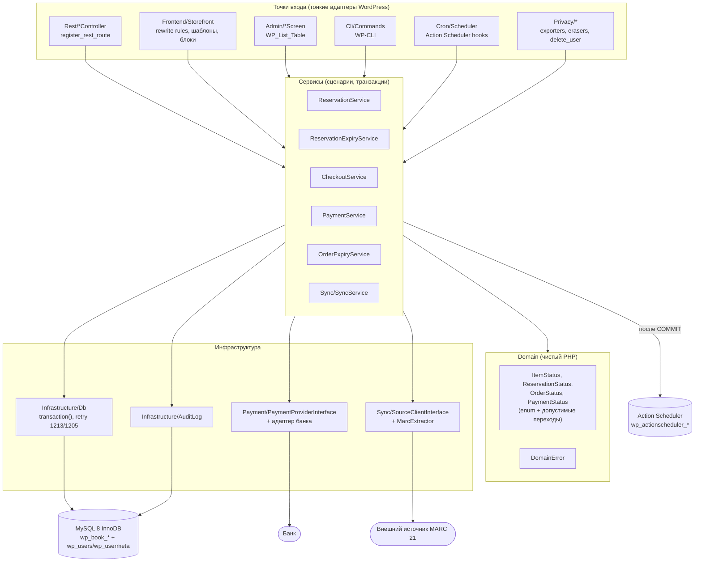
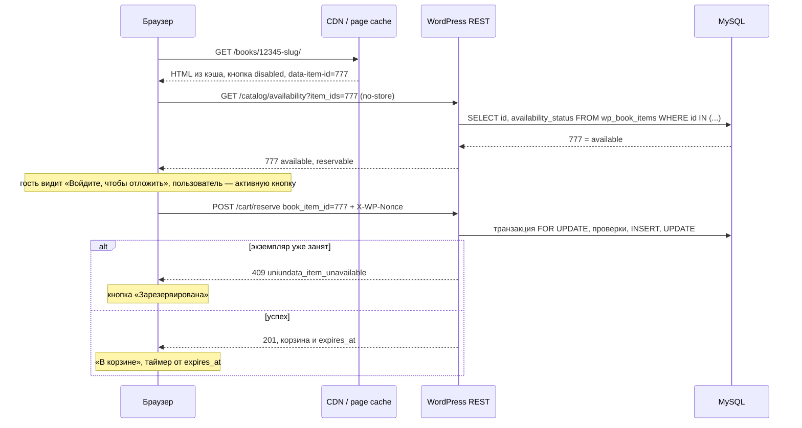

# 1. Архитектура плагина и выбор платформы

> **Решение.** Отдельный плагин `uniundata-books` без WooCommerce. Данные магазина хранятся в собственных
> InnoDB-таблицах (`sql/schema.sql`). Пользователи — `wp_users` с ролями и capabilities WordPress.
> Фоновые задачи выполняет Action Scheduler, подключённый как composer-библиотека
> (`woocommerce/action-scheduler`); его очередь запускает системный cron через WP-CLI. Витрина строится
> на rewrite rules и шаблонах поверх custom tables, без custom post type. Статус кнопки «Отложить»
> всегда приходит из некэшируемого REST-запроса.

## 1.1 Что определяет архитектуру

| Требование ТЗ | Архитектурное следствие |
|---|---|
| Экземпляр уникален, продаётся один раз | Остаток как счётчик не нужен. Нужен статус экземпляра, который меняется под блокировкой строки (`SELECT … FOR UPDATE`) и подкреплён ограничениями БД (UNIQUE, CHECK) |
| Резерв ровно 1 час, лимит 3 попытки на пару (пользователь, экземпляр), история резервов | Отдельная таблица резервов с generated column для «одного активного» и `UNIQUE(user_id, book_item_id, attempt_no)`. Корзина — представление активных резервов, а не сессия |
| MARC 21, ежедневная синхронизация | Полная запись хранится в `marc21_raw`, поля витрины денормализованы в колонки с индексами и FULLTEXT. Импорт пакетами с upsert по внешнему ID и checksum. Синхронизация не перетирает локальные статусы |
| Специальный банковский эквайринг | Адаптер провайдера за интерфейсом. Оплату подтверждает только подписанный webhook. Поздний и двойной платёж обрабатываются явно (`needs_attention`) |
| Публичный каталог при сотнях одновременных посетителей | HTML каталога кэшируется для гостей. Изменчивое состояние (статус экземпляра, корзина) отдаёт отдельный REST-запрос с `no-store` |
| PII и сроки хранения | Минимум персональных данных, снимки в заказе, анонимизация вместо удаления, экспортеры и эрейзеры WordPress (см. [07-users-roles](07-users-roles.md)) |

## 1.2 Слои



| Слой | Каталог | Ответственность | Чего в слое нет |
|---|---|---|---|
| Точки входа | `Rest/`, `Frontend/`, `Admin/`, `Cli/`, `Cron/`, `Privacy/` | Регистрация хуков и маршрутов, `permission_callback`, nonce, валидация и санитизация входа, преобразование `DomainError` в `WP_Error` и HTTP-код, экранирование вывода | SQL, бизнес-правил, транзакций |
| Сервисы | `Service/`, `Sync/SyncService.php` | Сценарий целиком: транзакция, порядок блокировок, перепроверка под блокировкой, аудит, постановка побочных эффектов в очередь после `COMMIT` | HTTP-ответов, `$_POST`, `wp_send_json`, вывода HTML |
| Domain | `Domain/` | Backed enums статусов, таблицы допустимых переходов, `DomainError`. Чистый PHP без функций WordPress: unit-тесты идут без WP | `$wpdb`, хуков, времени «сейчас» (время берётся из БД: `UTC_TIMESTAMP(6)`) |
| Инфраструктура | `Infrastructure/`, `Payment/`, `Sync/*Client*` | `Db::transaction()` (READ COMMITTED, `SET time_zone='+00:00'`, повтор при 1213/1205), `AuditLog`, HTTP-клиенты банка и источника | Бизнес-решений |
| Установка | `Install/` | `Migrator` (версионные миграции, не `dbDelta`), `Roles` | Логики запросов |

Правила зависимостей:

1. **Только сервисы открывают транзакции.** Контроллер вызывает один метод сервиса, а метод сервиса —
   это одна или несколько коротких транзакций `Db::transaction()`. Порядок блокировок един для всех
   операций: `carts → items → reservations → cart_items → orders → payments → payment_events`
   (подробно в [08-security-concurrency](08-security-concurrency.md)).
2. **Внутри транзакции нет HTTP-вызовов, писем и `do_action()` для сторонних кодов.** Чужой обработчик
   хука может сделать долгий запрос или свой `COMMIT` на том же соединении `$wpdb`. Публичные хуки плагина
   (`uniundata_order_paid` и т. п.) вызываются из задачи Action Scheduler уже после `COMMIT`.
3. **SQL пишется явно** через `$wpdb->prepare()`, без ORM. Для корректности здесь важны конкретные
   `SELECT … FOR UPDATE`, порядок блокировок и обработка ошибок 1062/3819. ORM прячет всё это.
4. **Композиция без контейнера.** `Plugin` создаёт сервисы лениво (фабричные методы). Для десятка
   сервисов DI-контейнер не нужен, а зависимостей и конфликтов версий с другими плагинами становится
   меньше.
5. **Сторонние composer-библиотеки** (например, `libphonenumber`) переносятся в собственный namespace
   через PHP-Scoper или Strauss. Иначе два плагина с разными версиями одной библиотеки ломают друг друга.
   Action Scheduler — исключение: у него встроен выбор самой новой из загруженных копий.
6. **Целевая среда — PHP 8.4, синтаксис ограничен PHP 8.3** (property hooks и asymmetric visibility не
   используются). Так код проходит `php -l` в CI на 8.3. Во всех файлах `declare(strict_types=1)`.

## 1.3 Структура плагина

```
uniundata-books/
├── uniundata-books.php        # заголовок плагина, require autoload + Action Scheduler, хуки активации
│                              # (в репозитории примеров — src/uniundata-books.php)
├── uninstall.php              # НЕ удаляет таблицы заказов/продаж/платежей (бухгалтерские данные)
├── composer.json              # PSR-4 "Uniundata\\Books\\": "src/", woocommerce/action-scheduler
├── vendor/                    # composer install --no-dev -o --classmap-authoritative
├── templates/                 # PHP-шаблоны витрины для классических тем (переопределяются темой)
├── blocks/                    # block.json динамических блоков: book-card, reserve-button, cart
├── assets/js/reserve-button.js
├── languages/
└── src/
    ├── Plugin.php                         # bootstrap: хуки, REST, Action Scheduler, CLI
    ├── Domain/      DomainError.php, ItemStatus.php, ReservationStatus.php, OrderStatus.php, PaymentStatus.php
    ├── Infrastructure/ Db.php, AuditLog.php, Clock.php
    ├── Service/     ReservationService.php, ReservationExpiryService.php, CheckoutService.php,
    │                PaymentService.php, OrderExpiryService.php
    ├── Payment/     PaymentProviderInterface.php, ProviderPaymentResult.php, WebhookResult.php,
    │                <Bank>Provider.php                 # адаптер конкретного банка
    ├── Sync/        SyncService.php, MarcExtractor.php, SourceClientInterface.php
    ├── Install/     Migrator.php, Roles.php
    ├── Rest/        CatalogController.php, CartController.php, CheckoutController.php,
    │                OrderController.php, PaymentWebhookController.php, AdminController.php
    ├── Cron/        Scheduler.php                       # recurring actions + обработчики
    ├── Cli/         Commands.php                        # wp uniundata sync|expire|migrate|doctor
    ├── Frontend/    Storefront.php, SeoMeta.php, BookSitemapProvider.php   (†)
    ├── Admin/       OrdersScreen.php, ItemsScreen.php, ReservationsScreen.php, SyncRunsScreen.php (†)
    ├── Security/    Capabilities.php                    # map_meta_cap: view_book_order, delete_user (†)
    ├── Privacy/     PersonalDataExporter.php, PersonalDataEraser.php,
    │                PrivacyService.php, UserLifecycle.php  (†)
    └── Config.php                                       # чтение секретов из констант/окружения (†)
```

(†) — модули целевой архитектуры, которые описаны в документации. PHP-примеры в `src/` для них
не обязательны.

## 1.4 Подключение к WordPress

### Главный файл

```php
<?php
/**
 * Plugin Name:       Uniundata Books
 * Description:       Магазин уникальных экземпляров книг (MARC 21, резервы, оплата).
 * Version:           1.0.0
 * Requires at least: 7.1
 * Requires PHP:      8.4
 * Text Domain:       uniundata-books
 */

declare(strict_types=1);

defined('ABSPATH') || exit;

require_once __DIR__ . '/vendor/autoload.php';
// Action Scheduler подключается файлом, а не автозагрузкой: он регистрирует свою версию
// и на plugins_loaded инициализирует самую новую копию из всех плагинов (WooCommerce и др.).
require_once __DIR__ . '/vendor/woocommerce/action-scheduler/action-scheduler.php';

register_activation_hook(__FILE__, [\Uniundata\Books\Plugin::class, 'activate']);
register_deactivation_hook(__FILE__, [\Uniundata\Books\Plugin::class, 'deactivate']);

add_action('plugins_loaded', [\Uniundata\Books\Plugin::class, 'boot'], 5);
```

### Хуки и порядок инициализации

| Момент | Обработчик | Что делает | Почему здесь |
|---|---|---|---|
| `register_activation_hook` | `Plugin::activate()` | Проверяет окружение (MySQL ≥ 8.0.16, InnoDB, PHP), выполняет `Migrator::migrate()` под `GET_LOCK('uniundata_migrate')`, затем `Roles::install()`. Добавляет options по умолчанию через `add_option` (существующие значения не перезаписываются). Регистрирует rewrite rules и вызывает `flush_rewrite_rules()` | Activation hook — единственный момент, когда администратор явно включает плагин. Ошибка окружения останавливает активацию с понятным сообщением |
| `plugins_loaded` (приоритет 5) | `Plugin::boot()` | Дешёвая проверка `uniundata_db_version` (autoload). Если версия ниже — `Migrator::migrate()` под тем же lock (см. [09](09-migrations-tests-edge-cases.md)). Затем регистрирует все остальные хуки | Activation hook **не вызывается** при обновлении плагина заменой файлов, через автообновление или деплой. Без этой проверки новая версия кода работала бы со старой схемой. Основной путь в продакшене — шаг деплоя `wp uniundata migrate`, проверка на `plugins_loaded` — страховка |
| `init` | `Roles::maybeUpgrade()`, `Storefront::registerRewriteRules()`, `register_meta('user', 'middle_name', …)`, `wp_register_script()` | Роли приводятся к карте capabilities, только если выросла `Roles::VERSION`. Rewrite rules регистрируются на каждом запросе, как требует WordPress | Роли хранятся в option `wp_user_roles`, и `add_cap()` каждый раз пишет в неё. Поэтому синхронизация идёт по версии, а не на каждом запросе |
| `rest_api_init` | `*Controller::registerRoutes()` | `register_rest_route('uniundata/v1', …)` с `args` (схема, `validate_callback`, `sanitize_callback`) и обязательным `permission_callback` | Маршруты регистрируются только при обработке REST-запроса |
| `action_scheduler_init` | `Scheduler::ensureRecurring()` | `as_has_scheduled_action()` → `as_schedule_recurring_action(…, 'uniundata', true)` для `uniundata_expire_reservations` (60 с), `uniundata_expire_orders` (60 с), `uniundata_sync_daily` (24 ч) | В запросе активации Action Scheduler может быть ещё не инициализирован: плагин подключается после `plugins_loaded`/`init`, а `as_*` до готовности хранилища ничего не планируют. Постановка идемпотентна, поэтому её можно делать на каждом запросе |
| `plugins_loaded` (из `boot`) | `add_action('uniundata_expire_reservations', …)` и другие обработчики задач | Подписка обработчиков задач | Action Scheduler выполняет задачу через `do_action($hook, …$args)`. Обработчик должен быть подписан в **каждом** процессе: в WP-CLI, WP-Cron и async-runner |
| `map_meta_cap` | `Security\Capabilities::map()` | `view_book_order` → `view_own_book_orders` (владелец) или `manage_book_orders`. Защита `delete_user` при незавершённой оплате | См. [07-users-roles](07-users-roles.md) |
| `query_vars`, `template_redirect`, `template_include`, `posts_pre_query` | `Storefront` | Виртуальные страницы каталога и книги (§ 1.7.1) | — |
| `wp_privacy_personal_data_exporters`, `…_erasers` | `Privacy\*` | Экспорт и анонимизация данных магазина | См. [07](07-users-roles.md) |
| `delete_user`, `wpmu_delete_user` | `Privacy\UserLifecycle` | Снятие резервов, отмена неоплаченных заказов, отложенная анонимизация | См. [07](07-users-roles.md) |
| `cli_init` | `WP_CLI::add_command('uniundata', Commands::class)` | `wp uniundata sync run`, `expire`, `migrate`, `doctor` | — |
| `admin_menu` | `Admin\*Screen` | Экраны с проверкой `manage_book_*` | — |
| `wp_initialize_site` (multisite) | `Plugin::installForSite()` | Таблицы и роли для нового сайта сети при сетевой активации | Таблицы создаются для каждого сайта с его `$wpdb->prefix` |
| `register_deactivation_hook` | `Plugin::deactivate()` | `as_unschedule_all_actions()` для хуков плагина, `flush_rewrite_rules()` | Таблицы, роли и данные **остаются**: деактивация обратима |
| `uninstall.php` | — | Удаляет options и роли. Таблицы заказов, продаж и платежей не удаляет: их удаляет только явная WP-CLI-команда с подтверждением | Бухгалтерские данные не должны исчезать от клика «Удалить плагин» |

### Соединение с MySQL

У WordPress одно соединение `$wpdb` на запрос, и плагин делит его с ядром и другими плагинами.
`Db` при первом обращении выполняет `SET time_zone = '+00:00'` и
`SET SESSION TRANSACTION ISOLATION LEVEL READ COMMITTED`. Обе настройки действуют до конца PHP-запроса и
затрагивают запросы других плагинов на этом соединении. Для `DATETIME` это безопасно: зона на
`DATETIME` не влияет, она меняет только `NOW()` и `TIMESTAMP`. Дополнительно рекомендуется
`default-time-zone = '+00:00'` в `my.cnf`. Тогда `DEFAULT CURRENT_TIMESTAMP(6)` даёт UTC и в сессиях,
которые не прошли через `Db`: ручной SQL, `wp db query`, отчёты.

## 1.5 Жизненный цикл запросов

**A. Гость открывает карточку книги** `GET /books/12345-voyna-i-mir/`

1. CDN или page cache отдаёт HTML из кэша, если он есть (гость, нет cookie `wordpress_logged_in_*`).
2. Промах кэша. WordPress разбирает rewrite rule `^books/([0-9]+)(?:-([^/]+))?/?$` →
   `uniundata_record=12345`. `posts_pre_query` отменяет пустой основной `WP_Query`. `Storefront` читает
   запись и экземпляры по первичному ключу и индексам: карточка записи берётся из объектного кэша,
   статусы экземпляров — из БД. Неканонический slug получает 301.
3. Шаблон выводит данные MARC с экранированием, JSON-LD `Book`/`Offer` и кнопку экземпляра с
   `data-item-id`. Кнопка заблокирована (`disabled`, `aria-busy="true"`), пока не придёт актуальный статус.
4. JS запрашивает `GET /wp-json/uniundata/v1/catalog/availability?item_ids=…` (`no-store`) и включает
   или отключает кнопку (§ 1.7.4).

**B. Пользователь нажимает «Отложить»** `POST /wp-json/uniundata/v1/cart/reserve`

1. `rest_api_init` регистрирует маршруты. Cookie-аутентификация WordPress проверяет `X-WP-Nonce`
   (`wp_rest`). Без nonce запрос считается анонимным (user 0), с неверным nonce получает 403
   `rest_cookie_invalid_nonce`.
2. WordPress проверяет `args` (`book_item_id`: integer, minimum 1), затем `permission_callback`:
   `is_user_logged_in()` → иначе 401 `uniundata_auth_required`; `current_user_can('reserve_books')` →
   иначе 403 `uniundata_forbidden`. Затем rate limit.
3. `ReservationService::reserve(get_current_user_id(), $itemId)` выполняет одну транзакцию: корзина
   `FOR UPDATE` → экземпляр `FOR UPDATE` → проверки → `INSERT` резерва и позиции → `UPDATE` статуса →
   аудит → `COMMIT` (алгоритм — в [05-algorithms](05-algorithms.md)).
4. Ответ 201 (или 200 при повторе) с корзиной и `expires_at` в ISO 8601 UTC, заголовок
   `Cache-Control: no-store`. `DomainError` превращается в `WP_Error` с кодом из контракта (409, 410, 429, 503).

**C. Webhook банка** `POST /wp-json/uniundata/v1/payment/webhook`

1. `permission_callback => '__return_true'`: у банка нет WordPress-сессии, и nonce здесь неприменим.
   Аутентичность обеспечивает подпись сырого тела `$request->get_body()`, а при необходимости — IP
   allowlist или mTLS на уровне веб-сервера.
2. `PaymentService::handleWebhook()`: проверка подписи → `INSERT` в `wp_book_payment_events`
   (дубль = 200 без действий) → транзакция по порядку блокировок → `COMMIT` → 200 быстро, в пределах
   таймаута банка.
3. Письмо, документы и возврат при конфликте ставятся в Action Scheduler
   (`as_enqueue_async_action('uniundata_order_paid_effects', ['order_id' => …], 'uniundata')`).

**D. Фоновые задачи.** Системный cron раз в минуту запускает `wp action-scheduler run`. Action Scheduler
забирает (claim) созревшие задачи и вызывает `do_action('uniundata_expire_reservations')`. Обработчик
вызывает `ReservationExpiryService::expireDue(200)`: каждый резерв обрабатывается в своей короткой
транзакции с перепроверкой под блокировкой.

**E. WP-CLI.** `wp uniundata sync run` и `wp uniundata migrate` работают вне веб-лимитов
(`max_execution_time` для CLI равен 0) и используют те же сервисы, что и задачи Action Scheduler.

## 1.6 WooCommerce + кастомное резервирование или отдельный плагин

Сравниваемые варианты:

- **WC** — WooCommerce: каждый экземпляр = simple product с `_manage_stock=yes`, `_stock=1`,
  `_sold_individually=yes`. Резервы и MARC — в своих таблицах. Заказы — HPOS, оплата — свой
  `WC_Payment_Gateway`.
- **Custom** — плагин из этого документа: собственные таблицы каталога, резервов, корзины, заказов и
  платежей, Action Scheduler как библиотека.

| Критерий | WooCommerce + кастомное резервирование | Custom plugin + Action Scheduler |
|---|---|---|
| **Модель уникального экземпляра и stock** | Экземпляр = товар (`wp_posts` + два-три десятка строк `wp_postmeta` + `wc_product_meta_lookup`). Stock — целочисленный счётчик, а не статус. Состояний `reserved`, `checkout_pending`, `sync_missing`, `blocked` у WC нет: их приходится кодировать через `_stock_status`, `post_status` и meta. Получаются **два источника истины**: stock WC и таблица резервов. Расхождение между ними рождает «призрачные» продажи и блокировки. Ограничений уровня БД («один активный резерв», «одна продажа») в модели WC нет | Строка `wp_book_items` с `availability_status` и CHECK — единственный источник истины и мьютекс экземпляра. Инварианты продублированы UNIQUE и generated columns (см. [03](03-tables-and-indexes.md), [08](08-security-concurrency.md)) |
| **HPOS-таблицы** | Заказы — в `wc_orders`, `wc_order_addresses`, `wc_order_operational_data`, `wc_orders_meta` (HPOS по умолчанию в новых магазинах). Наши поля (`public_order_id`, `payment_due_at`, `needs_attention`, `checkout_request_id`) попадают в `wc_orders_meta`: EAV, `meta_value` LONGTEXT, без CHECK и составных UNIQUE. Работать можно только через CRUD (`wc_get_order()`, `$order->save()`), иначе ломается совместимость и синхронизация с posts. Нужна декларация `FeaturesUtil::declare_compatibility('custom_order_tables', …)`. Суммы хранятся в DECIMAL, а не в центах. `$order->update_status()` синхронно вызывает хуки, письма и сторонние плагины, поэтому включить его в нашу транзакцию с `FOR UPDATE` нельзя | `wp_book_orders` с нужными колонками, CHECK итоговой суммы, `UNIQUE(public_order_id)` и `UNIQUE(user_id, checkout_request_id)`. Переходы статусов — в транзакции, побочные эффекты — после `COMMIT` |
| **Сессионная корзина WC** | `WC_Session_Handler`: cookie `wp_woocommerce_session_*`, таблица `woocommerce_sessions` со сроком около 48 ч, у вошедших — persistent cart в usermeta. Корзина — массив product_id × quantity, она ничего не резервирует. Позиции после истечения резерва возвращаются из persistent cart, поэтому их надо вычищать хуками (`woocommerce_cart_loaded_from_session`, `woocommerce_check_cart_items`). Интеграцию нужно делать **дважды**: для классического checkout (шорткоды) и для блоков Cart/Checkout (Store API, по умолчанию в новых магазинах). Cookie корзины отключает page cache для посетителя | Корзина — таблицы `wp_book_carts`/`wp_book_cart_items`, жёстко связанные с резервами, только для вошедших пользователей. `GET /cart` только читает и не продлевает резерв |
| **Резерв 1 час и лимит 3** | Встроенный «Hold stock» (`woocommerce_hold_stock_minutes`, по умолчанию 60) держит остаток в `wc_reserved_stock` **только с момента checkout**, а не по кнопке «Отложить». Неоплаченные заказы отменяет WP-Cron-событие `woocommerce_cancel_unpaid_orders`. Попыток на пользователя нет. Всё нужное — таблица резервов, лимит и expiry — всё равно пишется с нуля. WC добавляет поверхность интеграции, но не функциональность | Реализуется напрямую по контракту: `FOR UPDATE` экземпляра + `UNIQUE(user_id, book_item_id, attempt_no)` + `CHECK(attempt_no BETWEEN 1 AND 3)` |
| **MARC 21 и синхронизация** | Поддержки нет. MARC, авторы, рубрики и FULLTEXT всё равно живут в своих таблицах, а товары WC их дублируют. Импорт через CRUD (`WC_Product::save()`) или WC REST batch (≤ 100 объектов за запрос) делает десятки запросов и хуков на товар, обновляет lookup-таблицы и сбрасывает транзиенты. Прямой SQL в `wp_posts` ломает кэши и lookup-таблицы. Синхронизация должна не трогать товары в «наших» статусах — это ещё одна точка рассинхронизации | Upsert пакетами в `wp_book_records`/`wp_book_items` по `(source_name, external_id)` + checksum, `last_seen_sync_run_id` для поиска пропавших. Записи `wp_posts` не создаются |
| **Банковский эквайринг / шлюз** | Плюс WC — каркас `WC_Payment_Gateway`: настройки, `process_payment()` с редиректом, `process_refund()` из админки, `$order->payment_complete()`. Если у банка есть **официальный поддерживаемый** WC-плагин, это реальная экономия. Но поздний платёж, двойной платёж и `needs_attention` по контракту требуют форка или обёртки чужого плагина. Для блочного checkout шлюз дополнительно регистрируется на JS (`registerPaymentMethod`) | `PaymentProviderInterface` (`createSession`, `fetchPayment`, `verifyWebhook`, `cancelSession`, `refund`) + адаптер банка. Идемпотентность, поздние и двойные платежи — под нашим контролем. Кнопку возврата в админке нужно сделать самим |
| **Налоги, email, админка** | Сильная сторона WC: ставки и классы налогов, округление, OSS-сценарии, шаблоны писем с настройками, экран заказов, возвраты, «Мой аккаунт», купоны, зоны доставки, аналитика, расширения для PDF-счетов и выгрузок в бухгалтерию. Маржинальной схемы НДС для б/у товаров из коробки нет | Всё это делается самостоятельно: экраны `WP_List_Table` (заказы, экземпляры, резервы, прогоны синхронизации), 5–7 шаблонов писем через `wp_mail`, страницы аккаунта, налоговая конфигурация (`prices_include_tax`, ставка для книг), счета — через бухгалтерскую систему или генератор PDF |
| **Обновления WC и совместимость** | Ежемесячные релизы WC. Наша интеграция затрагивает самые изменчивые части: корзину, checkout, stock, статусы заказов и шлюз. Пример недавних волн изменений — HPOS и блочный checkout по умолчанию. Каждое обновление WC и его расширений требует регрессии сценариев резерва и оплаты | Зависимость только от стабильных API ядра: REST, роли, rewrite, privacy, `$wpdb`. Action Scheduler закреплён версией в `composer.lock` |
| **Производительность** | На каждом запросе загружается WC, а посетителям с корзиной поднимается сессия. Каталог 10⁵ экземпляров = 10⁵ записей `wp_posts` и миллионы строк postmeta. Фильтры каталога идут через `WP_Query` + meta/lookup. Посетители с корзиной обходят page cache. HPOS ускоряет заказы, но не каталог | Каталог — индексированные запросы и FULLTEXT по `wp_book_records`. Страницы гостей кэшируются целиком. Статус экземпляров — выборка по первичному ключу. Резерв — одна транзакция примерно из 10 запросов |
| **Стоимость разработки** | Админка, письма, налоги и аккаунт из коробки дают экономию. Но синхронизация MARC, резервы, лимит, expiry и шлюз пишутся всё равно, а сверху добавляется слой интеграции: два пути checkout, синхронизация товаров, маппинг статусов, совместимость с HPOS. В итоге стартовая стоимость сопоставима | Дороже на админке, письмах и документах. Дешевле на интеграции, потому что её нет. Бизнес-логика проще в тестировании: интеграционные тесты на реальном MySQL без WC |
| **Стоимость поддержки** | Выше: регрессия на каждый релиз WC и расширений, сверка двух источников истины, конфликты с плагинами экосистемы WC | Ниже и предсказуемее: изменения происходят только по решению команды. Риск — знания о системе сосредоточены в одной команде. Его снижают документация и тесты из этого репозитория |

### Рекомендация

**Custom plugin + Action Scheduler.** Ключевые требования ТЗ лежат вне модели WooCommerce: резерв
уникального экземпляра по кнопке, лимит попыток, MARC 21 с ежедневной синхронизацией, особый
жизненный цикл платежа. Их пришлось бы писать с нуля и в варианте с WC, только поверх чужой модели
stock, сессии и заказа. Это дало бы два источника истины и транзакции, которые нельзя объединить.
Готовые части WC (налоги, письма, админка) дешевле воспроизвести в объёме этого магазина, чем
поддерживать интеграцию с ядром WC при ежемесячных релизах. Action Scheduler берём из экосистемы WC
как отдельную библиотеку: это проверенная очередь с журналом, claim-механизмом и экраном
Tools → Scheduled Actions.

**Когда WooCommerce всё-таки лучше:**

- в первой версии обязательны купоны, калькуляторы доставки по зонам, несколько способов оплаты с
  готовыми плагинами (PayPal, карты, BNPL) или НДС по странам назначения (OSS);
- ассортимент становится смешанным: новые книги с остатком больше 1, подарочные карты, цифровые товары.
  Модель «один экземпляр — одна продажа» перестаёт быть основной;
- у банка есть официальный поддерживаемый WC-шлюз, и бизнес согласен на стандартный жизненный цикл
  заказа WC без поздних платежей и `needs_attention`;
- каталог небольшой (единицы тысяч экземпляров), синхронизация редкая, а у команды и хостинга уже есть
  отлаженный стек WooCommerce;
- нужны готовые интеграции экосистемы: Google Merchant Center, маркетплейсы, CRM, бухгалтерские
  выгрузки, а менеджеры уже работают в админке WC.

**Гибрид отклонён.** Вариант «наш каталог и резервы + WC только для заказов и оплаты» оставляет два
источника истины по заказу и требует согласовывать статусы резерва и заказа WC в разных транзакциях.
Своя корзина при этом всё равно нужна. Если позже потребуется бухгалтерия или ERP, оплаченные заказы
выгружаются задачами Action Scheduler без WC.

## 1.7 Где и почему применять механизмы WordPress

| Механизм | Что используем | Почему | Что **не** делаем |
|---|---|---|---|
| **WordPress options** | `uniundata_db_version`, `uniundata_roles_version`, `uniundata_payment_ttl_minutes` (30), `uniundata_payment_grace_minutes` (10), `uniundata_reservation_minutes` (60), `uniundata_sync_source` (без секретов), `uniundata_terms_versions`. Маленькие и часто читаемые — с autoload, редкие (`uniundata_sync_source`) — `autoload = false` | Настройки сайта: единицы значений, меняются редко, нужен `get_option()` из кэша `alloptions` без запроса | Изменчивое конкурентное состояние: блокировки, счётчики, статус синхронизации. У `update_option()` нет блокировок строки (read-modify-write), а запись сбрасывает `alloptions` у всех. Секреты — § 1.8 |
| **wp_usermeta** | Стандартные `first_name`, `last_name` и необязательный `middle_name` (`register_meta('user', …)`), служебные метки вроде `uniundata_erasure_requested_at` | Это профиль WordPress, он виден в «Профиле», экспортируется ядром и удаляется вместе с пользователем | Поиск, фильтры, сортировка и история. `meta_value` — LONGTEXT без индекса, формат не проверяется. Поэтому телефон, адреса и B2B-реквизиты лежат в `wp_book_customer_profiles` (см. [07](07-users-roles.md)) |
| **Custom post type** | В v1 **не используем** (обоснование — § 1.7.1). Опционально позже: «редакционный» CPT для книг, которым маркетинг пишет собственный текст | — | CPT-товары и CPT-заказы: EAV-postmeta, нет FK, UNIQUE и CHECK, `wp_insert_post()` медленный и вызывает чужие хуки |
| **Custom tables** | Каталог, экземпляры, резервы, корзины, заказы, платежи, продажи, синхронизация, аудит, профиль, согласия (`sql/schema.sql`) | Блокировки строк, UNIQUE на generated columns, CHECK, FK между своими таблицами, деньги в центах (INT), составные индексы и FULLTEXT. Только так инварианты гарантирует БД | Ссылки FK на `wp_users` (см. [07](07-users-roles.md)). Изменения через `dbDelta()` |
| **WooCommerce** | Не используется | § 1.6 | Если WC установлен для других задач, плагин сосуществует с ним: свои таблицы и роли (роль `customer` не используем), общий Action Scheduler (выбирается самая новая версия) |
| **Action Scheduler** | Повторяющиеся задачи (expiry резервов и заказов каждую минуту, ежедневная синхронизация, ретенция PII), пакеты синхронизации, побочные эффекты после `COMMIT` (письма, документы, возвраты, отмена сессии банка, сброс page cache) | Каждая задача — строка в `wp_actionscheduler_actions` с логом, статусом и повтором. Claim не даёт двум раннерам выполнить одну задачу. Есть экран в админке | Сам по себе не гарантирует однократного эффекта: обработчики идемпотентны (см. [08](08-security-concurrency.md) § 8.4) |
| **Системный cron + WP-CLI** | `DISABLE_WP_CRON`, crontab каждую минуту: `wp action-scheduler run`, `wp cron event run --due-now`. Первичный импорт — `wp uniundata sync run` | WP-Cron срабатывает только при визитах, хранит расписание в одной option `cron` (гонки) и выполняется внутри HTTP-запроса посетителя | Не завязываем корректность на точность cron: срок резерва проверяется в SQL при каждом действии |
| **Объектный кэш** (Redis/Memcached) | Карточки записей, списки и фасеты каталога, rate limit | Снимает нагрузку чтения с MySQL | Не кэшируем ничего, по чему принимается решение о резерве, checkout или оплате |
| **Page cache / CDN** | HTML каталога и карточек для гостей | Каталог — основная нагрузка, а он одинаков для всех гостей | Не кэшируем `/wp-json/uniundata/*`, страницы корзины, checkout, аккаунта, возврата из банка и страницы вошедших пользователей |
| **Transients** | Только как запасной вариант кэша без persistent object cache (rate limit, фасеты) | — | Резервы, блокировки, идемпотентность: транзиент может исчезнуть в любой момент |

### 1.7.1 Витрина: rewrite rules + шаблон на custom tables или тонкий CPT-прокси

Нужны индексируемые страницы книг: человекочитаемый URL, title и description, canonical, sitemap,
JSON-LD. Рассмотрены два варианта.

| | **A. Rewrite rules + шаблон на custom tables** (выбран) | **B. Тонкий CPT-прокси** `uniundata_book` (запись на каждую `wp_book_records`) |
|---|---|---|
| Источник истины | Один: `wp_book_records`/`wp_book_items` | Два: таблицы + `wp_posts` (slug, title, статус публикации). Их нужно синхронизировать |
| Ежедневная синхронизация | Только upsert в свои таблицы | Дополнительно `wp_insert_post()`/`wp_update_post()` на каждую изменённую запись. Это хуки всех плагинов (`save_post`), переиндексация SEO-плагинов, ревизии, сброс кэшей. На 10⁵ записей импорт становится долгим и хрупким |
| Объём | Нет роста `wp_posts`/`wp_postmeta` | +1 строка `wp_posts` и meta на запись, медленнее админка «Записи» и поиск ядра |
| SEO-плагины, меню, sitemap | Нужна своя интеграция: title (`pre_get_document_title`), meta description, canonical и Open Graph в `wp_head`, JSON-LD, провайдер карты сайта ядра `wp_register_sitemap_provider()` (или sitemap API SEO-плагина, если он отключает карты ядра) | Работает из коробки |
| Проданные книги | Страница остаётся (200, «Продано», `schema.org/SoldOut`) без изменений в `wp_posts` | Нужно решать, что делать с постом |

**Выбор — A.** Решающие аргументы: один источник истины и синхронизация без `wp_insert_post()`. SEO
закрывается примерно сотней строк собственной интеграции. Это дешевле, чем поддерживать зеркало
каталога в `wp_posts`. Слой `Frontend/` изолирован, поэтому переход на B позже не затронет домен и схему.
Если маркетингу понадобится редакционный текст к отдельным книгам, добавляется **разреженный** CPT
`uniundata_book_page`. Посты создаются вручную только для таких книг, связь — meta
`_uniundata_record_id`, а шаблон выводит редакционный текст поверх данных из таблиц.

Реализация варианта A:

- **URL:** `/books/{record_id}-{slug}/`. Авторитетен `record_id`. Slug декоративный: он вычисляется из
  `title` с транслитерацией кириллицы. При несовпадении slug — 301 на канонический URL, поэтому
  изменение названия при синхронизации не ломает ссылки. Отдельная колонка slug в схеме не нужна.
  Каталог и поиск: `/books/?q=…&author=…&year=…` (FULLTEXT `ft_records_main`/`ft_records_all`).
- **Rewrite:** `add_rewrite_rule('^books/([0-9]+)(?:-([^/]+))?/?$', 'index.php?uniundata_record=$matches[1]', 'top')`
  на `init` + `query_vars`. `flush_rewrite_rules()` вызывается только при активации и деактивации.
- **Основной запрос:** `posts_pre_query` возвращает `[]` для основного запроса с `uniundata_record`, чтобы
  WordPress не искал посты. На `template_redirect` загружается запись. Неактивная запись
  (`is_active = 0`) → `$wp_query->set_404()` и `status_header(404)`.
- **Шаблоны:** для классических тем — `templates/single-book.php`, переопределяемый темой
  (`locate_template('uniundata-books/single-book.php')`). Для блочных тем — шаблон через
  `register_block_template()` и фильтр иерархии шаблонов. Содержимое собирается из динамических
  блоков `uniundata/book-card` и `uniundata/reserve-button`, которые рендерятся из custom tables.
- **Показ экземпляров:** `available` → «Отложить»; `reserved`/`checkout_pending` → «Зарезервирована»;
  `sold` → «Продано»; `withdrawn`/`blocked`/`sync_missing` → «Нет в продаже». Публично статусы
  укрупнены, чтобы не раскрывать внутренние состояния (`blocked`, `sync_missing`).

### 1.7.2 Action Scheduler и системный cron

`wp-config.php`:

```php
define('DISABLE_WP_CRON', true);
```

`/etc/cron.d/uniundata` (пользователь веб-сервера, `flock -n` не даёт копиться процессам одного типа):

```
* * * * * www-data cd /var/www/site && flock -n /run/lock/uu-critical.lock wp action-scheduler run --hooks=uniundata_expire_reservations,uniundata_expire_orders --quiet
* * * * * www-data cd /var/www/site && flock -n /run/lock/uu-queue.lock    wp action-scheduler run --group=uniundata --quiet
* * * * * www-data cd /var/www/site && flock -n /run/lock/wp-cron.lock     wp cron event run --due-now --quiet
```

- Первая строка — выделенный раннер для expiry. Даже если вторая строка занята пакетом синхронизации,
  резервы и заказы освобождаются вовремя. WP-CLI-раннер Action Scheduler не стартует, если число
  одновременных claim-ов достигло `action_scheduler_queue_runner_concurrent_batches` (по умолчанию 1).
  Поэтому плагин поднимает лимит фильтром до 3: две строки crontab плюс штатный WP-Cron-раннер AS.
  Одновременная работа раннеров безопасна: задачу забирает один claim, а сервисы перепроверяют
  состояние под `FOR UPDATE`.
- Третья строка выполняет события WP-Cron ядра и других плагинов (WP-Cron остаётся триггером, но
  запускается по расписанию, а не визитами).
- Ежедневная синхронизация (`uniundata_sync_daily`) не выполняет весь импорт в одной задаче. Она
  открывает прогон (`wp_book_sync_runs`, `GET_LOCK`) и ставит цепочку задач-пакетов по N записей
  (≤ 20–30 с каждая) с `source_cursor`. Так падение посередине продолжается с курсора, а очередь не
  блокируется. Первичный импорт сотен тысяч записей запускается вручную: `wp uniundata sync run`.
- Флаг `unique = true` в `as_schedule_recurring_action()` используем только для повторяющихся задач.
  Action Scheduler сравнивает **hook + group, без аргументов**, поэтому для задач по конкретному заказу
  (`order_id`) этот флаг потеряет задачи других заказов. Там дедупликация делается в обработчике.
- Точность cron не влияет на корректность. Владелец не начнёт оплату после `expires_at`: checkout
  сравнивает срок с `UTC_TIMESTAMP(6)`. Другие пользователи видят «Зарезервирована» не дольше
  примерно 1–2 минут после истечения — пока задача не освободит экземпляр.
- Мониторинг: алерт, если `uniundata_expire_reservations` не завершалась более 5 минут или в очереди
  есть `failed`-задачи плагина. Хранение завершённых задач AS по умолчанию — 30 дней (фильтр
  `action_scheduler_retention_period`).

### 1.7.3 Объектный кэш

- **Кэшируем** (группа `uniundata`): данные карточки записи — запись, авторы, рубрики, изображения,
  ключ `record:{id}:v{catalog_ver}`; результаты списков и поиска с коротким TTL (60–300 с); фасеты.
  После каждого пакета синхронизации `catalog_ver` увеличивается (`wp_cache_incr`), и старые ключи
  перестают читаться без массового удаления.
- **Статус экземпляра в объектный кэш не попадает.** Он меняется чаще всего, а неверное значение здесь
  особенно дорого. `GET /catalog/availability` — выборка по первичному ключу ≤ 100 строк, это
  микросекунды. Сервисы резерва, checkout, webhook и expiry читают только из БД под `FOR UPDATE`.
- Rate limit (`wp_cache_incr` с TTL) использует объектный кэш, а без него — транзиенты
  (см. [08](08-security-concurrency.md)).
- Без persistent object cache всё работает корректно: кэш — только оптимизация.

### 1.7.4 Page cache и актуальный статус кнопки «Отложить»

HTML каталога может быть старым на минуты, поэтому кнопка никогда не опирается на HTML как на
источник статуса.



Правила:

1. **Кэшируемый HTML** выводит кнопку в нейтральном состоянии (`disabled`, `aria-busy`) с
   `data-item-id`. Статус на момент генерации используется только для текста без JS и JSON-LD.
   После продажи страница записи сбрасывается в page cache задачей Action Scheduler
   (`uniundata_purge_record_cache`), чтобы JSON-LD и текст «Продано» обновились.
2. **`GET /catalog/availability`** — публичный маршрут без персональных данных, одинаковый для всех.
   Он явно ставит `Cache-Control: no-store`: по умолчанию WordPress шлёт no-cache-заголовки в REST только
   вошедшим пользователям (фильтр `rest_send_nocache_headers`). На CDN путь `/wp-json/uniundata/` в
   правиле bypass.
3. **Персональное состояние** («в вашей корзине, осталось 42:10») JS вошедшего пользователя берёт из
   `GET /cart`. Этот же запрос нужен для мини-корзины. «Лимит резервов исчерпан» показывается после
   ответа 409 `uniundata_reservation_limit_reached`.
4. **Обновление:** при загрузке, на `pageshow` (возврат из bfcache), на `visibilitychange` → visible и
   раз в 60 с, пока вкладка видима. Идентификаторы пакуются в один запрос (лимит длины списка задан в
   [06-rest-api](06-rest-api.md)).
5. **Nonce.** Страницы вошедших пользователей не кэшируются (bypass по cookie `wordpress_logged_in_*`),
   поэтому `wp_create_nonce('wp_rest')` можно выводить в странице через `wp_add_inline_script()`.
   На ответ 403 `rest_cookie_invalid_nonce` (nonce истёк в открытой вкладке) JS один раз получает новый
   nonce через `admin-ajax.php?action=rest-nonce` и повторяет запрос.
6. **Последнее слово за сервером.** Даже если UI ошибся (старый статус, двойной клик, две вкладки),
   транзакция резерва отвечает 409 или идемпотентным 200.

## 1.8 Где хранить секреты

| Секрет | Где | Как читается |
|---|---|---|
| Ключ API банка, merchant ID, секрет подписи webhook (+ предыдущий на время ротации), путь к клиентскому сертификату и ключу mTLS | Переменные окружения процесса PHP-FPM или CLI (панель хостинга, systemd `EnvironmentFile`, секреты оркестратора). Без них — константы в `wp-config.php`. Файлы сертификатов — вне docroot, права `0400` | `Config::secret('UNIUNDATA_BANK_API_KEY')`: сначала константа, затем `getenv()`. Если нет ни того ни другого — исключение при первом обращении. Отката к options нет |
| Токен API источника MARC | То же (`UNIUNDATA_SOURCE_API_TOKEN`) | То же |
| SMTP, ключи CDN для purge | То же | То же |
| Соли WordPress (`AUTH_KEY` …) и доступ к БД | `wp-config.php` или окружение | Смена солей инвалидирует все сессии и nonce |

```php
// wp-config.php: значения приходят из окружения и не попадают в репозиторий и БД
define('UNIUNDATA_BANK_API_KEY',               getenv('UNIUNDATA_BANK_API_KEY') ?: '');
define('UNIUNDATA_BANK_WEBHOOK_SECRET',        getenv('UNIUNDATA_BANK_WEBHOOK_SECRET') ?: '');
define('UNIUNDATA_BANK_WEBHOOK_SECRET_PREVIOUS', getenv('UNIUNDATA_BANK_WEBHOOK_SECRET_PREVIOUS') ?: '');
define('UNIUNDATA_SOURCE_API_TOKEN',           getenv('UNIUNDATA_SOURCE_API_TOKEN') ?: '');
define('WP_ENVIRONMENT_TYPE',                  getenv('WP_ENVIRONMENT_TYPE') ?: 'production');
```

Почему **не `wp_options`:**

- options с autoload загружаются в память на каждом запросе и попадают в общий объектный кэш (Redis);
- options уходят в дампы БД: бэкапы, копии для разработчиков и staging. Staging с продакшен-ключом может
  создавать реальные платежи, а подделанный webhook будет подписан верным секретом;
- их видят все плагины и администраторы с `manage_options`, а плагины миграции и экспорта настроек
  выгружают их целиком.

Дополнительные правила:

- На не-продакшен окружении (`wp_get_environment_type() !== 'production'`) адаптер банка отказывается
  работать с боевыми ключами. Признак боевого ключа задаётся форматом или префиксом ключа конкретного
  банка.
- Webhook-подпись проверяется текущим секретом, а при неудаче — предыдущим (окно ротации). После
  ротации `…_PREVIOUS` очищается.
- Секреты, заголовки `Authorization` и подписи никогда не пишутся в лог, аудит или `payload_redacted`.
- В `wp_options` допустимы только несекретные настройки: URL API источника, размер пакета, TTL оплаты.
