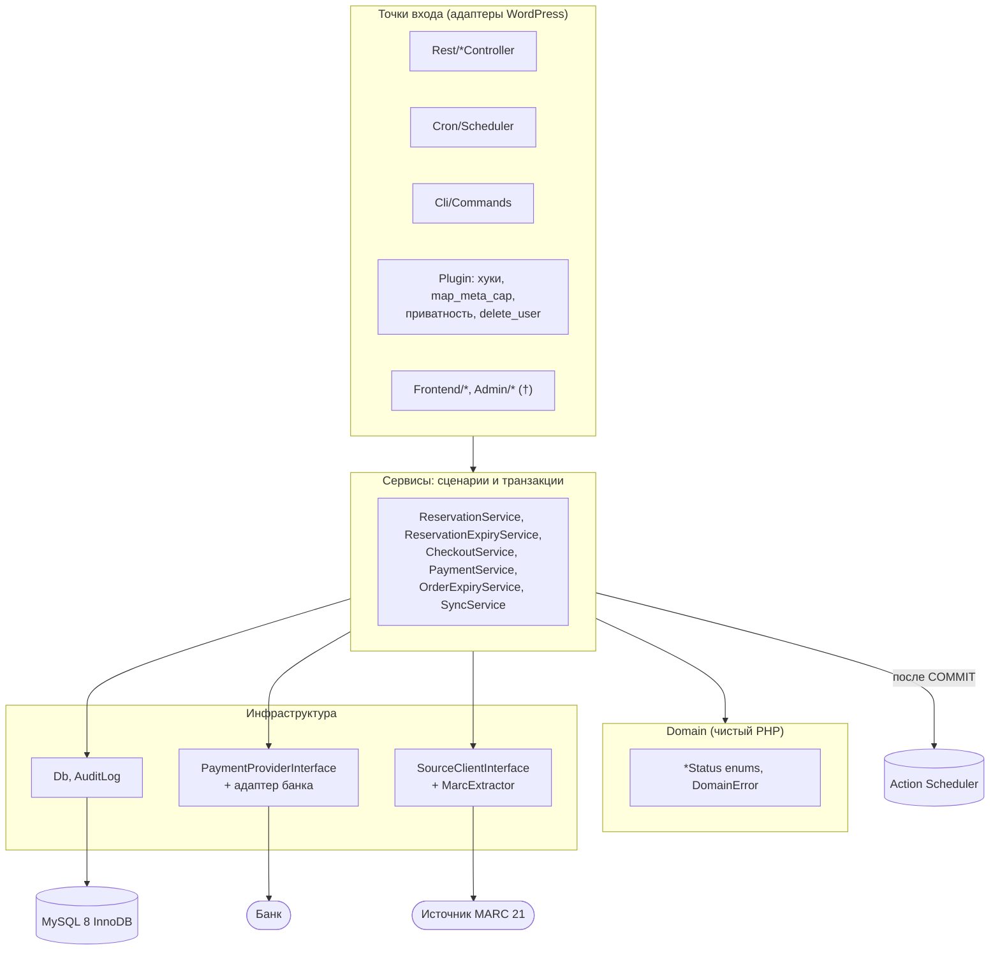
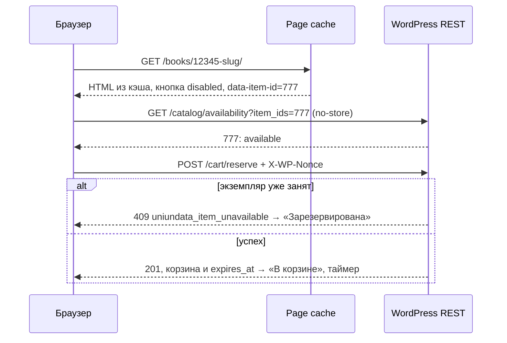

# 1. Архитектура плагина и выбор платформы

> **Решение.** Отдельный плагин `uniundata-books` без WooCommerce. Данные магазина хранятся в своих
> InnoDB-таблицах (`sql/schema.sql`), пользователи — в `wp_users` сайта магазина с ролями и capabilities
> WordPress. Фоновые задачи выполняет Action Scheduler ^4.2 (composer `woocommerce/action-scheduler`), его
> очередь запускает системный cron через WP-CLI. Витрина — rewrite rules и шаблоны поверх своих таблиц, без
> custom post type. Статус кнопки «Отложить» приходит только из некэшируемого REST-запроса.
> Платформа: WordPress 7.1, **PHP 8.3+** (у заказчика 8.3.27, код совместим и с 8.4), MySQL 8.0.16+
> (у заказчика 8.0.46). Валюта — RUB, суммы в копейках.

## 1.1 Окружение и требования

Окружение заказчика (данные «Здоровья сайта», настройка сервера — [11](11-environment.md)):

| Факт | Следствие для архитектуры |
|---|---|
| shop.libsmr.ru (магазин) и new.libsmr.ru (основной сайт) — **две отдельные установки** WordPress со своими `wp_users` | Плагин ставится только в магазин, таблицы — `wp_book_*` в БД магазина. Покупатель регистрируется в магазине; единый вход — опция ([07](07-users-roles.md) § 7.13) |
| Обе установки на одном сервере MySQL 8.0.46 | Имена `GET_LOCK` общие для сервера, поэтому строятся только через `Db::lockName()` (§ 1.4). Имена CHECK и FK начинаются с имени таблицы и не конфликтуют |
| Apache 2.4.52 + PHP-FPM 8.3.27 | `Requires PHP: 8.3`, синтаксис 8.3. Заголовок `Authorization` (Application Passwords, подпись банка) доходит до PHP только при пробросе ([06](06-rest-api.md) § 6.5.4) |
| `max_execution_time` 30 с, `memory_limit` 256M | Долгие операции идут шагами ≤ 25 с в Action Scheduler или в WP-CLI, не в веб-запросе |
| Зона сервера +04:00, `@@global.time_zone = SYSTEM` | В БД только UTC: `UTC_TIMESTAMP(6)` в SQL, `time_zone = '+00:00'` на время транзакций плагина (§ 1.4) |
| Постоянного объектного кэша нет | Корректность от кэша не зависит, rate limit — на транзиентах |
| Юрисдикция РФ, валюта RUB | ПДн — 152-ФЗ, GDPR — вариант ([07](07-users-roles.md) § 7.10). Чек 54-ФЗ пробивает облачная касса провайдера: позиции чека плагин передаёт в `createSession()`/`refund()` (`Payment\FiscalReceipt`). Мигратор ставит `uniundata_currency = 'RUB'` |

Требования ТЗ и их следствия:

| Требование | Следствие |
|---|---|
| Экземпляр уникален и продаётся один раз | Не счётчик остатка, а статус экземпляра под `SELECT … FOR UPDATE`, подкреплённый UNIQUE и CHECK |
| Резерв 1 час, лимит 3 попытки | Таблица резервов: generated column «один активный на экземпляр», `UNIQUE(user_id, book_item_id, attempt_no)`. Корзина — представление активных резервов, а не сессия |
| MARC 21, ежедневная синхронизация | Запись целиком — в `marc21_raw`, поля витрины — в колонках и FULLTEXT. Upsert пакетами по внешнему ID и checksum, локальные статусы не перетираются |
| Специальный эквайринг | Адаптер за `PaymentProviderInterface`. Оплату подтверждает только подписанный webhook или опрос банка тем же кодом (`PaymentService::applyProviderResult()`). Поздний и двойной платёж — ветки с `needs_attention` и очередью возвратов `wp_book_refunds` |
| Публичный каталог под нагрузкой | HTML для гостей кэшируется, изменчивое состояние — отдельный REST-запрос с `no-store` |
| Минимизация ПДн | Снимок данных в заказе, обезличивание по сроку (`orders.pii_erased_at`) вместо удаления строк, экспортеры и эрейзер WordPress |

## 1.2 Слои



| Слой | Каталог | Ответственность | Чего нет |
|---|---|---|---|
| Точки входа | `Rest/`, `Cron/`, `Cli/`, `Plugin.php`; (†) `Frontend/`, `Admin/` | Хуки и маршруты, `permission_callback`, nonce, rate limit, валидация, `DomainError` → `WP_Error`, экранирование | Бизнес-правил (исключение — короткие обработчики удаления пользователя и сроков ПДн в `Plugin`) |
| Сервисы | `Service/`, `Sync/SyncService.php` | Сценарий целиком: транзакции, порядок блокировок, перепроверка под блокировкой, аудит, побочные эффекты в очередь после `COMMIT` | HTTP-ответов, `$_POST`, HTML |
| Domain | `Domain/` | Backed enums статусов с таблицами переходов, `DomainError` | `$wpdb`, хуков, «текущего времени» (время — из БД) |
| Инфраструктура | `Infrastructure/`, `Payment/`, `Sync/*Client*`, `MarcExtractor` | `Db` (транзакции, сессия, `GET_LOCK`), `AuditLog`, адаптеры банка и источника | Бизнес-решений |
| Установка | `Install/` | `Migrator` (версионные миграции, не `dbDelta`), `Roles` | — |

Правила:

1. **Транзакции открывают только сервисы**, каждая — короткая `Db::transaction()`. Порядок блокировок един:
   `(sync_runs, records) → carts → items → reservations → cart_items → orders → payments → payment_events
   → refunds` ([08](08-security-concurrency.md) § 8.2).
2. **Внутри транзакции нет HTTP-вызовов, писем и `do_action()` для чужого кода**: тело при deadlock
   выполняется повторно, а чужой код может сделать свой `COMMIT` на общем `$wpdb`. Публичные хуки
   (`uniundata_after_order_paid`, `uniundata_alert`) вызываются из задач Action Scheduler.
3. **SQL явный**, через `$wpdb->prepare()` (`Db::execute()`/`getRow()`), без ORM: важны конкретные
   `FOR UPDATE`, порядок блокировок и разбор ошибок 1062/3819.
4. **Минимальный контейнер** в `Plugin`: фабрики для сервисов с настройками, autowiring для остальных.
   Расширение — фильтрами: `uniundata_payment_provider` (адаптер банка), `uniundata_sync_sources`
   (источники каталога), `uniundata_marc_converter` (ISO 2709/MRK → MARCXML).
5. **Сторонние composer-библиотеки** переносятся в свой namespace (Strauss/PHP-Scoper). Исключение —
   Action Scheduler: он сам выбирает самую новую загруженную копию.
6. **PHP 8.3+.** Не используются возможности только 8.4 (property hooks, asymmetric visibility,
   `new Foo()->bar()` без скобок, `array_find()`). CI: `php -l` на 8.3 и 8.4, `declare(strict_types=1)` везде.

## 1.3 Структура плагина

```
uniundata-books/
├── uniundata-books.php   # заголовок (Requires PHP: 8.3), автозагрузка, Action Scheduler, activation hooks
│                         # (в репозитории примеров — src/uniundata-books.php)
├── uninstall.php (†)     # options и роли; таблицы заказов, продаж и платежей НЕ удаляет
├── composer.json         # PSR-4 Uniundata\Books\ → src/, woocommerce/action-scheduler ^4.2, platform php 8.3.27
├── sql/schema.sql        # каноническая схема, её выполняет Install\Migrator
├── templates/, blocks/, assets/ (†)
└── src/
    ├── Plugin.php        # bootstrap, контейнер, map_meta_cap, удаление пользователя, экспорт/эрейзер/сроки ПДн
    ├── Domain/           DomainError, ItemStatus, ReservationStatus, OrderStatus, PaymentStatus
    ├── Infrastructure/   Db, AuditLog
    ├── Service/          ReservationService, ReservationExpiryService, CheckoutService, CheckoutRequest,
    │                     PaymentService, OrderExpiryService
    ├── Payment/          PaymentProviderInterface, PaymentSession, ProviderPaymentResult, ProviderRefundResult,
    │                     WebhookResult, FiscalReceipt, FiscalReceiptItem (+ адаптер банка через фильтр)
    ├── Sync/             SyncService, MarcExtractor, SourceClientInterface, SourceBatch
    ├── Install/          Migrator, Roles
    ├── Rest/             RestController (база), Catalog-, Cart-, Checkout-, Order-, PaymentWebhook-, AdminController
    ├── Cron/             Scheduler   # постановка recurring-задач и обработчики всех задач
    ├── Cli/              Commands    # wp uniundata sync|expire|privacy-retention|migrate|doctor
    └── Frontend/, Admin/ (†)         # витрина, SEO, sitemap; экраны WP_List_Table
```

(†) — описано в документации, в PHP-примерах не реализовано.

## 1.4 Подключение к WordPress

**Главный файл** (`src/uniundata-books.php`): заголовок `Requires at least: 7.1`, `Requires PHP: 8.3`;
`vendor/autoload.php` (без composer — свой PSR-4 автозагрузчик); Action Scheduler подключается **файлом**
`vendor/woocommerce/action-scheduler/action-scheduler.php` — библиотека регистрирует версию, и на
`plugins_loaded` инициализируется самая новая копия среди плагинов. Затем activation/deactivation hooks и
`add_action('plugins_loaded', [Plugin::class, 'boot'], 5)`. Синтаксис файла простой, чтобы на старом PHP
WordPress показал «требуется PHP 8.3», а не ParseError.

| Момент | Обработчик | Что делает |
|---|---|---|
| `register_activation_hook` | `Plugin::activate()` → `installForSite()` | `Migrator::migrate(30)` под `GET_LOCK(Db::lockName('migrate'))`: проверка окружения (MySQL ≥ 8.0.16, не MariaDB, InnoDB, collation, права пользователя БД с `REFERENCES`), схема, сверка существующих таблиц, `add_option()` значений по умолчанию (`Migrator::DEFAULT_OPTIONS`, существующие не перезаписываются), затем `Roles::install()`. Ошибка окружения — понятный `wp_die()` |
| `plugins_loaded` (5) | `Plugin::boot()` | Activation hook не вызывается при обновлении файлами, поэтому `boot()` догоняет миграцию (ожидание блокировки 30 с в CLI/cron, 5 с в вебе). Основной путь — шаг деплоя `wp uniundata migrate`. При неудаче `schemaReady = false`: REST не регистрируется, администратор видит уведомление, разовые задачи AS откладываются на 5 минут |
| `plugins_loaded` (из `boot`) | `Scheduler::register()` | Обработчики **всех** задач плагина (§ 1.7.2) в каждом процессе (WP-CLI, WP-Cron, async runner): AS вызывает задачу через `do_action()` |
| `action_scheduler_init` | `Scheduler::ensureRecurring()` | Ставит недостающие recurring-задачи (проверка не чаще раза в 10 минут). При смене `Scheduler::SCHEDULE_VERSION` пересоздаёт их и отменяет задачи снятых хуков |
| `init` | `Roles::maybeUpgrade()`, `registerUserMeta()`, переводы | Роли синхронизируются только при росте `Roles::VERSION`; meta `middle_name` |
| `rest_api_init` | `*Controller::register_routes()` | `register_rest_route('uniundata/v1', …)` с `args` и `permission_callback`. Контроллер, который не собрался (например, нет адаптера банка), отключается — его маршруты дают 404, каталог и корзина работают |
| `map_meta_cap` | `Plugin::mapMetaCap()` | `view_book_order` → владелец/менеджер; `delete_user` → `do_not_allow`, если у покупателя деньги «в пути» ([07](07-users-roles.md) § 7.4, 7.12) |
| `delete_user`, `wpmu_delete_user` | `Plugin::onDeleteUser()` / `onDeleteNetworkUser()` | Снятие резервов, отмена неоплаченных заказов, задача обезличивания ([07](07-users-roles.md) § 7.12) |
| `wp_privacy_personal_data_exporters` / `_erasers` | `Plugin::exportProfile()`, `exportOrders()`, `erasePersonalData()` | [07](07-users-roles.md) § 7.11 |
| `admin_notices` | `Plugin::adminNotices()` | Отстающая схема или ошибки настройки (`configProblems()`): валюта, версии оферты и согласия, адаптер банка, Action Scheduler < 4.2 |
| WP-CLI | `Commands::register()` | `wp uniundata …`; `migrate` и `doctor` работают и при отстающей схеме |
| `register_deactivation_hook` | `Plugin::deactivate()` | Снимает recurring-задачи. Таблицы, роли и данные остаются |

Мультисайт код поддерживает (`switch_to_blog()` при сетевой активации, `wp_initialize_site`,
`wpmu_delete_user`), но на shop.libsmr.ru это одиночная установка.

### Соединение с MySQL и `Db`

`$wpdb` — одно соединение на процесс, общее с ядром и плагинами, поэтому `Db` не меняет сессию насовсем
(подробно — docblock `Db::transaction()` и [08](08-security-concurrency.md) § 8.2):

- **`Db::transaction(callable $fn, ?int $maxRetries = null)`** сохраняет `time_zone`, `sql_mode`,
  `innodb_lock_wait_timeout`, ставит `'+00:00'`, `STRICT_TRANS_TABLES` и 5 с, перед `START TRANSACTION`
  выполняет `SET TRANSACTION ISOLATION LEVEL READ COMMITTED` (только на эту транзакцию), после
  `COMMIT`/`ROLLBACK` возвращает прежние значения.
- **Повторы** при 1213/1205 с паузой 50–200 мс: 2 в REST (`Db::RETRIES_WEB`), 3 в cron/CLI
  (`RETRIES_BACKGROUND`), затем 503 `uniundata_conflict_retry`. Deadlock порядок блокировок не исключает
  полностью (gap-блокировки при проверке UNIQUE, [10](10-scenarios.md) § 10.8): инварианты не страдают,
  транзакция повторяется целиком, поэтому `$fn` содержит только запросы к БД.
- **Вложенный вызов** присоединяется к внешней транзакции (счётчик глубины, без SAVEPOINT); исключение в
  нём делает транзакцию rollback-only.
- **Любая запись плагина** идёт с теми же настройками: `Db::execute()`/`insert()` вне транзакции сами
  открывают короткую транзакцию, поэтому `DEFAULT CURRENT_TIMESTAMP(6)` пишет UTC. `FOR UPDATE` вне
  транзакции — `LogicException`.

**Именованные блокировки.** Имена `GET_LOCK` глобальны для сервера MySQL, где живут обе установки, поэтому
строятся одной функцией:

```php
// 'expire_orders' → 'uniundata_expire_orders@1a2b3c4d5e6f' (≤ 64 символов)
$db->lockName($name) === 'uniundata_' . $name . '@' . substr(md5(DB_NAME . '|' . $wpdb->prefix), 0, 12);
```

Используются `migrate`, `expire_reservations`, `expire_orders`, `abandon_carts`, `sync_<source>`
(`Db::getLock()`/`releaseLock()`, таймаут 0 — занято → задача тихо завершается). Ждать `GET_LOCK` внутри
транзакции нельзя (`LogicException`): такое ожидание не видит детектор deadlock-ов.

Рекомендация для сервера — `default-time-zone = '+00:00'`, чтобы UTC получали и записи в обход плагина
([11](11-environment.md) § 11.2.2).

## 1.5 Жизненный цикл запросов

**A. Гость открывает карточку** `GET /books/12345-voyna-i-mir/` (†). Page cache отдаёт HTML; при промахе
rewrite rule даёт `uniundata_record=12345`, запись и экземпляры читаются по ключам, шаблон выводит кнопку
`disabled` с `data-item-id`. JS запрашивает `GET /catalog/availability?item_ids=…` (`no-store`) и включает
кнопку (§ 1.7.3).

**B. «Отложить»** `POST /wp-json/uniundata/v1/cart/reserve`:

1. Cookie-аутентификация с `X-WP-Nonce` (`wp_rest`): без nonce запрос анонимен, с неверным — 403
   `rest_cookie_invalid_nonce`.
2. `args` (`book_item_id` ≥ 1), `permission_callback` `requireCapability('reserve_books')` → 401/403;
   rate limit 20/мин на пользователя и 60/мин на IP → 429.
3. `ReservationService::reserve()` — одна транзакция: корзина `FOR UPDATE` (или `INSERT … ON DUPLICATE KEY
   UPDATE`), лимит активных резервов, экземпляр `FOR UPDATE`, идемпотентный ответ для своего активного
   резерва, проверки статуса, валюты магазина и лимита попыток, `INSERT` резерва и позиции, `UPDATE`
   экземпляра, аудит. Алгоритм — [05](05-algorithms.md).
4. 201 (или 200 при повторе) с корзиной и `expires_at` (`Db::toIso8601()`), `Cache-Control: no-store`;
   ошибки — 409 `uniundata_item_unavailable` / `_reservation_limit_reached` / `_active_reservation_limit`,
   429, 503.

**C. Webhook банка** `POST /wp-json/uniundata/v1/payment/webhook` (`PaymentWebhookController`):

1. `permission_callback` — **`permitWebhook()`**: транспортный фильтр без побочных эффектов. Если задана
   `UNIUNDATA_WEBHOOK_ALLOWED_IPS` (IP/CIDR через запятую), чужой IP получает 403; иначе пропускаются все.
   Nonce и cookie неприменимы: у банка нет сессии WordPress.
2. `handle()`: при 20 отклонённых доставках с IP за минуту — 429 без разбора тела (при включённом allowlist
   лимит не действует). Затем `PaymentService::handleWebhook($request->get_body(), $request->get_headers())`:
   **подпись проверяется в callback** первым шагом, по сырому телу (`verifyWebhook()` адаптера), до любой
   записи в БД — так проверка и разбор события делаются один раз, а коды ответа задаёт `WebhookResult`.
3. Событие пишется в inbox `wp_book_payment_events` (дубль по `UNIQUE(provider, provider_event_id)` → 200
   без действий), затем транзакция `items → orders → payments → payment_events (→ refunds)` и `COMMIT`.
4. После `COMMIT` — задачи AS `uniundata_order_paid {order_id}`, при конфликте
   `uniundata_refund_payment {refund_id}` (строка `wp_book_refunds` вставлена в той же транзакции) и
   `uniundata_order_needs_attention {order_id, reason}`.
5. Ответ: 200 (обработано или дубль), 400 (тело), 401 (подпись), 403 (allowlist), 413 (> 64 КБ), 429,
   500/503 — банк повторит ([06](06-rest-api.md) § 6.5).

**D. Фоновые задачи.** Системный cron раз в минуту запускает `wp action-scheduler run --group=uniundata`.
Например, `uniundata_expire_reservations` → `ReservationExpiryService::expireDue(200)` под
`GET_LOCK(Db::lockName('expire_reservations'))`; каждый резерв — своя короткая транзакция с перепроверкой
под блокировкой; полный пакет сразу ставит догоняющий проход.

**E. WP-CLI.** `wp uniundata sync run|status|reextract`, `expire`, `privacy-retention`,
`migrate [--rebuild-fulltext]`, `doctor` — те же сервисы без `max_execution_time`. `doctor` проверяет схему,
настройки и инварианты данных и при нарушениях завершается с кодом 1.

## 1.6 WooCommerce + кастомное резервирование или отдельный плагин

- **WC** — экземпляр как simple product (`_manage_stock=yes`, `_stock=1`, `_sold_individually=yes`), резервы
  и MARC в своих таблицах, заказы в HPOS, оплата через `WC_Payment_Gateway`.
- **Custom** — этот плагин: свои таблицы каталога, резервов, корзины, заказов и платежей; Action Scheduler
  как библиотека.

| Критерий | WooCommerce + резервирование | Custom plugin |
|---|---|---|
| Модель экземпляра | Товар = `wp_posts` + десятки строк postmeta. Stock — счётчик; `reserved`, `checkout_pending`, `sync_missing`, `blocked` кодируются через meta. **Два источника истины** (stock WC и резервы), ограничений уровня БД нет | Строка `wp_book_items` со статусом и CHECK — единственный источник истины и мьютекс экземпляра; инварианты продублированы UNIQUE ([03](03-tables-and-indexes.md) § 6) |
| Заказы | Наши поля (`public_order_id`, `payment_due_at`, `needs_attention`) — в `wc_orders_meta` без CHECK и UNIQUE. `update_status()` синхронно зовёт хуки и письма — в транзакцию с `FOR UPDATE` не включить | `wp_book_orders` с нужными колонками, CHECK и UNIQUE; переходы в транзакции, эффекты после `COMMIT` |
| Корзина | Сессионная корзина ничего не резервирует; истёкшие позиции возвращаются из persistent cart; интеграция дважды (классический и блочный checkout) | Корзина жёстко связана с резервами, только для вошедших, `GET /cart` резерв не продлевает |
| Резерв 1 час, лимит 3 | Hold stock WC держит остаток с checkout, а не с «Отложить»; попыток нет — всё равно пишем с нуля | Прямо по контракту: `FOR UPDATE`, `UNIQUE(user_id, book_item_id, attempt_no)`, CHECK 1..3 |
| MARC 21 и синхронизация | Нет; товары дублируют свои таблицы, импорт через CRUD — десятки запросов и хуков на товар | Upsert пакетами по `(source_name, external_id)` и checksum, `wp_posts` не растёт |
| Эквайринг и 54-ФЗ | Сильная сторона WC: готовые модули банков РФ с чеками и возвратами. Но поздний/двойной платёж и сверка суммы по контракту требуют форка модуля | Свой адаптер за `PaymentProviderInterface`, чек — `FiscalReceipt`, ставка НДС — option `uniundata_receipt_vat`. Идемпотентность и возвраты под контролем; адаптер пишем сами |
| Админка, письма, налоги | Готовы | Делаем сами: экраны `WP_List_Table`, 5–7 писем, страницы аккаунта. Налоги ведёт бухгалтерия, плагин хранит факты |
| Обновления | Ежемесячные релизы WC задевают корзину, checkout, stock и шлюз — регрессия каждый раз | Только стабильные API ядра; версия AS закреплена в `composer.lock` |
| Производительность | WC грузится на каждом запросе; 10⁵ экземпляров — 10⁵ постов и миллионы строк postmeta | Индексированные запросы и FULLTEXT, резерв — одна транзакция ≈ 10 запросов |

**Рекомендация — custom plugin + Action Scheduler.** Ключевые требования (резерв уникального экземпляра
по кнопке, лимит попыток, MARC 21 с ежедневной синхронизацией, особый жизненный цикл платежа) лежат вне
модели WC и в варианте с WC пишутся с нуля поверх чужих stock, сессии и заказа — с двумя источниками истины и
транзакциями, которые нельзя объединить. Готовые части WC дешевле воспроизвести в объёме магазина, чем
сопровождать интеграцию. Action Scheduler берём из экосистемы WC как проверенную очередь с журналом и
экраном «Инструменты → Запланированные действия».

**WooCommerce лучше**, если в первой версии обязательны купоны, доставка и несколько готовых способов
оплаты; ассортимент становится смешанным (остаток > 1); бизнес согласен на стандартный цикл заказа WC без
поздних платежей; нужны готовые интеграции экосистемы. **Гибрид** «наш каталог и резервы + WC для заказов»
отклонён: два источника истины по заказу и несогласуемые транзакции.

## 1.7 Где и почему применять механизмы WordPress

| Механизм | Что используем | Чего **не** делаем |
|---|---|---|
| **Options** | Версии: `uniundata_db_version`, `uniundata_roles_version`, `uniundata_schedule_version`. Настройки (`Migrator::DEFAULT_OPTIONS`, ставятся `add_option()` при установке): `uniundata_currency` = `RUB`, `uniundata_payment_ttl_minutes` 30, `uniundata_payment_grace_minutes` 10, `uniundata_reservation_minutes` 60 (менять только с бизнес-правилами), `uniundata_max_active_reservations` 10, `uniundata_receipt_vat` `none`; без autoload — `uniundata_sync_source`, `uniundata_terms_versions` (версия и SHA-256 оферты и согласия, заполняет администратор). Единицы значений из кэша `alloptions` | Изменчивое конкурентное состояние (у `update_option()` нет блокировки строки). Секреты (§ 1.8) |
| **wp_usermeta** | `first_name`, `last_name`, необязательная `middle_name`, служебная `uniundata_erasure_requested_at` | Поиск и историю: `meta_value` без индекса. Телефон, адреса, реквизиты — `wp_book_customer_profiles` ([07](07-users-roles.md) § 7.7) |
| **Custom post type** | В v1 нет (§ 1.7.1) | CPT-товары и CPT-заказы: EAV без UNIQUE/CHECK, медленный `wp_insert_post()` с чужими хуками |
| **Custom tables** | Каталог, экземпляры, резервы, корзины, заказы, платежи, возвраты, продажи, синхронизация, аудит, профиль, согласия | FK на `wp_users` ([07](07-users-roles.md) § 7.12), `dbDelta()` ([09](09-migrations-tests-edge-cases.md) § 9.1) |
| **WooCommerce** | Не используется (§ 1.6). Если установлен для других задач — сосуществуем: свои таблицы и роли, общий Action Scheduler | Роль `customer` WC |
| **Action Scheduler** | Recurring-задачи, шаги синхронизации, побочные эффекты после `COMMIT` (§ 1.7.2) | Не считаем гарантией однократности: обработчики идемпотентны |
| **Системный cron + WP-CLI** | `DISABLE_WP_CRON`, раннер AS раз в минуту; первичный импорт и ручные операции — `wp uniundata` | Корректность от точности cron не зависит: сроки сравниваются с `UTC_TIMESTAMP(6)` в каждой операции |
| **Объектный кэш / page cache** | Кэш карточек и списков (если появится Redis); HTML каталога для гостей | Ничего, по чему решается резерв, checkout или оплата; `/wp-json/uniundata/*`, корзину, checkout и аккаунт не кэшируем |
| **Transients** | Счётчики rate limit | Резервы, блокировки, идемпотентность |

### 1.7.1 Витрина на custom tables (†)

Выбраны rewrite rules + шаблоны поверх `wp_book_records`/`wp_book_items`, а не CPT-прокси (пост на каждую
запись). CPT дал бы SEO и sitemap из коробки, но второй источник истины и `wp_insert_post()` с хуками всех
плагинов на каждую изменённую запись при ежедневной синхронизации 10⁵ записей. Своя SEO-интеграция —
около сотни строк (`pre_get_document_title`, canonical, Open Graph, JSON-LD `Book`/`Offer`,
`wp_register_sitemap_provider()`).

- URL `/books/{record_id}-{slug}/`: авторитетен `record_id`, неканонический slug → 301. Поиск
  `/books/?q=…` — FULLTEXT `ft_records_main`/`ft_records_all`.
- `add_rewrite_rule()` на `init`, `flush_rewrite_rules()` только при активации/деактивации,
  `posts_pre_query` отменяет пустой основной запрос; неактивная запись — 404.
- Шаблоны: `templates/single-book.php` (переопределяется темой) и динамические блоки
  `uniundata/book-card`, `uniundata/reserve-button`.
- Публичные статусы укрупнены: `available` → «Отложить»; `reserved`/`checkout_pending` →
  «Зарезервирована»; `sold` → «Продано» (страница остаётся, `SoldOut`); прочие → «Нет в продаже».

### 1.7.2 Action Scheduler и системный cron

Группа `uniundata`; постановка и обработчики — `Cron\Scheduler` (имена хуков — его константы).

| Hook | Тип, расписание (UTC) | Аргументы | Обработчик |
|---|---|---|---|
| `uniundata_expire_reservations` | recurring, 60 с | — (`{backlog: 1}` у догоняющего прохода) | `ReservationExpiryService::expireDue(200)` |
| `uniundata_expire_orders` | recurring, 60 с | то же | `OrderExpiryService::expireDue(100)`: опрос банка вне транзакции, затем закрытие просроченных заказов |
| `uniundata_sync_daily` | cron `15 3 * * *` | `[triggered_by, source, attempt]`: cron — пусто, админ — `['admin', source]`, повтор — `['retry', source, n]` | Шаг `SyncService::run(…, resume: true)` ≤ 25 с |
| `uniundata_sync_continue` | async | `{source, run_id}` | Следующий шаг прогона |
| `uniundata_sync_alert` | async | `{run_id, code}` | Письмо оператору, `uniundata_alert` |
| `uniundata_abandon_carts` | cron `40 4 * * *` | — | `ReservationExpiryService::abandonStaleCarts()`: пустые корзины без активности 30 дней |
| `uniundata_privacy_retention` | cron `10 2 * * *` | — | `Plugin::privacyRetention()` ([07](07-users-roles.md) § 7.11) |
| `uniundata_order_paid` | async после `COMMIT` | `{order_id}` | Письмо покупателю (повтор отсекает аудит `notification.order_paid`; при `pii_erased_at` письма нет), затем `do_action('uniundata_after_order_paid')` |
| `uniundata_refund_payment` | async после `COMMIT` | `{refund_id}` | `PaymentService::processRefund()`: `FOR UPDATE` строки возврата, при `requested` — вызов банка вне транзакции с `idempotency_key`; следующие проверки ставит сам |
| `uniundata_order_needs_attention` | async | `{order_id, reason}` | Письмо менеджеру (номер и статус, без ПДн), `uniundata_alert` |
| `uniundata_user_deleted_cleanup` | async | `{user_id}` | `Plugin::cleanupDeletedUser()` ([07](07-users-roles.md) § 7.12) |

AS передаёт аргументы **позиционно** (`do_action_ref_array($hook, array_values($args))`), поэтому сигнатуры
обработчиков повторяют порядок ключей.

**Дубли.** `composer.json` требует `woocommerce/action-scheduler ^4.2`, `Plugin::configProblems()`
предупреждает, если активна копия старше 4.2.0. В AS ^4.2 флаг `unique` сравнивает **hook + group + args**
среди pending/running-задач (в 3.x — без args: задача по другому заказу молча терялась бы). Плагин ставит
`unique = true` для recurring-задач, догоняющих проходов и задач `order_paid`, `refund_payment`,
`order_needs_attention` после `COMMIT`; шаги синхронизации, повторы возврата и `user_deleted_cleanup` — без
него. `unique` лишь экономит дубли: обработчики идемпотентны (возврат — по статусу строки `wp_book_refunds`
и `idempotency_key` у банка, письмо — по аудиту, expiry и синхронизация — по перепроверке под `FOR UPDATE`
и `GET_LOCK(Db::lockName(…))`).

**Cron** (shop.libsmr.ru, совпадает с [11](11-environment.md) § 11.2.3):

```cron
# wp-config.php: define('DISABLE_WP_CRON', true);   crontab -u www-data -e
* * * * *  flock -n /tmp/uniundata-as.lock  wp --path=/var/www/shop action-scheduler run --group=uniundata --batch-size=25 --quiet
*/5 * * * * wp --path=/var/www/shop cron event run --due-now --quiet
```

- Синхронизацию запускает **только** Action Scheduler (`uniundata_sync_daily`); отдельной строки crontab
  для `wp uniundata sync run` нет, иначе за сутки пройдут два полных прохода. CLI — для первичного импорта
  и ручного продолжения после сбоя (`wp uniundata sync run --resume`); параллельный запуск безопасен:
  второй процесс получит занятый `GET_LOCK` и завершится.
- Шаг синхронизации ≤ 25 с (меньше `max_execution_time` и таймаута claim-а) сохраняет `source_cursor` и
  ставит `uniundata_sync_continue`; упавший прогон через 15 минут продолжается с курсора (до 3 повторов).
- `Scheduler` поднимает `action_scheduler_queue_runner_concurrent_batches` до 3: параллельные раннеры
  безопасны (один claim на задачу, перепроверка под блокировками).
- Точность cron на корректность не влияет: checkout сравнивает `expires_at` с `UTC_TIMESTAMP(6)`, другие
  покупатели видят «Зарезервирована» не дольше 1–2 минут после истечения.
- Мониторинг: `wp uniundata doctor` (в т. ч. `reservation_overdue_10min`, `order_overdue_10min`,
  `refund_stuck_1day`, `sync_run_stale`, `orders_need_attention`) и `failed`-задачи группы `uniundata`.

### 1.7.3 Кэш и актуальный статус кнопки «Отложить»

Статус экземпляра не кэшируется нигде: он меняется чаще всего, а ошибка дорогая. Сервисы читают его только
из БД под `FOR UPDATE`; `GET /catalog/availability` — до 100 строк по первичному ключу. Если появится
Redis, кэшируются карточки и списки (ключ `record:{id}:v{catalog_ver}`, `catalog_ver` растёт после каждого
пакета синхронизации).



1. Кэшируемый HTML выводит кнопку нейтральной (`disabled`, `aria-busy`); статус на момент генерации — только
   для текста без JS и JSON-LD. После продажи страницу сбрасывает обработчик `uniundata_after_order_paid`.
2. `GET /catalog/availability` публичен, без ПДн, явно шлёт `Cache-Control: no-store`; page cache и CDN не
   кэшируют `/wp-json/*` и `?rest_route=`.
3. Nonce не встраивается в HTML (страница могла прийти из кэша): JS берёт его некэшируемым запросом
   `admin-ajax.php?action=rest-nonce`; на 403 `rest_cookie_invalid_nonce` обновляет и повторяет один раз.
4. Персональное состояние («в вашей корзине, осталось 42:10») — из `GET /cart`. Статус обновляется при
   загрузке, на `pageshow`, `visibilitychange` и после 409/410.
5. Последнее слово за сервером: при устаревшем UI, двойном клике или двух вкладках транзакция ответит 409
   или идемпотентным 200. Клиент — [06](06-rest-api.md) § 6.7–6.8.

## 1.8 Где хранить секреты

| Секрет | Где | Как читается |
|---|---|---|
| Ключ API банка, merchant ID, секрет подписи webhook (и предыдущий на время ротации), сертификаты mTLS | Константы в `wp-config.php` магазина, значения — из окружения пула PHP-FPM (`env[UNIUNDATA_BANK_API_KEY] = …`; при `clear_env = yes` иначе не дойдут). Файлы — вне docroot, `0400` | Адаптер в фильтре `uniundata_payment_provider`. Нет константы — нет адаптера: маршруты оплаты отключены, администратор видит уведомление |
| Токен API источника MARC | То же | Клиент источника в фильтре `uniundata_sync_sources` |
| IP allowlist банка (конфигурация, не секрет) | `UNIUNDATA_WEBHOOK_ALLOWED_IPS` в `wp-config.php` | `PaymentWebhookController::permitWebhook()` |

```php
// wp-config.php магазина
define('UNIUNDATA_BANK_API_KEY',                 getenv('UNIUNDATA_BANK_API_KEY') ?: '');
define('UNIUNDATA_BANK_WEBHOOK_SECRET',          getenv('UNIUNDATA_BANK_WEBHOOK_SECRET') ?: '');
define('UNIUNDATA_BANK_WEBHOOK_SECRET_PREVIOUS', getenv('UNIUNDATA_BANK_WEBHOOK_SECRET_PREVIOUS') ?: '');
define('UNIUNDATA_SOURCE_API_TOKEN',             getenv('UNIUNDATA_SOURCE_API_TOKEN') ?: '');
define('UNIUNDATA_WEBHOOK_ALLOWED_IPS',          '203.0.113.0/24'); // из документации банка
```

Имена `UNIUNDATA_BANK_*` — пример, набор задаёт адаптер банка. **Не в `wp_options`**: autoload-значения
загружаются на каждом запросе; options уходят в бэкапы и копии для staging (staging с боевым ключом создаёт
реальные платежи и принимает «подписанные» поддельные webhook-и); их видят все плагины и администраторы с
`manage_options`. Дополнительно: вне `production` адаптер отказывается работать с боевыми ключами; подпись
проверяется текущим секретом, при неудаче — предыдущим; секреты, `Authorization` и подписи не попадают в
лог, аудит и `payload_redacted`.
