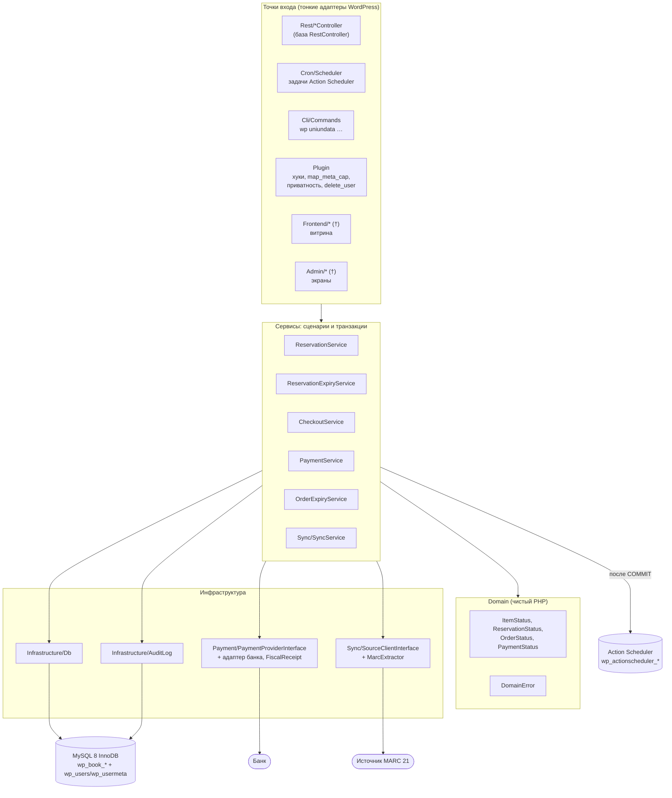
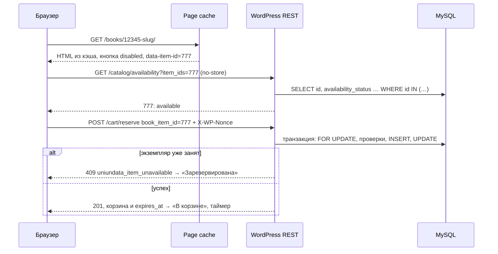

# 1. Архитектура плагина и выбор платформы

> **Решение.** Отдельный плагин `uniundata-books` без WooCommerce. Данные магазина хранятся в собственных
> InnoDB-таблицах (`sql/schema.sql`), пользователи — в `wp_users` с ролями и capabilities WordPress.
> Фоновые задачи выполняет Action Scheduler, подключённый composer-библиотекой
> (`woocommerce/action-scheduler`); его очередь запускает системный cron через WP-CLI. Витрина построена
> на rewrite rules и шаблонах поверх своих таблиц, без custom post type. Статус кнопки «Отложить» всегда
> приходит из некэшируемого REST-запроса.
> Платформа: WordPress 7.1, **PHP 8.3+** (у заказчика 8.3.27; код совместим и с 8.4), MySQL 8.0.16+
> (у заказчика 8.0.46).

## 1.1 Окружение и требования, которые определяют архитектуру

Окружение заказчика (по данным «Здоровья сайта»; настройки сервера — в [11-environment](11-environment.md)):

| Факт | Следствие для архитектуры |
|---|---|
| Магазин — **shop.libsmr.ru**, основной сайт — **new.libsmr.ru**. Мультисайт это или две установки, пока неизвестно | Плагин активируется только на сайте магазина и работает с `$wpdb->prefix` этого сайта (`wp_book_*` или `wp_N_book_*`). Варианты единого входа покупателя — [07](07-users-roles.md) § 7.13 |
| Оба сайта на одном сервере MySQL 8.0.46 | Имена `GET_LOCK` общие для всего сервера, поэтому плагин строит их только через `Db::lockName()` (§ 1.4). Имена CHECK и FK начинаются с имени таблицы и не конфликтуют даже в одной БД |
| Apache 2.4.52 + PHP-FPM 8.3.27 | Заголовок плагина `Requires PHP: 8.3`, синтаксис PHP 8.3. Заголовок `Authorization` (Application Passwords, подпись банка) доходит до PHP только при пробросе в `.htaccess` ([06](06-rest-api.md) § 6.5.4) |
| `max_execution_time` 30 с, `memory_limit` 256M | Долгие операции (синхронизация, пакетные пересчёты) выполняются шагами ≤ 25 с в Action Scheduler или в WP-CLI, но не в веб-запросе |
| Зона сервера +04:00 (Самара), `@@global.time_zone` = `SYSTEM` | В БД хранится только UTC: в SQL используется `UTC_TIMESTAMP(6)`, на время транзакций плагина ставится `time_zone = '+00:00'` (§ 1.4) |
| Постоянного объектного кэша нет | Корректность от кэша не зависит, rate limit работает на транзиентах (§ 1.7.3) |
| Вероятная юрисдикция — РФ | ПДн по 152-ФЗ: БД с ПДн в РФ, согласие отдельным документом ([07](07-users-roles.md) § 7.10). Фискальный чек по 54-ФЗ пробивает облачная касса провайдера: позиции чека плагин передаёт в `createSession()`/`refund()` (`Payment\FiscalReceipt`) |

Требования ТЗ и их следствия:

| Требование | Следствие |
|---|---|
| Экземпляр уникален и продаётся один раз | Вместо счётчика остатка — статус экземпляра. Он меняется под `SELECT … FOR UPDATE` и подкреплён UNIQUE и CHECK |
| Резерв ровно 1 час, лимит 3 попытки, история резервов | Таблица резервов с generated column «один активный на экземпляр» и `UNIQUE(user_id, book_item_id, attempt_no)`. Корзина — представление активных резервов, а не сессия |
| MARC 21, ежедневная синхронизация | Полная запись лежит в `marc21_raw`, поля витрины — в индексируемых колонках и FULLTEXT. Импорт идёт пакетами с upsert по внешнему ID и checksum и не перетирает локальные статусы |
| Специальный эквайринг | Адаптер банка за `PaymentProviderInterface`. Оплату подтверждает только подписанный webhook или опрос банка тем же кодом (`PaymentService::applyProviderResult()`). Поздний и двойной платёж — явные ветки с `needs_attention` и очередью возвратов `wp_book_refunds` |
| Публичный каталог под нагрузкой | HTML каталога кэшируется для гостей. Изменчивое состояние отдаёт отдельный REST-запрос с `no-store` |
| ПДн и сроки хранения | Минимум ПДн, снимок данных в заказе, обезличивание по сроку (`orders.pii_erased_at`) вместо удаления строк, экспортеры и эрейзер WordPress ([07](07-users-roles.md)) |

## 1.2 Слои



| Слой | Каталог | Ответственность | Чего в слое нет |
|---|---|---|---|
| Точки входа | `Rest/`, `Cron/`, `Cli/`, `Plugin.php`; (†) `Frontend/`, `Admin/` | Регистрация хуков и маршрутов, `permission_callback`, nonce, rate limit, валидация входа, перевод `DomainError` в `WP_Error` и HTTP-код, экранирование вывода | Бизнес-правил и транзакций (исключение — короткие обработчики удаления пользователя и сроков хранения ПДн в `Plugin`, [07](07-users-roles.md) § 7.11–7.12) |
| Сервисы | `Service/`, `Sync/SyncService.php` | Сценарий целиком: транзакции, порядок блокировок, перепроверка под блокировкой, аудит, постановка побочных эффектов в очередь после `COMMIT` | HTTP-ответов, `$_POST`, вывода HTML |
| Domain | `Domain/` | Backed enums статусов с таблицами допустимых переходов, `DomainError`. Чистый PHP без функций WordPress | `$wpdb`, хуков, «текущего времени»: время берётся из БД (`UTC_TIMESTAMP(6)`) |
| Инфраструктура | `Infrastructure/`, `Payment/`, `Sync/*Client*`, `Sync/MarcExtractor.php` | `Db` (транзакции, сессия, `GET_LOCK`), `AuditLog`, адаптеры банка и источника | Бизнес-решений |
| Установка | `Install/` | `Migrator` (версионные миграции, не `dbDelta`), `Roles` | Логики запросов |

Правила зависимостей:

1. **Транзакции открывают только сервисы.** Контроллер вызывает один метод сервиса, а метод состоит из
   одной или нескольких коротких `Db::transaction()`. Порядок блокировок един для всех операций:
   `(sync_runs, records) → carts → items → reservations → cart_items → orders → payments → payment_events
   → refunds`. Подробности и таблица «операция → что блокирует» — в [08](08-security-concurrency.md) § 8.2.
2. **Внутри транзакции нет HTTP-вызовов, писем и `do_action()` для чужого кода.** Чужой обработчик может
   сделать долгий запрос или свой `COMMIT` на том же соединении `$wpdb`, а тело транзакции при deadlock
   выполняется повторно. Публичные хуки плагина (`uniundata_after_order_paid`, `uniundata_alert`)
   вызываются из задач Action Scheduler после `COMMIT`.
3. **SQL пишется явно** через `$wpdb->prepare()` (обёртки `Db::execute()`/`getRow()`), без ORM. Для
   корректности важны конкретные `FOR UPDATE`, порядок блокировок и разбор ошибок 1062 и 3819, а ORM всё
   это прячет.
4. **Минимальный контейнер.** `Plugin` создаёт сервисы лениво: явные фабрики для сервисов с настройками
   (`ReservationService` получает `uniundata_reservation_minutes`) и autowiring по типам конструктора для
   остальных. Точки расширения — фильтры: адаптер банка — `uniundata_payment_provider`, источники
   каталога — `uniundata_sync_sources`, конвертер ISO 2709/MRK → MARCXML — `uniundata_marc_converter`.
5. **Сторонние composer-библиотеки** (например, `libphonenumber`) переносятся в свой namespace через
   Strauss или PHP-Scoper, иначе два плагина с разными версиями одной библиотеки ломают друг друга. Action
   Scheduler — исключение: он сам выбирает самую новую из загруженных копий.
6. **PHP 8.3+.** Целевой сервер — PHP 8.3.27, поэтому не используются возможности, которые появились только
   в 8.4: property hooks, asymmetric visibility, `new Foo()->bar()` без скобок, `array_find()` и другие
   новые функции. CI проверяет `php -l` на 8.3 и 8.4. Во всех файлах `declare(strict_types=1)`.

## 1.3 Структура плагина

```
uniundata-books/
├── uniundata-books.php        # заголовок (Requires PHP: 8.3), автозагрузка, Action Scheduler, activation hooks
│                              # (в репозитории примеров — src/uniundata-books.php)
├── uninstall.php (†)          # options и роли; таблицы заказов, продаж и платежей НЕ удаляет
├── composer.json              # PSR-4 "Uniundata\\Books\\": "src/", woocommerce/action-scheduler
├── sql/schema.sql             # каноническая схема, её выполняет Install\Migrator
├── vendor/                    # composer install --no-dev -o
├── templates/, blocks/, assets/ (†)   # шаблоны витрины, динамические блоки, JS кнопки «Отложить»
└── src/
    ├── Plugin.php             # bootstrap и контейнер; map_meta_cap; удаление пользователя; экспорт,
    │                          # эрейзер и сроки хранения ПДн
    ├── Domain/          DomainError, ItemStatus, ReservationStatus, OrderStatus, PaymentStatus
    ├── Infrastructure/  Db, AuditLog
    ├── Service/         ReservationService, ReservationExpiryService, CheckoutService, CheckoutRequest,
    │                    PaymentService, OrderExpiryService
    ├── Payment/         PaymentProviderInterface, PaymentSession, ProviderPaymentResult,
    │                    ProviderRefundResult, WebhookResult, FiscalReceipt, FiscalReceiptItem
    │                    (+ адаптер конкретного банка, подключается фильтром)
    ├── Sync/            SyncService, MarcExtractor, SourceClientInterface, SourceBatch
    ├── Install/         Migrator, Roles
    ├── Rest/            RestController (база), CatalogController, CartController, CheckoutController,
    │                    OrderController, PaymentWebhookController, AdminController
    ├── Cron/            Scheduler                 # постановка recurring-задач и обработчики всех задач
    ├── Cli/             Commands                  # wp uniundata sync|expire|privacy-retention|migrate|doctor
    ├── Frontend/ (†)    Storefront, SeoMeta, BookSitemapProvider
    └── Admin/ (†)       OrdersScreen, ItemsScreen, ReservationsScreen, SyncRunsScreen
```

(†) — модули целевой архитектуры, которые описаны в документации, но в PHP-примерах не реализованы.
Права (`map_meta_cap`) и приватность в примерах — методы `Plugin`. В рабочем коде их можно вынести в
классы `Security\Capabilities` и `Privacy\*` без изменения поведения.

## 1.4 Подключение к WordPress

### Главный файл

Полный текст — `src/uniundata-books.php`. Существенное:

```php
/**
 * Plugin Name:       Uniundata Books
 * Requires at least: 7.1
 * Requires PHP:      8.3
 */
declare(strict_types=1);
defined('ABSPATH') || exit;
define('UNIUNDATA_BOOKS_FILE', __FILE__);

require_once __DIR__ . '/vendor/autoload.php';
// Action Scheduler подключается файлом: он регистрирует свою версию, а на plugins_loaded
// инициализируется самая новая копия среди всех плагинов (WooCommerce и др.).
require_once __DIR__ . '/vendor/woocommerce/action-scheduler/action-scheduler.php';

register_activation_hook(__FILE__, ['Uniundata\\Books\\Plugin', 'activate']);
register_deactivation_hook(__FILE__, ['Uniundata\\Books\\Plugin', 'deactivate']);
add_action('plugins_loaded', ['Uniundata\\Books\\Plugin', 'boot'], 5);
```

Синтаксис главного файла намеренно простой: на старом PHP WordPress покажет «требуется PHP 8.3» по
заголовку `Requires PHP` и не упадёт с ParseError.

### Хуки и порядок инициализации

| Момент | Обработчик | Что делает | Почему здесь |
|---|---|---|---|
| `register_activation_hook` | `Plugin::activate()` → `installForSite()` | `Migrator::migrate(30)` под `GET_LOCK(Db::lockName('migrate'))`. Мигратор проверяет MySQL ≥ 8.0.16, что это не MariaDB, InnoDB, `utf8mb4_unicode_520_ci` и права пользователя БД (нужен `REFERENCES`). Затем `Roles::install()` и `add_option()` значений по умолчанию (существующие не перезаписываются). При сетевой активации — для каждого сайта через `switch_to_blog()` | Activation hook — единственный момент, когда администратор явно включает плагин. Ошибка окружения останавливает активацию понятным `wp_die()` |
| `plugins_loaded` (5) | `Plugin::boot()` | Если `uniundata_db_version` ниже версии кода — `migrate()` с ожиданием блокировки 30 с в CLI/cron и 5 с в вебе. При неудаче `schemaReady = false`: REST-маршруты не регистрируются, администратор видит уведомление, разовые задачи AS откладываются на 5 минут. Затем регистрируются остальные хуки | Activation hook **не вызывается** при обновлении файлами, автообновлении и деплое. Основной путь в продакшене — шаг деплоя `wp uniundata migrate`, проверка на `plugins_loaded` — страховка |
| `init` | `Roles::maybeUpgrade()`, `Plugin::registerUserMeta()`, `load_plugin_textdomain()` | Роли приводятся к карте capabilities, только если выросла `Roles::VERSION`. Регистрируется необязательная meta `middle_name` | `add_cap()` перезаписывает option `wp_user_roles`, поэтому синхронизация идёт по версии, а не на каждом запросе. На загрузку переводов раньше `init` WordPress 6.7+ пишет notice |
| `rest_api_init` | `*Controller::register_routes()` | `register_rest_route('uniundata/v1', …)` с `args` и обязательным `permission_callback`. Контроллер, который не удалось собрать, отключается, и его маршруты отдают 404. Например, без адаптера банка нет checkout, заказов и webhook, а каталог и корзина работают | Маршруты нужны только REST-запросу |
| `plugins_loaded` (из `boot`) | `Scheduler::register()` | Подписывает обработчики **всех** задач плагина (§ 1.7.2) и поднимает `action_scheduler_queue_runner_concurrent_batches` до 3 | Action Scheduler выполняет задачу через `do_action()`, поэтому обработчик должен быть подписан в каждом процессе: WP-CLI, WP-Cron, async runner |
| `action_scheduler_init` | `Scheduler::ensureRecurring()` | `as_schedule_recurring_action()` / `as_schedule_cron_action()` для повторяющихся задач, если их нет. Проверка — не чаще раза в 10 минут (транзиент), при смене `Scheduler::SCHEDULE_VERSION` задачи пересоздаются | До инициализации хранилища AS функции `as_*` ничего не планируют, поэтому делать это при активации бесполезно |
| `map_meta_cap` | `Plugin::mapMetaCap()` | `view_book_order` → `view_own_book_orders` (владелец) или `manage_book_orders`. `delete_user` → `do_not_allow`, если у покупателя есть заказ в `pending_payment`, `payment_processing` или `paid` | [07](07-users-roles.md) § 7.4, 7.12 |
| `delete_user`, `wpmu_delete_user` | `Plugin::onDeleteUser()`, `onDeleteNetworkUser()` | Снятие резервов, закрытие корзины, отмена неоплаченных заказов, задача `uniundata_user_deleted_cleanup` | [07](07-users-roles.md) § 7.12 |
| `wp_privacy_personal_data_exporters` / `_erasers` | `Plugin::exportProfile()`, `exportOrders()`, `erasePersonalData()` | Экспорт и обезличивание данных магазина | [07](07-users-roles.md) § 7.11 |
| `admin_notices` | `Plugin::adminNotices()` | Схема отстаёт или магазин не настроен (`Plugin::configProblems()`): нет валюты магазина, версий оферты и согласия, адаптера банка, Action Scheduler | Без этих настроек резерв, checkout или фоновые задачи отказывают, и администратор должен это видеть |
| WP-CLI | `Commands::register()` | `wp uniundata …` (§ 1.5 E) | `migrate` и `doctor` доступны и при отстающей схеме: именно ими её чинят |
| `wp_initialize_site` | `installForSite()` для нового сайта | Таблицы и роли нового сайта сети, если плагин активирован на всю сеть | Таблицы создаются с `$wpdb->prefix` сайта |
| `register_deactivation_hook` | `Plugin::deactivate()` | `as_unschedule_all_actions()` для повторяющихся задач | Таблицы, роли и данные **остаются**: деактивация обратима |
| `uninstall.php` (†) | — | Удаляет options и роли (`Roles::uninstall()`). Таблицы заказов, продаж и платежей удаляет только явная WP-CLI-команда с подтверждением | Бухгалтерские данные не должны исчезать от кнопки «Удалить плагин» |
| `query_vars`, `template_redirect`, `template_include`, `posts_pre_query` (†) | `Frontend\Storefront` | Виртуальные страницы каталога и книги (§ 1.7.1). `flush_rewrite_rules()` — при активации и деактивации | — |

### Соединение с MySQL и `Db`

У WordPress одно соединение `$wpdb` на PHP-процесс, общее с ядром и другими плагинами. Поэтому `Db`
не меняет сессию насовсем (подробности — в docblock `Db::transaction()` и в
[08](08-security-concurrency.md) § 8.2):

- **Транзакция.** `Db::transaction(callable $fn, ?int $maxRetries = null)` запоминает `time_zone`,
  `sql_mode` и `innodb_lock_wait_timeout` сессии и ставит `'+00:00'`, `STRICT_TRANS_TABLES` и 5 с. Перед
  каждым `START TRANSACTION` выполняется `SET TRANSACTION ISOLATION LEVEL READ COMMITTED` — он действует
  только на ближайшую транзакцию. После `COMMIT` или `ROLLBACK` прежние значения возвращаются. На время
  транзакции автопереподключение `$wpdb` выключено: после обрыва связи запросы не должны молча
  продолжаться в autocommit.
- **Повторы.** При 1213 (deadlock) и 1205 (lock wait timeout) функция выполняется заново с паузой 50–200 мс:
  2 повтора в REST-запросе (`Db::RETRIES_WEB`), 3 — в cron и CLI (`Db::RETRIES_BACKGROUND`). Когда
  повторы исчерпаны, клиент получает 503 `uniundata_conflict_retry`.
- **Deadlock не исключён.** Порядок блокировок убирает циклы между операциями, но InnoDB ставит
  gap-блокировки при проверке UNIQUE и в READ COMMITTED. Например, при одновременном закрытии и создании
  открытой корзины одного пользователя возникает редкий 1213 на `uq_carts_one_open_per_user`
  ([10](10-scenarios.md), S8.7e). Инварианты при этом не нарушаются, транзакция повторяется целиком.
  Поэтому `$fn` содержит только запросы к БД.
- **Вложенный вызов** `transaction()` присоединяется к текущей транзакции: счётчик глубины, без SAVEPOINT.
  Исключение во вложенном вызове делает транзакцию rollback-only.
- **Любая запись плагина идёт с теми же настройками.** `Db::execute()` вне транзакции сам открывает
  `Db::transaction()`, поэтому `DEFAULT CURRENT_TIMESTAMP(6)` и `ON UPDATE` всегда пишут UTC. Блокирующее
  чтение (`FOR UPDATE`) вне транзакции завершается `LogicException`.

**Именованные блокировки.** Имена `GET_LOCK` глобальны для всего сервера MySQL, а на сервере заказчика
живут и new.libsmr.ru, и shop.libsmr.ru (а в мультисайте — все сайты сети). Поэтому все имена строятся
одной функцией:

```php
// 'expire_orders' → 'uniundata_expire_orders@1a2b3c4d5e6f' (≤ 64 символов)
Db::lockName($name) === 'uniundata_' . $name . '@' . substr(md5(DB_NAME . '|' . $wpdb->prefix), 0, 12);
```

Плагин использует имена `migrate`, `expire_reservations`, `expire_orders`, `abandon_carts` и
`sync_<source>`. Ждать `GET_LOCK` внутри транзакции нельзя, `Db::getLock()` в этом случае бросает
`LogicException`: ожидание именованной блокировки с удержанием строк InnoDB не видит детектор deadlock-ов.

**Сервер.** Рекомендуется `default-time-zone = '+00:00'` (сейчас `SYSTEM`, то есть +04:00). Тогда UTC
получат и записи в обход плагина: ручной SQL, `wp db query`. Настройка глобальная для обоих сайтов, поэтому
перед включением нужно проверить сторонний код с `NOW()` ([11](11-environment.md) § 11.2.2).

## 1.5 Жизненный цикл запросов

**A. Гость открывает карточку книги** `GET /books/12345-voyna-i-mir/` (†)

1. Page cache отдаёт HTML из кэша, если он есть (гость без cookie `wordpress_logged_in_*`).
2. При промахе кэша rewrite rule `^books/([0-9]+)(?:-([^/]+))?/?$` даёт `uniundata_record=12345`, а
   `posts_pre_query` отменяет пустой основной `WP_Query`. Запись и экземпляры читаются по первичному ключу
   и индексам. Неканонический slug получает 301.
3. Шаблон выводит данные MARC с экранированием, JSON-LD `Book`/`Offer` и кнопку экземпляра с
   `data-item-id`. Кнопка неактивна (`disabled`, `aria-busy="true"`), пока не придёт статус.
4. JS запрашивает `GET /wp-json/uniundata/v1/catalog/availability?item_ids=…` (`no-store`) и включает
   кнопку или меняет её текст (§ 1.7.4).

**B. Пользователь нажимает «Отложить»** `POST /wp-json/uniundata/v1/cart/reserve`

1. Cookie-аутентификация проверяет `X-WP-Nonce` (`wp_rest`). Без nonce запрос анонимен (user 0), с неверным
   nonce WordPress сразу отвечает 403 `rest_cookie_invalid_nonce`.
2. WordPress проверяет `args` (`book_item_id`: integer ≥ 1), затем `permission_callback`
   (`RestController::requireCapability('reserve_books')`): 401 `uniundata_auth_required` или 403
   `uniundata_forbidden`. Rate limit — 20 запросов в минуту на пользователя и 60 на IP, иначе 429.
3. `ReservationService::reserve(get_current_user_id(), $itemId)` выполняет одну транзакцию. Открытая
   корзина блокируется `FOR UPDATE` или создаётся через `INSERT … ON DUPLICATE KEY UPDATE`. Проверяется
   лимит активных резервов (`uniundata_max_active_reservations`). Экземпляр блокируется `FOR UPDATE`;
   если у пользователя уже есть свой активный резерв, ответ идемпотентный. Затем проверяются статус,
   валюта магазина и лимит попыток, выполняются `INSERT` резерва и позиции, `UPDATE` статуса и аудит,
   и транзакция фиксируется. Алгоритм — [05-algorithms](05-algorithms.md).
4. Ответ 201 (или 200 при повторе) с корзиной и `expires_at` в формате `Db::toIso8601()` и заголовком
   `Cache-Control: no-store`. `DomainError` превращается в `WP_Error` с кодом из контракта: 409
   `uniundata_item_unavailable`, `uniundata_reservation_limit_reached`, `uniundata_active_reservation_limit`,
   а также 429 и 503.

**C. Webhook банка** `POST /wp-json/uniundata/v1/payment/webhook` (`PaymentWebhookController`)

1. `permission_callback` — `permitWebhook()`: транспортный фильтр без побочных эффектов. Если задана
   константа `UNIUNDATA_WEBHOOK_ALLOWED_IPS` (IP или CIDR через запятую), запрос с чужого IP получает 403,
   иначе фильтр пропускает всех. Nonce и cookie здесь неприменимы: у банка нет сессии WordPress.
2. `handle()`: если с этого IP за минуту уже было 20 отклонённых доставок (401/400/413), ответ 429 без
   разбора тела; при включённом allowlist этот лимит не применяется.
   Иначе вызывается `PaymentService::handleWebhook($request->get_body(), $request->get_headers())`.
   Первый шаг — проверка подписи по **сырому** телу (`verifyWebhook()` адаптера), до любой записи в БД.
   Затем событие пишется в inbox `wp_book_payment_events`: при дубле по UNIQUE `(provider,
   provider_event_id)` ответ 200 без действий. Дальше — транзакция в порядке блокировок
   `items → order → payments → payment_event` и `COMMIT`.
3. После `COMMIT` ставятся задачи Action Scheduler: `uniundata_order_paid {order_id}`. При конфликте
   добавляются `uniundata_refund_payment {refund_id}` (строка `wp_book_refunds` вставлена в той же
   транзакции, что и решение о возврате) и `uniundata_order_needs_attention {order_id, reason}`.
4. Коды ответа: 200 — обработано или дубль; 400 — тело не разбирается; 401 — подпись; 403 — allowlist;
   413 — тело больше 64 КБ; 429; 500 или 503 — временная ошибка, банк повторит доставку
   ([06](06-rest-api.md) § 6.5).

**D. Фоновые задачи.** Системный cron раз в минуту запускает `wp action-scheduler run --group=uniundata`.
Action Scheduler забирает (claim) созревшие задачи и вызывает, например,
`do_action('uniundata_expire_reservations')`. Обработчик `Scheduler::expireReservations()` вызывает
`ReservationExpiryService::expireDue(200)` под `GET_LOCK(Db::lockName('expire_reservations'))`. Каждый
резерв обрабатывается в своей короткой транзакции с перепроверкой под блокировкой. Если пакет заполнен
целиком, сразу ставится догоняющий проход.

**E. WP-CLI.** Команды `wp uniundata sync run|status|reextract`, `expire`, `privacy-retention`,
`migrate [--rebuild-fulltext]` и `doctor` работают без `max_execution_time` и используют те же сервисы,
что и задачи Action Scheduler. `doctor` проверяет схему, настройки и инварианты данных и при нарушениях
завершается с кодом 1 (для мониторинга).

## 1.6 WooCommerce + кастомное резервирование или отдельный плагин

Сравниваются два варианта:

- **WC** — WooCommerce, где каждый экземпляр — simple product с `_manage_stock=yes`, `_stock=1`,
  `_sold_individually=yes`. Резервы и MARC хранятся в своих таблицах, заказы — в HPOS, оплата — через
  `WC_Payment_Gateway`.
- **Custom** — плагин из этого документа: свои таблицы каталога, резервов, корзины, заказов и платежей,
  Action Scheduler как библиотека.

| Критерий | WooCommerce + кастомное резервирование | Custom plugin + Action Scheduler |
|---|---|---|
| **Модель экземпляра и stock** | Экземпляр — товар: `wp_posts`, десятки строк `wp_postmeta` и `wc_product_meta_lookup`. Stock — счётчик, а не статус. Состояний `reserved`, `checkout_pending`, `sync_missing`, `blocked` нет: их приходится кодировать через `_stock_status`, `post_status` и meta. Получаются **два источника истины** — stock WC и таблица резервов, — и расхождение между ними даёт «призрачные» продажи и блокировки. Ограничений уровня БД («один активный резерв», «одна продажа») нет | Строка `wp_book_items` с `availability_status` и CHECK — единственный источник истины и мьютекс экземпляра. Инварианты продублированы UNIQUE и generated columns ([03](03-tables-and-indexes.md) § 6) |
| **Заказы (HPOS)** | Наши поля (`public_order_id`, `payment_due_at`, `needs_attention`, `checkout_request_id`) попадают в `wc_orders_meta`: EAV без CHECK и составных UNIQUE. Работать можно только через CRUD (`wc_get_order()`, `$order->save()`). `$order->update_status()` синхронно вызывает хуки, письма и чужие плагины, поэтому включить его в транзакцию с `FOR UPDATE` нельзя | `wp_book_orders` с нужными колонками, CHECK итоговой суммы, `UNIQUE(public_order_id)` и `UNIQUE(user_id, checkout_request_id)`. Переходы статусов — в транзакции, побочные эффекты — после `COMMIT` |
| **Корзина** | Сессионная корзина (`woocommerce_sessions`, persistent cart в usermeta) ничего не резервирует. Позиции с истёкшим резервом возвращаются из persistent cart, их надо вычищать хуками. Интеграцию нужно делать дважды: для классического checkout и для блочного (Store API, по умолчанию в новых магазинах). Cookie корзины выключает page cache для посетителя | Корзина — `wp_book_carts`/`wp_book_cart_items`, жёстко связанные с резервами, только для вошедших. `GET /cart` только читает и резерв не продлевает |
| **Резерв 1 час и лимит 3** | Встроенный hold stock (`wc_reserved_stock`, 60 мин) держит остаток **с момента checkout**, а не по кнопке «Отложить». Попыток на пользователя нет. Таблицу резервов, лимит и expiry всё равно пишем с нуля, а WC добавляет только поверхность интеграции | Реализуется прямо по контракту: `FOR UPDATE` экземпляра, `UNIQUE(user_id, book_item_id, attempt_no)`, `CHECK (attempt_no BETWEEN 1 AND 3)` |
| **MARC 21 и синхронизация** | Поддержки нет. MARC, авторы и FULLTEXT всё равно живут в своих таблицах, а товары WC их дублируют. Импорт через CRUD или REST batch (≤ 100 объектов за запрос) — это десятки запросов и хуков на товар. Синхронизация не должна трогать товары в «наших» статусах — ещё одна точка рассинхронизации | Upsert пакетами в `wp_book_records`/`wp_book_items` по `(source_name, external_id)` и checksum, `last_seen_sync_run_id` для поиска пропавших. `wp_posts` не растёт |
| **Эквайринг и 54-ФЗ** | Сильная сторона WC в РФ: у многих эквайеров (ЮKassa, Т-Банк, Сбер, Робокасса и др.) есть модули для WooCommerce с чеками 54-ФЗ и возвратом из админки. Но поздний и двойной платёж, `needs_attention` и сверка суммы по контракту потребуют форка или обёртки чужого модуля | `PaymentProviderInterface` (`createSession`, `fetchPayment`, `verifyWebhook`, `cancelSession`, `refund`) и адаптер конкретного банка. Позиции чека передаются в `createSession()` и `refund()` (`FiscalReceipt`, ставка НДС — option `uniundata_receipt_vat` и фильтр). Идемпотентность, поздние и двойные платежи, очередь возвратов — под нашим контролем. Адаптер и кнопку возврата в админке пишем сами |
| **Налоги, письма, админка** | Готовые налоговые классы, шаблоны писем, экран заказов, возвраты, «Мой аккаунт», купоны, доставка, аналитика, выгрузки в учётные системы | Делаем сами: экраны `WP_List_Table` (заказы, экземпляры, резервы, прогоны синхронизации), 5–7 писем через `wp_mail`, страницы аккаунта. Налоговую логику и документы ведёт бухгалтерская система, плагин хранит факты (`prices_include_tax`, суммы, снимки) |
| **Обновления и совместимость** | Ежемесячные релизы WC, а наша интеграция затрагивает самые изменчивые части: корзину, checkout, stock, статусы и шлюз (последние примеры — HPOS и блочный checkout по умолчанию). Каждое обновление WC и расширений требует регрессии резерва и оплаты | Зависимость только от стабильных API ядра: REST, роли, rewrite, privacy, `$wpdb`. Версия Action Scheduler закреплена в `composer.lock` |
| **Производительность** | WC загружается на каждом запросе, посетителю с корзиной поднимается сессия. 10⁵ экземпляров — это 10⁵ записей `wp_posts` и миллионы строк postmeta. Фильтры каталога идут через `WP_Query` и meta/lookup | Каталог — индексированные запросы и FULLTEXT. Страницы гостей кэшируются целиком, статус экземпляров выбирается по первичному ключу, резерв — одна транзакция примерно из 10 запросов |
| **Стоимость** | Старт сопоставим: синхронизация MARC, резервы, лимит, expiry и адаптер банка пишутся в обоих вариантах, а WC добавляет слой интеграции (два пути checkout, маппинг статусов, HPOS). Поддержка дороже: регрессия на релизы WC и сверка двух источников истины | Дороже на админке, письмах и документах, дешевле на интеграции, которой нет. Бизнес-логика тестируется на реальном MySQL без WC. Риск — знания сосредоточены в одной команде, его снижают документация и тесты |

### Рекомендация

**Custom plugin + Action Scheduler.** Ключевые требования ТЗ лежат вне модели WooCommerce: резерв
уникального экземпляра по кнопке, лимит попыток, MARC 21 с ежедневной синхронизацией, особый жизненный
цикл платежа. В варианте с WC их всё равно пришлось бы писать с нуля, только поверх чужой модели stock,
сессии и заказа. Это дало бы два источника истины и транзакции, которые нельзя объединить. Готовые части
WC (письма, админка, налоги) дешевле воспроизвести в объёме этого магазина, чем поддерживать интеграцию с
ядром WC при ежемесячных релизах. Action Scheduler берём из экосистемы WC как отдельную библиотеку: это
проверенная очередь с журналом, claim-механизмом и экраном «Инструменты → Запланированные действия».

**Когда WooCommerce всё-таки лучше:**

- в первой версии обязательны купоны, расчёт доставки, несколько способов оплаты с готовыми модулями;
- ассортимент становится смешанным (новые книги с остатком больше 1, подарочные карты), и модель «один
  экземпляр — одна продажа» перестаёт быть основной;
- у банка есть поддерживаемый WC-модуль с чеками 54-ФЗ, и бизнес согласен на стандартный жизненный цикл
  заказа WC без поздних платежей и `needs_attention`;
- каталог небольшой (единицы тысяч экземпляров), синхронизация редкая, а у команды уже есть отлаженный
  стек WooCommerce;
- нужны готовые интеграции экосистемы (маркетплейсы, CRM, учётные системы), и менеджеры уже работают в
  админке WC.

**Гибрид отклонён.** Вариант «наш каталог и резервы + WC только для заказов и оплаты» оставляет два
источника истины по заказу и требует согласовывать статусы резерва и заказа WC в разных транзакциях, а
своя корзина всё равно нужна. Выгрузку оплаченных заказов в учётную систему делают задачи Action
Scheduler без WC.

## 1.7 Где и почему применять механизмы WordPress

| Механизм | Что используем | Почему | Чего **не** делаем |
|---|---|---|---|
| **Options** | Служебные версии: `uniundata_db_version`, `uniundata_roles_version`, `uniundata_schedule_version`. Настройки: `uniundata_currency` (валюта магазина, ISO 4217, без значения по умолчанию — её выбирает администратор), `uniundata_payment_ttl_minutes` (30), `uniundata_payment_grace_minutes` (10), `uniundata_reservation_minutes` (60, менять только вместе с бизнес-правилами), `uniundata_max_active_reservations` (10), `uniundata_receipt_vat`. Редко читаемые — с `autoload = false`: `uniundata_sync_source`, `uniundata_terms_versions` (версия и SHA-256 текстов оферты и согласия, [07](07-users-roles.md) § 7.8) | Настройки сайта: единицы значений, меняются редко, `get_option()` читает их из кэша `alloptions` без запроса | Изменчивое конкурентное состояние (блокировки, счётчики, статус синхронизации): у `update_option()` нет блокировки строки. Секреты — § 1.8 |
| **wp_usermeta** | `first_name`, `last_name` ядра, необязательная `middle_name`, служебная метка `uniundata_erasure_requested_at` | Это профиль WordPress: он виден в «Профиле», экспортируется ядром и удаляется вместе с пользователем | Поиск, фильтры и историю: `meta_value` — LONGTEXT без индекса. Телефон, адреса и реквизиты лежат в `wp_book_customer_profiles` ([07](07-users-roles.md) § 7.7) |
| **Custom post type** | В v1 **не используем** (§ 1.7.1). Позже, если понадобится, — разреженный редакционный CPT для отдельных книг | — | CPT-товары и CPT-заказы: EAV-postmeta без FK, UNIQUE и CHECK, а `wp_insert_post()` медленный и вызывает чужие хуки |
| **Custom tables** | Каталог, экземпляры, резервы, корзины, заказы, платежи, возвраты, продажи, синхронизация, аудит, профиль, согласия (`sql/schema.sql`) | Блокировки строк, UNIQUE на generated columns, CHECK, FK между своими таблицами, деньги в INT, составные индексы и FULLTEXT. Только так инварианты гарантирует БД | FK на `wp_users` ([07](07-users-roles.md) § 7.12) и `dbDelta()` ([09](09-migrations-tests-edge-cases.md) § 9.1) |
| **WooCommerce** | Не используется (§ 1.6) | — | Если WC установлен для других задач, плагин с ним сосуществует: свои таблицы и роли (роль `customer` не используем), общий Action Scheduler (работает самая новая копия) |
| **Action Scheduler** | Повторяющиеся задачи, шаги синхронизации, побочные эффекты после `COMMIT` (§ 1.7.2) | Каждая задача — строка с логом, статусом и повтором. Claim не даёт двум раннерам выполнить одну задачу. Есть экран в админке | Не считаем его гарантией однократного эффекта: обработчики идемпотентны |
| **Системный cron + WP-CLI** | `DISABLE_WP_CRON`, crontab раз в минуту запускает раннер Action Scheduler ([11](11-environment.md) § 11.2.3). Первичный импорт — `wp uniundata sync run` | WP-Cron срабатывает только при визитах и выполняется внутри HTTP-запроса посетителя с лимитом 30 с | Корректность от точности cron не зависит: сроки сравниваются с `UTC_TIMESTAMP(6)` в каждой операции |
| **Объектный кэш** | Если появится: карточки записей, списки и фасеты каталога, счётчики rate limit | Снимает нагрузку чтения с MySQL | Ничего, по чему принимается решение о резерве, checkout или оплате |
| **Page cache / CDN** | HTML каталога и карточек для гостей | Каталог — основная нагрузка, а он одинаков для всех гостей | `/wp-json/uniundata/*`, корзину, checkout, аккаунт, страницу возврата из банка и страницы вошедших не кэшируем |
| **Transients** | Счётчики rate limit без постоянного объектного кэша (на shop.libsmr.ru его нет) | — | Резервы, блокировки, идемпотентность: транзиент может исчезнуть в любой момент |

### 1.7.1 Витрина: rewrite rules + шаблоны на custom tables (†)

Нужны индексируемые страницы книг: человекочитаемый URL, title и description, canonical, sitemap,
JSON-LD. Рассмотрены два варианта.

| | **A. Rewrite rules + шаблон на custom tables** (выбран) | **B. Тонкий CPT-прокси** (пост на каждую `wp_book_records`) |
|---|---|---|
| Источник истины | Один: `wp_book_records`/`wp_book_items` | Два: таблицы и `wp_posts` (slug, title, статус), их надо синхронизировать |
| Ежедневная синхронизация | Только upsert в свои таблицы | Плюс `wp_insert_post()`/`wp_update_post()` на каждую изменённую запись: хуки всех плагинов, переиндексация SEO-плагинов, ревизии. На 10⁵ записей импорт долгий и хрупкий |
| SEO, sitemap | Своя интеграция: `pre_get_document_title`, meta description, canonical и Open Graph в `wp_head`, JSON-LD, провайдер карты сайта `wp_register_sitemap_provider()` | Работает из коробки |
| Проданные книги | Страница остаётся (200, «Продано», `schema.org/SoldOut`) | Нужно решать судьбу поста |

**Выбран вариант A.** Один источник истины и синхронизация без `wp_insert_post()` перевешивают
примерно сотню строк своей SEO-интеграции. Слой `Frontend/` изолирован, поэтому переход на B позже не
затронет домен и схему. Редакционный текст к отдельным книгам — разреженный CPT `uniundata_book_page`,
связанный meta `_uniundata_record_id`.

Реализация:

- **URL** `/books/{record_id}-{slug}/`. Авторитетен `record_id`, slug декоративный (из `title`, с
  транслитерацией кириллицы). Несовпадение slug даёт 301 на канонический URL, поэтому смена названия при
  синхронизации не ломает ссылки, а колонка slug в схеме не нужна. Каталог и поиск —
  `/books/?q=…&author=…&year=…` (FULLTEXT `ft_records_main`/`ft_records_all`). Базовый путь витрины
  настраиваемый: правило `top` перекрывает страницу WordPress с тем же slug.
- **Rewrite** — `add_rewrite_rule()` на `init` и `query_vars`. `flush_rewrite_rules()` вызывается только при
  активации и деактивации. `posts_pre_query` возвращает `[]` для основного запроса с `uniundata_record`.
  Неактивная запись — `set_404()`.
- **Шаблоны.** Для классических тем — `templates/single-book.php`, переопределяемый темой. Для блочных —
  `register_block_template()` и динамические блоки `uniundata/book-card` и `uniundata/reserve-button`.
- **Показ экземпляров:** `available` → «Отложить»; `reserved`/`checkout_pending` → «Зарезервирована»;
  `sold` → «Продано»; `withdrawn`/`blocked`/`sync_missing` → «Нет в продаже». Публичные статусы укрупнены,
  чтобы не раскрывать внутренние состояния.

### 1.7.2 Action Scheduler и системный cron

Все задачи — в группе `uniundata`. Постановку повторяющихся задач и обработчики держит `Cron\Scheduler`.

| Hook | Тип и расписание (UTC) | Аргументы | Что делает |
|---|---|---|---|
| `uniundata_expire_reservations` | recurring, 60 с | — | `ReservationExpiryService::expireDue(200)` |
| `uniundata_expire_orders` | recurring, 60 с | — | `OrderExpiryService::expireDue(100)`: опрашивает банк вне транзакции, затем закрывает просроченные заказы |
| `uniundata_sync_daily` | cron `15 3 * * *` | `[triggered_by, source, attempt]`: cron — без аргументов, ручной запуск — `['admin', source]`, повтор после сбоя — `['retry', source, n]` | Первый шаг прогона `SyncService::run()`, ≤ 25 с |
| `uniundata_sync_continue` | async | `{source, run_id}` | Следующий шаг того же прогона |
| `uniundata_sync_alert` | async | `{run_id, code}` | Письмо оператору и `do_action('uniundata_alert', …)` |
| `uniundata_abandon_carts` | cron `40 4 * * *` | — | Пустые корзины без активности 30 дней → `abandoned` |
| `uniundata_privacy_retention` | cron `10 2 * * *` | — | `Plugin::privacyRetention()`: сроки хранения ПДн ([07](07-users-roles.md) § 7.11) |
| `uniundata_order_paid` | async, после `COMMIT` | `{order_id}` | Письмо покупателю (повтор отсекает запись аудита `notification.order_paid`), затем WP-хук `uniundata_after_order_paid` для документов, CRM и сброса page cache карточки |
| `uniundata_refund_payment` | async, после `COMMIT` | `{refund_id}` | `PaymentService::processRefund()`: `FOR UPDATE` строки возврата; если `status = 'requested'` — вызов банка вне транзакции с `idempotency_key` возврата |
| `uniundata_order_needs_attention` | async | `{order_id, reason}` | Письмо менеджеру заказов (номер и статус, без ПДн) и `uniundata_alert` |
| `uniundata_user_deleted_cleanup` | async | `{user_id}` | `Plugin::cleanupDeletedUser()` ([07](07-users-roles.md) § 7.12) |

Action Scheduler передаёт аргументы **позиционно** (`do_action_ref_array($hook, array_values($args))`),
поэтому сигнатуры обработчиков повторяют порядок ключей в местах постановки.

**Флаг `unique` — не защита от дублей.** Его семантика зависит от версии библиотеки. В 3.9 проверяются
только hook и group, без аргументов, и проверка не атомарна. В 4.2 проверяются hook, group и args через
колонку `unique_key` с UNIQUE-индексом. Поэтому:

- `unique = true` ставится только там, где потеря «лишней» задачи безвредна: recurring-задачи без
  аргументов и догоняющий проход expiry;
- задачи с аргументами (`order_id`, `refund_id`) ставятся без `unique`. Исключение допустимо, только если
  в `composer.json` закреплена версия `^4.2`. Работает самая новая из загруженных копий, поэтому другой
  плагин может только поднять версию, но не опустить её;
- однократность эффекта обеспечивают обработчики. Возврат идемпотентен по статусу строки
  `wp_book_refunds` и `idempotency_key` у банка, письмо — по записи аудита, expiry и синхронизация — по
  перепроверке под `FOR UPDATE` и `GET_LOCK(Db::lockName(…))`.

**Cron.** В `wp-config.php` — `define('DISABLE_WP_CRON', true)`, а системный cron раз в минуту запускает
`wp action-scheduler run --group=uniundata` (crontab для shop.libsmr.ru — [11](11-environment.md)
§ 11.2.3). Ежедневную синхронизацию запускает задача `uniundata_sync_daily`. Отдельная строка crontab с
`wp uniundata sync run` нужна только для первичного импорта или ручного прогона, иначе за сутки пройдут два
полных прохода. Если шаги синхронизации задерживают expiry, добавляется выделенный раннер:

```cron
* * * * * flock -n /tmp/uniundata-expiry.lock wp --path=/var/www/shop action-scheduler run --hooks=uniundata_expire_reservations,uniundata_expire_orders --quiet
```

- Раннер WP-CLI не стартует, если число одновременных claim-ов достигло
  `action_scheduler_queue_runner_concurrent_batches`. `Scheduler` поднимает этот лимит до 3. Параллельные
  раннеры безопасны: задачу забирает один claim, а сервисы перепроверяют состояние под блокировками.
- Синхронизация не выполняет импорт одной задачей. Каждый шаг укладывается в 25 с: это меньше
  `max_execution_time` (30 с) и таймаута claim-а. Шаг сохраняет `source_cursor`, и следующий шаг ставится
  задачей `uniundata_sync_continue`. Упавший прогон через 15 минут продолжается с курсора (до 3 повторов).
- Точность cron на корректность не влияет: checkout сравнивает `expires_at` с `UTC_TIMESTAMP(6)`. Другие
  покупатели видят «Зарезервирована» не дольше 1–2 минут после истечения резерва.
- Мониторинг: `wp uniundata doctor` (проверки `reservation_overdue_10min`, `order_overdue_10min`,
  `refund_stuck_1day`, `sync_run_stale`) и `failed`-задачи группы `uniundata`. Завершённые задачи AS хранит
  30 дней (фильтр `action_scheduler_retention_period`).

### 1.7.3 Объектный кэш

- На shop.libsmr.ru постоянного объектного кэша нет, и всё работает корректно: кэш — только оптимизация.
  Счётчики rate limit живут в транзиентах ([06](06-rest-api.md) § 6.6).
- Если Redis появится, кэшируются данные карточки записи (ключ `record:{id}:v{catalog_ver}`, группа
  `uniundata`), списки и фасеты с TTL 60–300 с. После каждого пакета синхронизации `catalog_ver`
  увеличивается, и старые ключи перестают читаться без массового удаления.
- **Статус экземпляра в кэш не попадает.** Он меняется чаще всего, а неверное значение особенно дорого.
  `GET /catalog/availability` — выборка до 100 строк по первичному ключу. Сервисы резерва, checkout, webhook
  и expiry читают статус только из БД под `FOR UPDATE`.

### 1.7.4 Page cache и актуальный статус кнопки «Отложить»

HTML каталога может отставать на минуты, поэтому кнопка никогда не берёт статус из HTML.



Правила (реализация JS-клиента — [06](06-rest-api.md) § 6.7–6.8):

1. **Кэшируемый HTML** выводит кнопку в нейтральном состоянии (`disabled`, `aria-busy`) с `data-item-id`.
   Статус на момент генерации используется только для текста без JS и для JSON-LD. После продажи
   страницу записи сбрасывает в page cache обработчик хука `uniundata_after_order_paid`.
2. **`GET /catalog/availability`** — публичный маршрут без персональных данных. Он явно ставит
   `Cache-Control: no-store`: по умолчанию WordPress шлёт no-cache-заголовки в REST только вошедшим. Page
   cache и CDN не кэшируют `/wp-json/*` и `?rest_route=`.
3. **Nonce не встраивается в HTML**: страница могла прийти из кэша, и nonce оказался бы чужим или
   просроченным. JS получает его отдельным некэшируемым запросом `admin-ajax.php?action=rest-nonce` (для
   гостя ответ — `0`). На 403 `rest_cookie_invalid_nonce` JS один раз обновляет nonce и повторяет запрос.
4. **Персональное состояние** («в вашей корзине, осталось 42:10») JS вошедшего пользователя берёт из
   `GET /cart`.
5. **Обновление статуса** — при загрузке, на `pageshow` (возврат из bfcache), на `visibilitychange` →
   visible и после любого 409 или 410 от `reserve`.
6. **Последнее слово за сервером.** Даже если UI ошибся (старый статус, двойной клик, две вкладки),
   транзакция резерва ответит 409 или идемпотентным 200.

## 1.8 Где хранить секреты

| Секрет | Где | Как читается |
|---|---|---|
| Ключ API банка, merchant ID, секрет подписи webhook (и предыдущий — на время ротации), клиентский сертификат mTLS, CA-bundle банка | Константы в `wp-config.php` магазина, значения — из окружения пула PHP-FPM (`env[UNIUNDATA_BANK_API_KEY] = …` в конфиге пула; при `clear_env = yes` без этого переменная до PHP не дойдёт). Файлы — вне docroot, права `0400` | Адаптер банка получает значения при создании в фильтре `uniundata_payment_provider`. Если константы нет, адаптер не создаётся: маршруты оплаты отключены, администратор видит уведомление. Отката к options нет |
| Токен API источника MARC | То же | Клиент источника в фильтре `uniundata_sync_sources` |
| IP allowlist банка (не секрет, но конфигурация безопасности) | `UNIUNDATA_WEBHOOK_ALLOWED_IPS` в `wp-config.php` | `PaymentWebhookController::permitWebhook()` |
| Соли WordPress и доступ к БД | `wp-config.php` | Смена солей инвалидирует все сессии и nonce |

```php
// wp-config.php магазина: значения приходят из окружения пула FPM и не попадают в репозиторий и БД
define('UNIUNDATA_BANK_API_KEY',                 getenv('UNIUNDATA_BANK_API_KEY') ?: '');
define('UNIUNDATA_BANK_WEBHOOK_SECRET',          getenv('UNIUNDATA_BANK_WEBHOOK_SECRET') ?: '');
define('UNIUNDATA_BANK_WEBHOOK_SECRET_PREVIOUS', getenv('UNIUNDATA_BANK_WEBHOOK_SECRET_PREVIOUS') ?: '');
define('UNIUNDATA_SOURCE_API_TOKEN',             getenv('UNIUNDATA_SOURCE_API_TOKEN') ?: '');
define('UNIUNDATA_WEBHOOK_ALLOWED_IPS',          '203.0.113.0/24');   // из документации банка
define('WP_ENVIRONMENT_TYPE',                    getenv('WP_ENVIRONMENT_TYPE') ?: 'production');
```

Имена `UNIUNDATA_BANK_*` — пример: набор констант определяет адаптер конкретного банка.

Почему **не `wp_options`**:

- options с autoload загружаются в память на каждом запросе и попадают в объектный кэш;
- options уходят в дампы: бэкапы, копии для разработчиков и staging. Staging с боевым ключом может
  создавать реальные платежи, а поддельный webhook будет подписан верным секретом;
- их видят все плагины и администраторы с `manage_options`, а плагины миграции и экспорта настроек
  выгружают их целиком. Если new.libsmr.ru и shop.libsmr.ru — одна сеть, это ещё и администраторы
  основного сайта.

Дополнительные правила:

- На не-продакшен окружении (`wp_get_environment_type() !== 'production'`) адаптер отказывается работать
  с боевыми ключами (признак боевого ключа зависит от банка).
- Подпись webhook проверяется текущим секретом, а при неудаче — предыдущим (окно ротации). После ротации
  `…_PREVIOUS` очищается.
- Секреты, заголовки `Authorization` и подписи никогда не пишутся в лог, аудит и `payload_redacted`.
- В `wp_options` допустимы только несекретные настройки: URL API источника, размер пакета, TTL оплаты.
