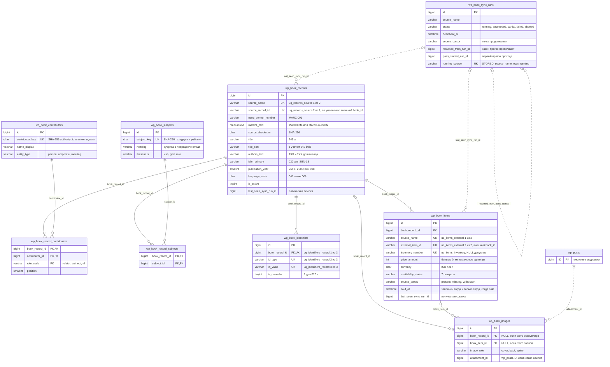
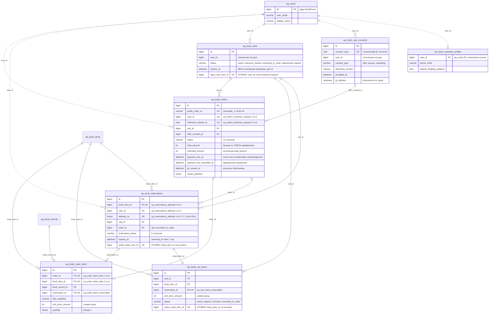
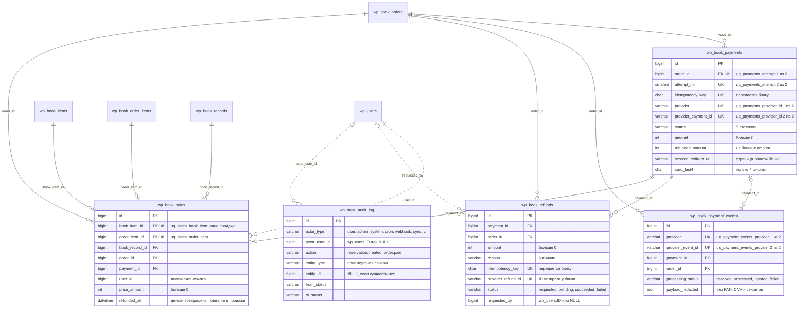

# 02. ER-диаграмма

Источник истины — `sql/schema.sql` (схема v2, MySQL 8.0.16+, InnoDB, проверена на 8.0.46). Ниже — **все 21
таблица плагина** и две сущности ядра WordPress (`wp_users`, `wp_posts`). Префикс `wp_` условный: мигратор
заменяет его на `$wpdb->prefix`, а `wp_users` в запросах — это `$wpdb->users` (в мультисайте таблица общая для
сети). Имена FOREIGN KEY начинаются с имени таблицы (`wp_book_items_fk_record`) и меняются вместе с префиксом
(`wp_2_book_items_fk_record`): в MySQL имена FK и CHECK уникальны в пределах всей БД
([03, раздел 7](03-tables-and-indexes.md#7-check-ограничения-и-имена-ограничений)).

## Легенда

| Обозначение | Смысл |
|---|---|
| `PK` / `FK` / `UK` | первичный ключ / колонка физического `FOREIGN KEY` / колонка `UNIQUE KEY` (для составных ключей в комментарии — имя индекса и позиция) |
| `STORED` | generated column: равна ключу у «активной» строки и `NULL` у остальных, под ней `UNIQUE` |
| сплошная линия `--` | физический `FOREIGN KEY` (без каскадов, `RESTRICT`) |
| пунктир `..` | логическая связь без FK: `wp_users`, `wp_posts`, `wp_book_sync_runs` |
| `\|\|` / `\|o` / `o{` / `\|{` | ровно один / ноль или один / ноль или много / один или много |

Типы упрощены (`varchar` вместо `VARCHAR(191) … COLLATE utf8mb4_bin`, `datetime` вместо `DATETIME(6)`).
Точные типы, CHECK и все индексы — в `sql/schema.sql` и `docs/03-tables-and-indexes.md`.

## 1. Обзор связей

Только сущности и кардинальности.

```mermaid
erDiagram
    wp_users ||..o{ wp_book_carts : "user_id"
    wp_users ||..o{ wp_book_reservations : "user_id"
    wp_users ||..o{ wp_book_orders : "user_id"
    wp_users ||..o{ wp_book_sales : "user_id"
    wp_users ||..o| wp_book_customer_profiles : "user_id = PK"
    wp_users ||..o{ wp_book_user_consents : "user_id"
    wp_users |o..o{ wp_book_refunds : "requested_by"
    wp_users |o..o{ wp_book_audit_log : "actor_user_id"
    wp_posts |o..o{ wp_book_images : "attachment_id"

    wp_book_records ||--o{ wp_book_items : "экземпляры"
    wp_book_records ||--o{ wp_book_record_contributors : ""
    wp_book_contributors ||--o{ wp_book_record_contributors : ""
    wp_book_records ||--o{ wp_book_record_subjects : ""
    wp_book_subjects ||--o{ wp_book_record_subjects : ""
    wp_book_records ||--o{ wp_book_identifiers : "020, 022, 035"
    wp_book_records |o--o{ wp_book_images : ""
    wp_book_items |o--o{ wp_book_images : ""

    wp_book_items ||--o{ wp_book_reservations : "история резервов"
    wp_book_carts |o--o{ wp_book_reservations : ""
    wp_book_carts ||--o{ wp_book_cart_items : ""
    wp_book_items ||--o{ wp_book_cart_items : ""
    wp_book_reservations ||--o| wp_book_cart_items : "1 резерв = 1 позиция"

    wp_book_carts |o--o{ wp_book_orders : ""
    wp_book_user_consents |o--o{ wp_book_orders : "offer_consent_id"
    wp_book_orders |o--o{ wp_book_reservations : "converted_to_order"
    wp_book_orders ||--|{ wp_book_order_items : ""
    wp_book_items ||--o{ wp_book_order_items : ""
    wp_book_records ||--o{ wp_book_order_items : ""
    wp_book_reservations |o--o| wp_book_order_items : "резерв в заказе"

    wp_book_orders ||--o{ wp_book_payments : "попытки оплаты"
    wp_book_payments |o--o{ wp_book_payment_events : ""
    wp_book_orders |o--o{ wp_book_payment_events : ""
    wp_book_payments ||--o{ wp_book_refunds : "возвраты платежа"
    wp_book_orders ||--o{ wp_book_refunds : ""

    wp_book_items ||--o| wp_book_sales : "не более 1 продажи"
    wp_book_order_items ||--o| wp_book_sales : ""
    wp_book_orders ||--o{ wp_book_sales : ""
    wp_book_payments ||--o{ wp_book_sales : ""
    wp_book_records ||--o{ wp_book_sales : ""

    wp_book_sync_runs |o..o{ wp_book_records : "last_seen_sync_run_id"
    wp_book_sync_runs |o..o{ wp_book_items : "last_seen_sync_run_id"
    wp_book_sync_runs |o..o{ wp_book_sync_runs : "resumed_from, pass_started"
```

`wp_book_audit_log` связан с бизнес-таблицами **полиморфно** (`entity_type` + `entity_id`), поэтому линий к
ним нет: FK на «одну из N таблиц» невозможен, а аудит не должен блокировать бизнес-строки FK-проверками.

## 2. Таблицы с ключевыми полями

Для читаемости схема разбита на три диаграммы. Атрибуты каждой таблицы показаны один раз — в «её» диаграмме;
в остальных она появляется как блок без полей. Показаны PK, все FK, все колонки уникальных ключей (включая
generated columns), статусы и поля, без которых не понять смысл таблицы.

### 2.1. Каталог и синхронизация

### 2.2. Покупатель, корзина, резервы, заказ

### 2.3. Платежи, возвраты, продажи, аудит

## 3. Связи и кардинальности

### 3.1. Физические FOREIGN KEY (30, все без каскадов, у каждого — явный индекс)

Имя ограничения = `<таблица-потомок>_fk_<суффикс>`; в таблице указан суффикс. Индекс на колонке потомка
объявлен в схеме явно — MySQL не создаёт «автоматических» индексов с именем ограничения
([03, раздел 8](03-tables-and-indexes.md#8-foreign-key-без-каскадов)).

| # | Потомок.колонка → родитель | Суффикс | Кардинальность | Пояснение |
|---|---|---|---|---|
| 1 | `items.book_record_id` → `records` | `_fk_record` | 1 : 0..N | По умолчанию одна запись на внешний `book_id` (фактически 1:1), схема допускает группировку экземпляров одного издания |
| 2 | `record_contributors.book_record_id` → `records` | `_fk_record` | 1 : 0..N | Связка M:N «запись — персона» |
| 3 | `record_contributors.contributor_id` → `contributors` | `_fk_contributor` | 1 : 0..N | `role_code` в PK: одна персона может быть и автором, и переводчиком книги |
| 4 | `record_subjects.book_record_id` → `records` | `_fk_record` | 1 : 0..N | Связка M:N «запись — рубрика» |
| 5 | `record_subjects.subject_id` → `subjects` | `_fk_subject` | 1 : 0..N | |
| 6 | `identifiers.book_record_id` → `records` | `_fk_record` | 1 : 0..N | ISBN/ISSN/LCCN/OCLC записи; глобальной уникальности нет |
| 7 | `images.book_record_id` (NULL) → `records` | `_fk_record` | 0..1 : 0..N | Фото издания |
| 8 | `images.book_item_id` (NULL) → `items` | `_fk_item` | 0..1 : 0..N | Фото экземпляра; `_chk_owner` требует хотя бы одного владельца |
| 9 | `reservations.book_item_id` → `items` | `_fk_item` | 1 : 0..N | История резервов; активный — не более одного (`uq_reservations_one_active_per_item`) |
| 10 | `reservations.cart_id` (NULL) → `carts` | `_fk_cart` | 0..1 : 0..N | В какую корзину попал резерв |
| 11 | `reservations.order_id` (NULL) → `orders` | `_fk_order` | 0..1 : 0..N | Заполняется при `converted_to_order` (`_chk_order`). Добавляется `ALTER TABLE` после создания `orders` (цикл резерв ↔ заказ) |
| 12 | `cart_items.cart_id` → `carts` | `_fk_cart` | 1 : 0..N | Каждая книга — отдельная строка |
| 13 | `cart_items.book_item_id` → `items` | `_fk_item` | 1 : 0..N | Активной позицией — не более чем в одной корзине (`uq_cart_items_one_active_per_item`) |
| 14 | `cart_items.reservation_id` → `reservations` | `_fk_reservation` | 1 : 0..1 | `UNIQUE (reservation_id)`: позиция — представление резерва |
| 15 | `orders.cart_id` (NULL) → `carts` | `_fk_cart` | 0..1 : 0..N | Из какой корзины оформлен заказ |
| 16 | `orders.offer_consent_id` (NULL) → `user_consents` | `_fk_consent` | 0..1 : 0..N | Принятая редакция оферты |
| 17 | `order_items.order_id` → `orders` | `_fk_order` | 1 : 1..N | «Хотя бы одна позиция» — инвариант checkout, БД его не проверяет |
| 18 | `order_items.book_item_id` → `items` | `_fk_item` | 1 : 0..N | Экземпляр может побывать в нескольких заказах (первый истёк), продан — один раз |
| 19 | `order_items.book_record_id` → `records` | `_fk_record` | 1 : 0..N | Для отчётов; заказ отображается по снимкам `*_snapshot` |
| 20 | `order_items.reservation_id` (NULL) → `reservations` | `_fk_reservation` | 0..1 : 0..1 | `uq_order_items_reservation`: один резерв — не более одной позиции заказа |
| 21 | `payments.order_id` → `orders` | `_fk_order` | 1 : 0..N | Повторные попытки — новые строки (`uq_payments_attempt`) |
| 22 | `payment_events.payment_id` (NULL) → `payments` | `_fk_payment` | 0..1 : 0..N | NULL, если событие не сопоставлено с платежом (`ignored`) |
| 23 | `payment_events.order_id` (NULL) → `orders` | `_fk_order` | 0..1 : 0..N | Поиск событий по заказу (`ix_payment_events_order`) |
| 24 | `refunds.payment_id` → `payments` | `_fk_payment` | 1 : 0..N | Возвраты конкретного платежа (основного или дублирующего) |
| 25 | `refunds.order_id` → `orders` | `_fk_order` | 1 : 0..N | Возвраты заказа; «есть незавершённый возврат» для ретеншна ПДн |
| 26 | `sales.book_item_id` → `items` | `_fk_item` | 1 : 0..1 | `uq_sales_book_item`: **одна успешная продажа на экземпляр** |
| 27 | `sales.order_item_id` → `order_items` | `_fk_order_item` | 1 : 0..1 | `uq_sales_order_item`: повторный webhook не создаст вторую продажу |
| 28 | `sales.order_id` → `orders` | `_fk_order` | 1 : 0..N | |
| 29 | `sales.payment_id` → `payments` | `_fk_payment` | 1 : 0..N | Каким платежом оплачена продажа (дубль, поздний платёж); `ix_sales_payment` |
| 30 | `sales.book_record_id` → `records` | `_fk_record` | 1 : 0..N | Отчёты по изданиям |

Полное имя: префикс + `book_` + таблица + суффикс, например №24 — `wp_book_refunds_fk_payment`.

### 3.2. Логические связи без FOREIGN KEY

| Связь | Колонки | Почему без FK |
|---|---|---|
| `wp_users` → `carts`, `reservations`, `orders`, `sales`, `user_consents`, `customer_profiles` | `user_id` | Таблица ядра: `wp_delete_user()` не должен ни падать на RESTRICT, ни каскадно стирать заказы и продажи; мультисайт. Подробно — [03, раздел 9](03-tables-and-indexes.md#9-почему-нет-fk-на-wp_users) |
| `wp_users` → `refunds`, `audit_log` | `requested_by`, `actor_user_id` | `NULL` для автоматических действий (`system`, `cron`, `webhook`, `sync`) |
| `wp_posts` → `images` | `attachment_id` | Вложение удаляется средствами WP; тогда изображение показывается по `source_url` |
| `sync_runs` → `records`, `items` | `last_seen_sync_run_id` | Журнал прогонов можно архивировать. FK ставил бы S-блокировку на строку прогона при каждом UPDATE экземпляра, а прогон в это время обновляет в ней счётчики и `heartbeat_at` |
| `sync_runs` → `sync_runs` | `resumed_from_run_id`, `pass_started_run_id` | Цепочка возобновлённых прогонов одного полного прохода; FK на себя мешал бы архивированию |
| все бизнес-таблицы → `audit_log` | `entity_type` + `entity_id` | Полиморфная ссылка; `entity_id` = `NULL`, если сущности нет (отклонённый webhook, запрос синхронизации до создания прогона) |

### 3.3. Ключевые инварианты на диаграмме

* **Экземпляр ↔ активный резерв ↔ активная позиция корзины.** Истории много, но `active_book_item_id`
  (STORED) под `UNIQUE` в `reservations` и `cart_items` даёт не более одного активного резерва и одной
  активной позиции на экземпляр.
* **Лимит трёх попыток.** `UNIQUE (user_id, book_item_id, attempt_no)` + `CHECK (attempt_no BETWEEN 1 AND 3)`;
  у `released_by_admin` `attempt_no = NULL` (NULL в UNIQUE не конфликтует) — снятие администратором
  возвращает попытку.
* **Одна открытая корзина на пользователя.** `open_cart_user_id` (STORED) + `uq_carts_one_open_per_user`.
* **Одна продажа на экземпляр.** `sales.book_item_id` UNIQUE; `items.sold_at` заполнен тогда и только тогда,
  когда статус `sold` (`_chk_sold_at`).
* **Резерв → позиция корзины → позиция заказа — 1 : 0..1 : 0..1** (`uq_cart_items_reservation`,
  `uq_order_items_reservation`).
* **Снимки вместо живых ссылок.** `order_items` хранит FK на экземпляр и запись (для отчётов), но
  отображает `*_snapshot` и `unit_price_amount`: синхронизация не меняет оформленный заказ.
* **Деньги.** Все суммы — `INT UNSIGNED` с `CHECK > 0`; `payments.refunded_amount ≤ amount`,
  `orders.refunded_amount ≤ total_amount`. `refunds` — идемпотентная очередь возвратов: ключ банку
  `idempotency_key` UNIQUE, ответ банка `provider_refund_id` UNIQUE. Возврат денег не возвращает экземпляр в
  продажу (`sales.refunded_at`, статус `sold` терминален).
* **Платежи и события.** `payments` — попытки оплаты (у каждой свой `idempotency_key`), `payment_events` —
  inbox проверенных webhook-ов с дедупликацией по `(provider, provider_event_id)`.
