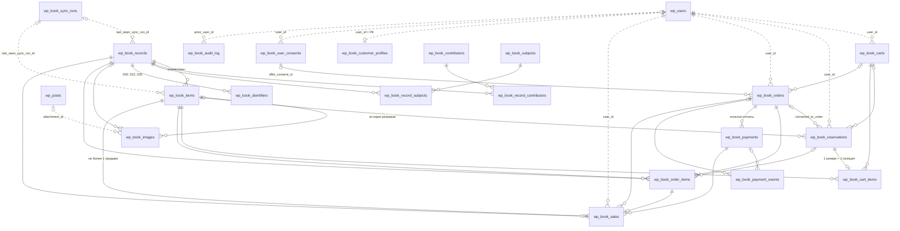

# 02. ER-диаграмма

Источник истины — `sql/schema.sql` (MySQL 8.0.16+, InnoDB). Диаграммы ниже отражают **все 20 таблиц плагина**
и две внешние сущности ядра WordPress (`wp_users`, `wp_posts`). Префикс `wp_` условный: в рантайме он
заменяется на `$wpdb->prefix`, а `wp_users` — на `$wpdb->users` (в мультисайте таблица пользователей общая
для сети).

## Легенда

| Обозначение | Смысл |
|---|---|
| `PK` | первичный ключ (у составного PK помечена каждая колонка) |
| `FK` | колонка участвует в физическом `FOREIGN KEY` (без каскадов, `RESTRICT`) |
| `UK` | колонка входит в `UNIQUE KEY`; для составных ключей в комментарии указаны имя индекса и позиция |
| `STORED` | generated column `... GENERATED ALWAYS AS (...) STORED`: равна ключу у «активной» строки и `NULL` у остальных |
| сплошная линия `--` | физический `FOREIGN KEY` в БД |
| пунктир `..` | логическая связь **без** FK: `wp_users`, `wp_posts`, `wp_book_sync_runs` |
| `\|\|` / `\|o` | ровно один / ноль или один |
| `o{` / `\|{` / `o\|` | ноль или много / один или много / ноль или один |

Типы в диаграмме упрощены (`varchar` вместо `VARCHAR(191)`, `datetime` вместо `DATETIME(6)`). Точные
типы, длины, CHECK-ограничения и все индексы см. в `sql/schema.sql` и `docs/03-tables-and-indexes.md`.

## 1. Обзор связей

Только сущности и кардинальности, без атрибутов: так проще увидеть устройство модели.

`wp_book_audit_log` связан с бизнес-таблицами **полиморфно** (`entity_type` + `entity_id`), поэтому линий к
ним нет: FK на «одну из N таблиц» в MySQL невозможен, а аудит не должен блокировать и не должен
блокироваться бизнес-транзакциями.

## 2. Полная схема с ключевыми полями

Для каждой таблицы показаны PK, все FK, все колонки уникальных ключей (включая generated columns),
статусные колонки и поля, без которых не понять смысл таблицы.

```mermaid
erDiagram
    wp_users {
        bigint ID PK "ядро WordPress"
        varchar user_email
        varchar display_name
    }
    wp_posts {
        bigint ID PK "вложение медиатеки"
        varchar post_type "attachment"
    }

    wp_book_records {
        bigint id PK
        varchar source_name UK "uq_records_source 1 из 2"
        varchar source_record_id UK "uq_records_source 2 из 2, по умолчанию внешний book_id"
        varchar marc_control_number "MARC 001"
        varchar marc_control_org "MARC 003"
        char record_type "Leader 06"
        char bib_level "Leader 07"
        mediumtext marc21_raw "MARCXML или MARC-in-JSON"
        char source_checksum "SHA-256"
        varchar title "245 a"
        varchar title_sort "с учетом 245 ind2"
        varchar authors_text "1XX и 7XX для вывода"
        varchar isbn_primary "020 a в ISBN-13"
        smallint publication_year "264 c, 260 c или 008"
        char language_code "041 a или 008"
        tinyint is_active
        bigint last_seen_sync_run_id "логическая ссылка на sync_runs"
    }
    wp_book_contributors {
        bigint id PK
        char contributor_key UK "SHA-256 authority_id или имя и даты"
        varchar name_display
        varchar name_sort
        varchar entity_type "person, corporate, meeting"
        varchar authority_id "VIAF, GND, LC NAF"
    }
    wp_book_record_contributors {
        bigint book_record_id PK, FK
        bigint contributor_id PK, FK
        varchar role_code PK "relator 4: aut, edt, trl"
        char marc_tag "100, 110, 700, 710"
        smallint position
    }
    wp_book_subjects {
        bigint id PK
        char subject_key UK "SHA-256 тезаурус и рубрика"
        varchar heading "рубрика с подразделениями"
        char marc_tag "600, 650, 651, 655"
        varchar thesaurus "lcsh, gnd, rero"
    }
    wp_book_record_subjects {
        bigint book_record_id PK, FK
        bigint subject_id PK, FK
        smallint position
    }
    wp_book_identifiers {
        bigint id PK
        bigint book_record_id FK, UK "uq_identifiers_record 1 из 3"
        varchar id_type UK "uq_identifiers_record 2 из 3: isbn, issn, lccn, oclc"
        varchar id_value UK "uq_identifiers_record 3 из 3, нормализовано"
        varchar raw_value "как в записи, вместе с q"
        tinyint is_cancelled "1 для 020 z"
    }

    wp_book_items {
        bigint id PK
        bigint book_record_id FK
        varchar source_name UK "uq_items_external 1 из 2"
        varchar external_item_id UK "uq_items_external 2 из 2, внешний book_id"
        varchar inventory_number UK "uq_items_inventory, NULL допустим"
        int price_amount "центы"
        char currency "ISO 4217"
        varchar condition_code
        varchar availability_status "7 статусов, CHECK"
        varchar source_status "present, missing, withdrawn"
        tinyint is_active
        datetime sold_at "NOT NULL тогда и только тогда, когда sold"
        bigint last_seen_sync_run_id "логическая ссылка на sync_runs"
    }
    wp_book_images {
        bigint id PK
        bigint book_record_id FK "NULL, если фото экземпляра"
        bigint book_item_id FK "NULL, если фото записи"
        varchar image_role "cover, back, spine"
        bigint attachment_id "wp_posts.ID, логическая ссылка"
    }

    wp_book_customer_profiles {
        bigint user_id PK "wp_users.ID, логическая ссылка"
        varchar phone_e164
        json default_shipping_address
        varchar vat_id "B2B, необязательно"
    }
    wp_book_user_consents {
        bigint id PK
        char consent_uuid UK "технический ID согласия"
        bigint user_id "wp_users.ID, логическая ссылка"
        varchar consent_type "offer, privacy, marketing"
        varchar document_version
        datetime accepted_at
        varbinary ip_address "INET6_ATON"
    }

    wp_book_carts {
        bigint id PK
        bigint user_id "wp_users.ID, логическая ссылка"
        varchar status "active, checkout_started, converted_to_order, abandoned, expired"
        datetime last_activity_at
        datetime expires_at "MIN по активным позициям, только для UI"
        bigint open_cart_user_id UK "STORED: user_id, если корзина открыта, иначе NULL"
    }
    wp_book_reservations {
        bigint id PK
        bigint book_item_id FK, UK "uq_reservations_attempt 2 из 3"
        bigint user_id UK "uq_reservations_attempt 1 из 3, wp_users.ID"
        tinyint attempt_no UK "uq_reservations_attempt 3 из 3: 1..3, NULL у released_by_admin"
        bigint cart_id FK
        bigint order_id FK "при converted_to_order"
        varchar reservation_status "active, expired, cancelled, converted_to_order, released_by_admin"
        datetime expires_at "reserved_at плюс 1 час"
        bigint active_book_item_id UK "STORED: book_item_id, если active, иначе NULL"
    }
    wp_book_cart_items {
        bigint id PK
        bigint cart_id FK
        bigint book_item_id FK
        bigint reservation_id FK, UK "uq_cart_items_reservation"
        int unit_price_amount "снимок цены"
        varchar status "active, expired, removed, converted_to_order"
        datetime expires_at "копия срока резерва"
        bigint active_book_item_id UK "STORED: book_item_id, если active, иначе NULL"
    }

    wp_book_orders {
        bigint id PK
        varchar public_order_id UK "uniundata_ плюс UUID v4"
        bigint user_id UK "uq_orders_checkout_request 1 из 2, wp_users.ID"
        char checkout_request_id UK "uq_orders_checkout_request 2 из 2, Idempotency-Key"
        bigint cart_id FK
        bigint offer_consent_id FK
        varchar status "11 статусов, CHECK"
        int total_amount "CHECK суммы"
        varchar customer_email "снимок"
        json shipping_address_json "снимок"
        datetime payment_due_at "после него экземпляры освобождаются"
        tinyint needs_attention
    }
    wp_book_order_items {
        bigint id PK
        bigint order_id FK, UK "uq_order_items_item 1 из 2"
        bigint book_item_id FK, UK "uq_order_items_item 2 из 2"
        bigint book_record_id FK
        bigint reservation_id FK
        varchar title_snapshot
        varchar isbn_snapshot
        int unit_price_amount "снимок цены"
        tinyint quantity "CHECK равно 1"
    }
    wp_book_payments {
        bigint id PK
        bigint order_id FK, UK "uq_payments_attempt 1 из 2"
        smallint attempt_no UK "uq_payments_attempt 2 из 2"
        char idempotency_key UK "передается банку"
        varchar provider UK "uq_payments_provider_id 1 из 2"
        varchar provider_payment_id UK "uq_payments_provider_id 2 из 2"
        varchar status "9 статусов, CHECK"
        int amount
        char card_last4 "только 4 цифры"
    }
    wp_book_payment_events {
        bigint id PK
        varchar provider UK "uq_payment_events_provider 1 из 2"
        varchar provider_event_id UK "uq_payment_events_provider 2 из 2"
        bigint payment_id FK
        bigint order_id FK
        varchar processing_status "received, processed, ignored, failed"
        json payload_redacted "без PAN, CVV и секретов"
    }
    wp_book_sales {
        bigint id PK
        bigint book_item_id FK, UK "uq_sales_book_item: одна продажа на экземпляр"
        bigint order_item_id FK, UK "uq_sales_order_item"
        bigint book_record_id FK
        bigint order_id FK
        bigint payment_id FK
        bigint user_id "wp_users.ID, логическая ссылка"
        datetime sold_at
        int price_amount
    }

    wp_book_sync_runs {
        bigint id PK
        varchar source_name
        varchar triggered_by "cron, wp_cli, admin, retry"
        varchar status "running, succeeded, partial, failed, aborted"
        datetime heartbeat_at
        varchar source_cursor "точка продолжения"
        varchar running_source UK "STORED: source_name, если running, иначе NULL"
    }
    wp_book_audit_log {
        bigint id PK
        varchar actor_type "user, admin, system, cron, webhook, sync, cli"
        bigint actor_user_id "wp_users.ID или NULL"
        varchar action "reservation.created, order.paid"
        varchar entity_type "полиморфная ссылка"
        bigint entity_id
        varchar from_status
        varchar to_status
    }

    wp_users ||..o{ wp_book_carts : "user_id"
    wp_users ||..o{ wp_book_reservations : "user_id"
    wp_users ||..o{ wp_book_orders : "user_id"
    wp_users ||..o{ wp_book_sales : "user_id"
    wp_users ||..o| wp_book_customer_profiles : "user_id = PK"
    wp_users ||..o{ wp_book_user_consents : "user_id"
    wp_users |o..o{ wp_book_audit_log : "actor_user_id"
    wp_posts |o..o{ wp_book_images : "attachment_id"

    wp_book_records ||--o{ wp_book_record_contributors : "fk_rc_record"
    wp_book_contributors ||--o{ wp_book_record_contributors : "fk_rc_contributor"
    wp_book_records ||--o{ wp_book_record_subjects : "fk_rs_record"
    wp_book_subjects ||--o{ wp_book_record_subjects : "fk_rs_subject"
    wp_book_records ||--o{ wp_book_identifiers : "fk_identifiers_record"
    wp_book_records ||--o{ wp_book_items : "fk_items_record"
    wp_book_records |o--o{ wp_book_images : "fk_images_record"
    wp_book_items |o--o{ wp_book_images : "fk_images_item"

    wp_book_items ||--o{ wp_book_reservations : "fk_reservations_item"
    wp_book_carts |o--o{ wp_book_reservations : "fk_reservations_cart"
    wp_book_orders |o--o{ wp_book_reservations : "fk_reservations_order"
    wp_book_carts ||--o{ wp_book_cart_items : "fk_cart_items_cart"
    wp_book_items ||--o{ wp_book_cart_items : "fk_cart_items_item"
    wp_book_reservations ||--o| wp_book_cart_items : "fk_cart_items_reservation"

    wp_book_carts |o--o{ wp_book_orders : "fk_orders_cart"
    wp_book_user_consents |o--o{ wp_book_orders : "fk_orders_consent"
    wp_book_orders ||--|{ wp_book_order_items : "fk_order_items_order"
    wp_book_items ||--o{ wp_book_order_items : "fk_order_items_item"
    wp_book_records ||--o{ wp_book_order_items : "fk_order_items_record"
    wp_book_reservations |o--o{ wp_book_order_items : "fk_order_items_reservation"

    wp_book_orders ||--o{ wp_book_payments : "fk_payments_order"
    wp_book_payments |o--o{ wp_book_payment_events : "fk_payment_events_payment"
    wp_book_orders |o--o{ wp_book_payment_events : "fk_payment_events_order"

    wp_book_items ||--o| wp_book_sales : "fk_sales_item"
    wp_book_order_items ||--o| wp_book_sales : "fk_sales_order_item"
    wp_book_orders ||--o{ wp_book_sales : "fk_sales_order"
    wp_book_payments ||--o{ wp_book_sales : "fk_sales_payment"
    wp_book_records ||--o{ wp_book_sales : "fk_sales_record"

    wp_book_sync_runs |o..o{ wp_book_records : "last_seen_sync_run_id"
    wp_book_sync_runs |o..o{ wp_book_items : "last_seen_sync_run_id"
```

## 3. Связи и кардинальности

### 3.1. Физические FOREIGN KEY (28 штук, все без каскадов)

| # | Родитель → потомок | Колонка потомка | Constraint | Кардинальность | Пояснение |
|---|---|---|---|---|---|
| 1 | `wp_book_records` → `wp_book_items` | `book_record_id` NOT NULL | `fk_items_record` | 1 : 0..N | Запись — библиография, экземпляр — единица продажи. По умолчанию синхронизация создаёт одну запись на каждый внешний `book_id`, т.е. фактически 1:1, но схема допускает группировку экземпляров одного издания |
| 2 | `wp_book_records` → `wp_book_record_contributors` | `book_record_id` | `fk_rc_record` | 1 : 0..N | Связка M:N «запись — персона/организация» |
| 3 | `wp_book_contributors` → `wp_book_record_contributors` | `contributor_id` | `fk_rc_contributor` | 1 : 0..N | Одна персона у многих записей; в PK входит `role_code`, поэтому одна персона может быть и автором, и переводчиком одной книги |
| 4 | `wp_book_records` → `wp_book_record_subjects` | `book_record_id` | `fk_rs_record` | 1 : 0..N | Связка M:N «запись — рубрика» |
| 5 | `wp_book_subjects` → `wp_book_record_subjects` | `subject_id` | `fk_rs_subject` | 1 : 0..N | |
| 6 | `wp_book_records` → `wp_book_identifiers` | `book_record_id` | `fk_identifiers_record` | 1 : 0..N | Все ISBN/ISSN/LCCN/OCLC записи; глобальной уникальности нет |
| 7 | `wp_book_records` → `wp_book_images` | `book_record_id` NULL | `fk_images_record` | 0..1 : 0..N | Фото издания (общая обложка) |
| 8 | `wp_book_items` → `wp_book_images` | `book_item_id` NULL | `fk_images_item` | 0..1 : 0..N | Фото конкретного экземпляра (состояние, автограф). `ck_images_owner` требует хотя бы одного владельца |
| 9 | `wp_book_items` → `wp_book_reservations` | `book_item_id` | `fk_reservations_item` | 1 : 0..N | Вся история резервов экземпляра; активный — не более одного (`uq_reservations_one_active_per_item`) |
| 10 | `wp_book_carts` → `wp_book_reservations` | `cart_id` NULL | `fk_reservations_cart` | 0..1 : 0..N | В какую корзину попал резерв |
| 11 | `wp_book_orders` → `wp_book_reservations` | `order_id` NULL | `fk_reservations_order` | 0..1 : 0..N | Заполняется при `converted_to_order` (`ck_reservations_order`). FK добавляется `ALTER TABLE` после создания `wp_book_orders` |
| 12 | `wp_book_carts` → `wp_book_cart_items` | `cart_id` | `fk_cart_items_cart` | 1 : 0..N | Каждая книга — отдельная строка |
| 13 | `wp_book_items` → `wp_book_cart_items` | `book_item_id` | `fk_cart_items_item` | 1 : 0..N | Активной позицией экземпляр бывает не более чем в одной корзине (`uq_cart_items_one_active_per_item`) |
| 14 | `wp_book_reservations` → `wp_book_cart_items` | `reservation_id` NOT NULL | `fk_cart_items_reservation` | 1 : 0..1 | `UNIQUE (reservation_id)`: позиция корзины — представление резерва, срок копируется из него |
| 15 | `wp_book_carts` → `wp_book_orders` | `cart_id` NULL | `fk_orders_cart` | 0..1 : 0..N | Из какой корзины оформлен заказ |
| 16 | `wp_book_user_consents` → `wp_book_orders` | `offer_consent_id` NULL | `fk_orders_consent` | 0..1 : 0..N | Какую редакцию оферты принял покупатель при оформлении |
| 17 | `wp_book_orders` → `wp_book_order_items` | `order_id` | `fk_order_items_order` | 1 : 1..N | «Хотя бы одна позиция» — бизнес-инвариант checkout, БД его не проверяет |
| 18 | `wp_book_items` → `wp_book_order_items` | `book_item_id` | `fk_order_items_item` | 1 : 0..N | Экземпляр может побывать в нескольких заказах (первый истёк, второй оплачен), но продан только один раз |
| 19 | `wp_book_records` → `wp_book_order_items` | `book_record_id` | `fk_order_items_record` | 1 : 0..N | Для отчётов; отображение заказа берёт снимки `*_snapshot`, а не живую запись |
| 20 | `wp_book_reservations` → `wp_book_order_items` | `reservation_id` NULL | `fk_order_items_reservation` | 0..1 : 0..N | Трассировка «из какого резерва». Логически 0..1 : 0..1, UNIQUE не объявлен |
| 21 | `wp_book_orders` → `wp_book_payments` | `order_id` | `fk_payments_order` | 1 : 0..N | Повторные попытки оплаты — новые строки (`uq_payments_attempt`) |
| 22 | `wp_book_payments` → `wp_book_payment_events` | `payment_id` NULL | `fk_payment_events_payment` | 0..1 : 0..N | NULL, если событие не удалось сопоставить с платежом (тогда `ignored`) |
| 23 | `wp_book_orders` → `wp_book_payment_events` | `order_id` NULL | `fk_payment_events_order` | 0..1 : 0..N | Денормализация для поиска событий по заказу |
| 24 | `wp_book_items` → `wp_book_sales` | `book_item_id` | `fk_sales_item` | 1 : 0..1 | `uq_sales_book_item`: **одна успешная продажа на экземпляр** — главная гарантия БД |
| 25 | `wp_book_order_items` → `wp_book_sales` | `order_item_id` | `fk_sales_order_item` | 1 : 0..1 | `uq_sales_order_item`: повторный webhook не создаст вторую продажу той же строки |
| 26 | `wp_book_orders` → `wp_book_sales` | `order_id` | `fk_sales_order` | 1 : 0..N | |
| 27 | `wp_book_payments` → `wp_book_sales` | `payment_id` | `fk_sales_payment` | 1 : 0..N | Каким платежом оплачена продажа (важно при дубле или позднем платеже) |
| 28 | `wp_book_records` → `wp_book_sales` | `book_record_id` | `fk_sales_record` | 1 : 0..N | Отчёты по изданиям |

### 3.2. Логические связи без FOREIGN KEY

| Связь | Колонки | Почему без FK |
|---|---|---|
| `wp_users` → `wp_book_carts`, `wp_book_reservations`, `wp_book_orders`, `wp_book_sales`, `wp_book_user_consents` | `user_id` | Таблица ядра WP: удаление пользователя через `wp_delete_user()` не должно ни падать на RESTRICT, ни каскадно стирать заказы и продажи (сроки хранения бухгалтерских документов). Подробно — `docs/03-tables-and-indexes.md`, раздел «Почему нет FK на wp_users» |
| `wp_users` → `wp_book_customer_profiles` | `user_id` = PK | 1 : 0..1, профиль создаётся лениво при первом оформлении |
| `wp_users` → `wp_book_audit_log` | `actor_user_id` | NULL для `system`/`cron`/`webhook`/`sync` |
| `wp_posts` → `wp_book_images` | `attachment_id` | Вложение медиатеки удаляется средствами WP; изображение тогда показывается по `source_url` |
| `wp_book_sync_runs` → `wp_book_records`, `wp_book_items` | `last_seen_sync_run_id` | Журнал прогонов можно архивировать по сроку хранения. FK ставил бы S-блокировку на строку прогона при каждом UPDATE экземпляра, а сам прогон в это время обновляет в ней счётчики и `heartbeat_at` |
| все бизнес-таблицы → `wp_book_audit_log` | `entity_type` + `entity_id` | Полиморфная ссылка; FK невозможен по определению |

### 3.3. Как читать ключевые инварианты по диаграмме

* **Экземпляр ↔ активный резерв ↔ активная позиция корзины.** У `wp_book_items` может быть много резервов
  и позиций корзин (история), но `active_book_item_id` (STORED) в `wp_book_reservations` и
  `wp_book_cart_items` под `UNIQUE` гарантирует: активный резерв и активная позиция на экземпляр — не более
  одной каждый.
* **Лимит трёх попыток.** `UNIQUE (user_id, book_item_id, attempt_no)` + `CHECK (attempt_no BETWEEN 1 AND 3)`:
  четвёртую попытку физически невозможно вставить. У `released_by_admin` `attempt_no = NULL`, а NULL в
  UNIQUE не конфликтует, поэтому снятие резерва администратором освобождает слот.
* **Одна открытая корзина на пользователя.** `open_cart_user_id` (STORED) + `uq_carts_one_open_per_user`.
* **Одна продажа на экземпляр.** `wp_book_sales.book_item_id` UNIQUE, а `wp_book_items.sold_at` заполнен
  тогда и только тогда, когда статус `sold` (`ck_items_sold_at`).
* **Снимки вместо живых ссылок.** `wp_book_order_items` хранит FK на экземпляр и запись (для отчётов), но
  отображает `title_snapshot`, `author_snapshot`, `isbn_snapshot`, `unit_price_amount`: последующая
  синхронизация каталога не меняет состав и сумму оформленного заказа.
* **Платежи и события.** `wp_book_payments` — попытки оплаты (у каждой свой `idempotency_key`);
  `wp_book_payment_events` — inbox проверенных webhook-ов, дедупликация по
  `(provider, provider_event_id)`.
