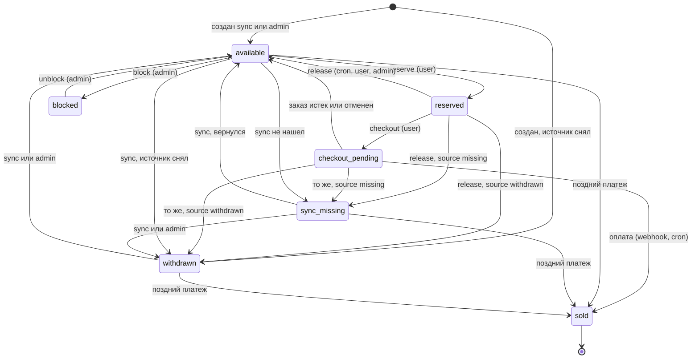
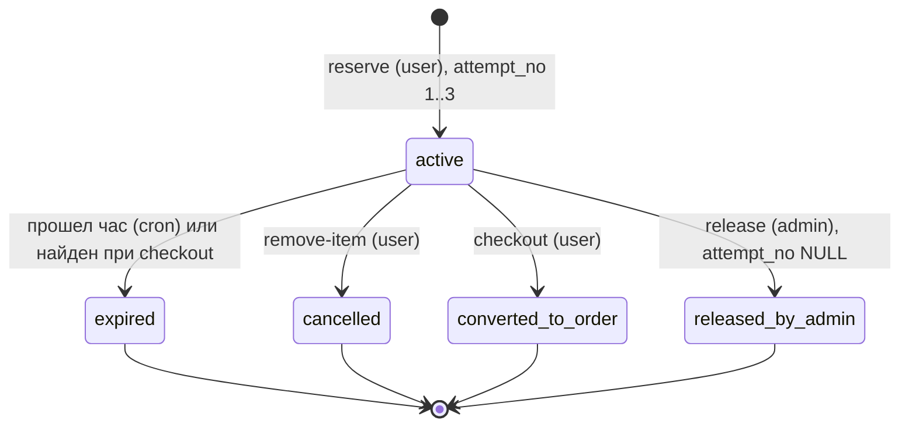
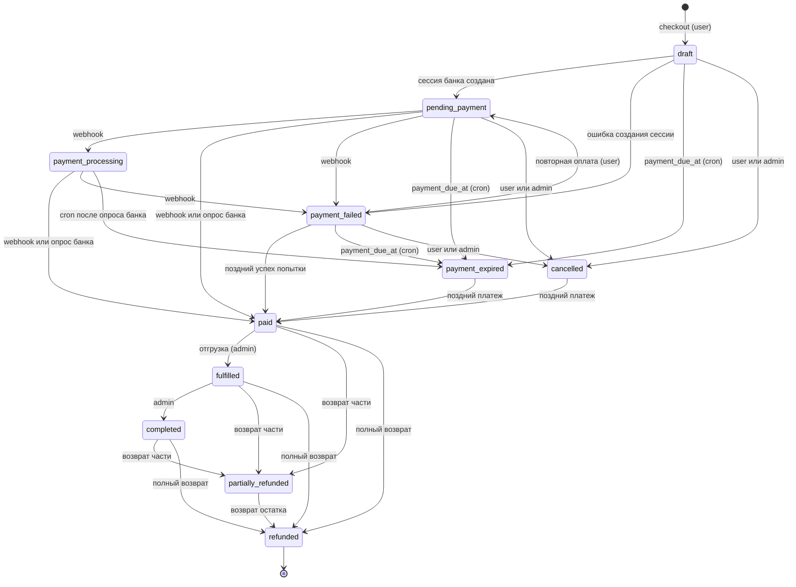
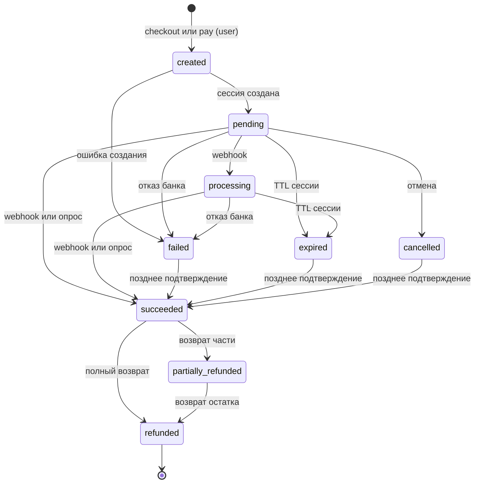

# 04. Статусы и переходы

Документ фиксирует все статусы схемы (`sql/schema.sql`), их смысл, допустимые переходы, инициатора каждого
перехода и способ, которым запрещённые переходы блокируются. Допустимые переходы совпадают с контрактом
проекта; там, где контракт не называет инициатора или детали, это помечено как решение этого документа.

Содержание:

1. [Принципы](#1-принципы)
2. [Сводка](#2-сводка)
3. [Экземпляр: `wp_book_items.availability_status`](#3-экземпляр-wp_book_itemsavailability_status)
4. [Резерв: `wp_book_reservations.reservation_status`](#4-резерв-wp_book_reservationsreservation_status)
5. [Позиция корзины: `wp_book_cart_items.status`](#5-позиция-корзины-wp_book_cart_itemsstatus)
6. [Корзина: `wp_book_carts.status`](#6-корзина-wp_book_cartsstatus)
7. [Заказ: `wp_book_orders.status`](#7-заказ-wp_book_ordersstatus)
8. [Платёж: `wp_book_payments.status`](#8-платёж-wp_book_paymentsstatus)
9. [Событие платежа: `wp_book_payment_events.processing_status`](#9-событие-платежа-wp_book_payment_eventsprocessing_status)
10. [Прогон синхронизации: `wp_book_sync_runs.status`](#10-прогон-синхронизации-wp_book_sync_runsstatus)
11. [Согласованность статусов между таблицами](#11-согласованность-статусов-между-таблицами)
12. [Защита переходов](#12-защита-переходов)
13. [Гонки: какой переход выигрывает](#13-гонки-какой-переход-выигрывает)
14. [Соответствие ТЗ](#14-соответствие-тз)

---

## 1. Принципы

* Статус — `VARCHAR … CHARACTER SET ascii` + `CHECK (… IN (…))` в БД и backed enum в PHP
  (`Domain\ItemStatus`, `ReservationStatus`, `OrderStatus`, `PaymentStatus`; для корзины, позиции корзины,
  события платежа и прогона синхронизации — enum или константы по тому же образцу). Почему не `ENUM` —
  `docs/03-tables-and-indexes.md`, разделы 1 и 7.
* Любой переход выполняется внутри `Db::transaction()`: сначала `SELECT … FOR UPDATE` в глобальном порядке
  блокировок (корзина → экземпляры по возрастанию id → резервы → позиции корзины → заказ → платежи →
  события), затем **перепроверка** прочитанного под блокировкой, затем условный `UPDATE … WHERE status IN
  (допустимые исходные)` с проверкой числа затронутых строк, затем `AuditLog::record()` в той же транзакции:
  статус и запись аудита фиксируются или откатываются вместе.
* Таблица допустимых переходов хранится в коде одним местом (например, метод enum
  `canTransitionTo(self $to): bool`) и покрывается unit-тестом, сверяющим её с этим документом.
* Терминальные статусы не покидаются. Исключение одно и намеренное: деньги. Если банк подтвердил платёж
  после того, как мы закрыли заказ или платёж, заказ всё равно переходит в `paid` по ветке «поздний платёж»
  (деньги не теряются, конфликт разбирает человек).

Инициаторы переходов:

| Инициатор | Что это | `actor_type` в аудите |
|---|---|---|
| user | REST-запрос авторизованного покупателя: cookie + `X-WP-Nonce`, `user_id = get_current_user_id()` | `user` |
| admin | REST/админка с capability (`manage_book_reservations`, `manage_book_orders`, `manage_book_catalog`) | `admin` |
| cron | Action Scheduler: `uniundata_expire_reservations` и `uniundata_expire_orders` (каждую минуту) | `cron` |
| webhook | `POST /payment/webhook` после проверки подписи банка | `webhook` |
| sync | `uniundata_sync_daily`, `POST /admin/sync/run`, WP-CLI | `sync` / `cli` |
| system | Фоновые задачи после COMMIT (письма, документы, возвраты) — сами статусы не меняют, результат приходит webhook-ом | `system` |

---

## 2. Сводка

| Сущность | Колонка | Значения | Терминальные |
|---|---|---|---|
| Экземпляр | `wp_book_items.availability_status` | `available`, `reserved`, `checkout_pending`, `sold`, `withdrawn`, `sync_missing`, `blocked` | `sold` |
| Экземпляр (источник) | `wp_book_items.source_status` | `present`, `missing`, `withdrawn` | — (отражает источник) |
| Резерв | `wp_book_reservations.reservation_status` | `active`, `expired`, `cancelled`, `converted_to_order`, `released_by_admin` | все, кроме `active` |
| Позиция корзины | `wp_book_cart_items.status` | `active`, `expired`, `removed`, `converted_to_order` | все, кроме `active` |
| Корзина | `wp_book_carts.status` | `active`, `checkout_started`, `converted_to_order`, `abandoned`, `expired` | `converted_to_order`, `abandoned`, `expired` |
| Заказ | `wp_book_orders.status` | `draft`, `pending_payment`, `payment_processing`, `paid`, `payment_failed`, `payment_expired`, `cancelled`, `refunded`, `partially_refunded`, `fulfilled`, `completed` | `refunded` (а `payment_expired`, `cancelled` — кроме позднего платежа) |
| Платёж | `wp_book_payments.status` | `created`, `pending`, `processing`, `succeeded`, `failed`, `cancelled`, `expired`, `refunded`, `partially_refunded` | `refunded` (а `failed`, `expired`, `cancelled` — кроме позднего подтверждения) |
| Событие платежа | `wp_book_payment_events.processing_status` | `received`, `processed`, `ignored`, `failed` | `processed`, `ignored` |
| Прогон синхронизации | `wp_book_sync_runs.status` | `running`, `succeeded`, `partial`, `failed`, `aborted` | все, кроме `running` |

Флаг `wp_book_orders.needs_attention` (+ `attention_reason`) — не статус: он ортогонален статусу и
сочетается, например, с `paid`.

---

## 3. Экземпляр: `wp_book_items.availability_status`

### 3.1. Статусы

| Статус | Смысл | Витрина (рекомендация) | Можно «Отложить» |
|---|---|---|---|
| `available` | Свободен. Нет активного резерва и открытого заказа | Кнопка «Отложить» активна | да |
| `reserved` | Есть ровно один активный резерв (не старше часа) | «Зарезервирована», кнопка неактивна; владельцу — «В корзине» | нет |
| `checkout_pending` | В неоплаченном заказе (`draft`, `pending_payment`, `payment_processing`, `payment_failed`) до `payment_due_at` | «Зарезервирована» | нет |
| `sold` | Продан: есть строка в `wp_book_sales`, `sold_at` заполнен | «Продано», кнопки нет | никогда |
| `withdrawn` | Снят с продажи источником | Скрыт из списков; по прямой ссылке «Нет в продаже» | нет |
| `sync_missing` | Не пришёл в последнем полном проходе синхронизации, требуется проверка | Как `withdrawn` | нет |
| `blocked` | Заблокирован администратором вручную | Как `withdrawn` | нет |

Состояние кнопки на витрине берётся из `GET /catalog/availability?item_ids=…` (без кэша), а не из
закэшированной HTML-страницы; решение о резерве принимает только сервер под блокировкой.

`source_status` — отдельная колонка с мнением источника. Она нужна, потому что синхронизация не имеет права
трогать `reserved`, `checkout_pending`, `sold`, `blocked`, но должна запомнить, что источник книгу снял или
потерял. При освобождении экземпляр получает **целевой статус освобождения** (release target):

```sql
CASE source_status
  WHEN 'present'   THEN 'available'
  WHEN 'missing'   THEN 'sync_missing'
  WHEN 'withdrawn' THEN 'withdrawn'
END
```

### 3.2. Переходы

| # | Переход | Операция | Инициатор | Условие (guard) |
|---|---|---|---|---|
| 1 | (новый) → `available` или `withdrawn` | Создание экземпляра синхронизацией (по `source_status` из источника) или вручную | sync, admin | `INSERT`; уникальность `uq_items_external` |
| 2 | `available` → `reserved` | `POST /cart/reserve` | user | `WHERE id = ? AND availability_status = 'available' AND is_active = 1`; под `FOR UPDATE`; попыток < 3; одновременно `INSERT` активного резерва и позиции корзины |
| 3 | `reserved` → `checkout_pending` | `POST /checkout` | user | `WHERE id = ? AND availability_status = 'reserved'`; резерв этого пользователя `active` и `expires_at > UTC_TIMESTAMP(6)`; в той же транзакции резерв → `converted_to_order` |
| 4 | `reserved` → release target | Истечение резерва; удаление из корзины; снятие администратором; checkout обнаружил истёкшую позицию | cron, user, admin | `WHERE id = ? AND availability_status = 'reserved'`; освобождающий резерв заблокирован, `active` и принадлежит этому экземпляру |
| 5 | `checkout_pending` → `sold` | Подтверждённая оплата заказа | webhook, cron (опрос банка, общий путь `applyProviderResult`) | `WHERE id IN (…) AND availability_status = 'checkout_pending'`; экземпляр — позиция оплачиваемого заказа; `sold_at` заполняется; `INSERT` в `wp_book_sales` (UNIQUE по экземпляру) |
| 6 | `checkout_pending` → release target | Заказ → `payment_expired` (после `payment_due_at` и опроса банка) или → `cancelled` | cron, user, admin | `WHERE id IN (…) AND availability_status = 'checkout_pending'`; заказ заблокирован и был в открытом статусе |
| 7 | `available` → `sync_missing` | Экземпляр не пришёл в **полном** проходе синхронизации | sync | `WHERE availability_status = 'available'`; только прогон, прошедший источник целиком (`failed`/`aborted` не помечают) |
| 8 | `available` → `withdrawn` | Источник снял экземпляр | sync | `WHERE availability_status = 'available'` |
| 9 | `available` → `blocked` | `POST /admin/items/{id}/block` | admin | `WHERE availability_status = 'available'`. Резерв или заказ сначала снимается (`released_by_admin` / отмена заказа) |
| 10 | `blocked` → `available` | `POST /admin/items/{id}/unblock` | admin | `WHERE availability_status = 'blocked'`. Если `source_status` ≠ `present`, следующая синхронизация переведёт в `sync_missing`/`withdrawn` (переходы 7, 8) |
| 11 | `sync_missing` → `available` | Экземпляр снова пришёл из источника | sync | `WHERE availability_status = 'sync_missing'` |
| 12 | `sync_missing` → `withdrawn` | Источник явно снял экземпляр, или проверка подтвердила отсутствие | sync, admin | `WHERE availability_status = 'sync_missing'` |
| 13 | `withdrawn` → `available` | Источник вернул экземпляр; ручная коррекция | sync, admin | `WHERE availability_status = 'withdrawn'` |
| 14 | `available` / `sync_missing` / `withdrawn` → `sold` | **Поздний платёж**: заказ уже `payment_expired`/`cancelled`, экземпляр свободен (нет активного резерва, не в чужом checkout) | webhook, cron | `WHERE id = ? AND availability_status IN ('available', 'sync_missing', 'withdrawn')` под `FOR UPDATE`; иначе экземпляр не продаётся, заказ получает `needs_attention = 1`, `attention_reason = 'late_payment_conflict'` и задачу возврата |

Ручное снятие с продажи делается через `blocked`, а не через `withdrawn`: `withdrawn` отражает источник и
может быть отменён следующей синхронизацией (переход 13), а `blocked` синхронизация не трогает.

### 3.3. Диаграмма



### 3.4. Синхронизация и локальный статус

Синхронизация **всегда** обновляет `source_status` (а также цену, состояние и прочие поля источника), но
`availability_status` меняет только из `available`, `sync_missing`, `withdrawn`:

| Локальный статус \ источник | `present` | нет в полном проходе (`missing`) | `withdrawn` |
|---|---|---|---|
| `available` | без изменений | → `sync_missing` | → `withdrawn` |
| `sync_missing` | → `available` | без изменений | → `withdrawn` |
| `withdrawn` | → `available` | без изменений (переход `withdrawn → sync_missing` не предусмотрен) | без изменений |
| `reserved`, `checkout_pending` | статус не меняется | статус не меняется, `items_conflicts += 1`; при освобождении → `sync_missing` | статус не меняется, `items_conflicts += 1`; при освобождении → `withdrawn` |
| `blocked` | статус не меняется | статус не меняется | статус не меняется |
| `sold` | статус не меняется; если источник снова прислал проданную книгу как доступную — `items_conflicts += 1` и запись в `error_log`, продажа и экземпляр не трогаются | не меняется | не меняется |

### 3.5. Запрещённые переходы и защита

| Запрещено | Чем защищено |
|---|---|
| Выход из `sold` в любой статус | Ни один `UPDATE` в коде не содержит `sold` в списке исходных статусов; синхронизация обновляет только строки в `available`/`sync_missing`/`withdrawn`; `ck_items_sold_at` требует `sold_at = NULL` у непроданного, а `uq_sales_book_item` не даст продать второй раз. Возврат денег (`refunded`) экземпляр в продажу не возвращает |
| Второй резерв на `reserved` (другой пользователь, двойной клик) | `FOR UPDATE` строки экземпляра + guard `availability_status = 'available'`; второй рубеж — `uq_reservations_one_active_per_item` и `uq_cart_items_one_active_per_item` (1062 → 409 `uniundata_item_unavailable`) |
| `available` → `checkout_pending` в обход резерва | Checkout берёт экземпляры только из активных резервов пользователя; guard `availability_status = 'reserved'` |
| `reserved`/`checkout_pending` → `blocked` напрямую | Guard блокировки `availability_status = 'available'`; админ сначала снимает резерв (`released_by_admin`) или отменяет заказ |
| `reserved`/`checkout_pending`/`blocked` меняет синхронизация | Guard синхронизации `availability_status IN ('available', 'sync_missing', 'withdrawn')`; мнение источника сохраняется в `source_status` |
| `reserved` → `sold` без заказа | Продажа идёт только из `checkout_pending` позиции оплаченного заказа (или по ветке позднего платежа из свободных статусов); нет заказа — нет платежа |
| `withdrawn`/`sync_missing` → `blocked` | Не предусмотрено: такие экземпляры и так не продаются; guard блокировки — только `available` |

---

## 4. Резерв: `wp_book_reservations.reservation_status`

### 4.1. Статусы

| Статус | Смысл | Считается попыткой | `attempt_no` | `released_at` |
|---|---|---|---|---|
| `active` | Действует до `expires_at = reserved_at + 1 час`. Не продлевается | да | 1..3 | `NULL` |
| `expired` | Час истёк до начала оплаты | да | 1..3 | заполнен |
| `cancelled` | Пользователь удалил книгу из корзины (`release_reason = 'user_removed'`) | да | 1..3 | заполнен |
| `converted_to_order` | Пользователь начал оплату; `order_id` заполнен | да | 1..3 | заполнен |
| `released_by_admin` | Снят администратором | **нет** | `NULL` (слот освобождён) | заполнен |

Подсчёт попыток: новый `attempt_no = 1 + COUNT(*)` резервов пары `(user_id, book_item_id)` с
`attempt_no IS NOT NULL`, под блокировкой строки экземпляра. Четвёртую попытку физически не вставить:
`ck_reservations_attempt_range` (3819) и `uq_reservations_attempt` (1062) → 409
`uniundata_reservation_limit_reached`. Повторное «Отложить» владельцем своего активного резерва
идемпотентно: 200 и текущий резерв, новая попытка не создаётся. Новая попытка возможна только после того,
как предыдущий резерв вышел из `active`.

`converted_to_order` считается попыткой: если заказ истёк без оплаты и экземпляр освободился, следующее
«Отложить» того же пользователя — попытка N+1. После покупки экземпляр `sold`, и резервы невозможны вовсе.

### 4.2. Переходы

| Переход | Операция | Инициатор | Условие (guard) и сопутствующие изменения |
|---|---|---|---|
| (новый) → `active` | `POST /cart/reserve` | user | `INSERT` под `FOR UPDATE` экземпляра; экземпляр `available` → `reserved`; позиция корзины `active` |
| `active` → `expired` | Задача `uniundata_expire_reservations` (`expires_at <= UTC_TIMESTAMP(6)`); checkout, обнаруживший истёкшую позицию | cron, user | `WHERE id = ? AND reservation_status = 'active'` (cron дополнительно перепроверяет `expires_at` под блокировкой); позиция → `expired`; экземпляр → release target |
| `active` → `cancelled` | `POST /cart/remove-item` | user | `WHERE id = ? AND reservation_status = 'active' AND user_id = ?`; позиция → `removed`; экземпляр → release target немедленно |
| `active` → `converted_to_order` | `POST /checkout` | user | `WHERE id = ? AND reservation_status = 'active' AND expires_at > UTC_TIMESTAMP(6)`; `order_id` заполняется (`ck_reservations_order`); позиция → `converted_to_order`; экземпляр → `checkout_pending` |
| `active` → `released_by_admin` | `POST /admin/reservations/{id}/release` | admin (`manage_book_reservations`) | `WHERE id = ? AND reservation_status = 'active'`; `attempt_no = NULL` (`ck_reservations_attempt_admin`); позиция → `removed`; экземпляр → release target |

Во всех финальных переходах `released_at = UTC_TIMESTAMP(6)` (`ck_reservations_released`), а generated
column `active_book_item_id` становится `NULL`, освобождая экземпляр для следующего активного резерва.

### 4.3. Диаграмма



### 4.4. Запрещённые переходы и защита

| Запрещено | Чем защищено |
|---|---|
| Любой выход из финального статуса (в том числе «реанимация» `expired` → `active`) | Все `UPDATE` резерва имеют guard `reservation_status = 'active'`; новая попытка — только новая строка |
| Продление (`expires_at` дальше) | Код не меняет `expires_at`; открытие корзины ничего не пишет |
| `converted_to_order` после истечения часа | Guard `expires_at > UTC_TIMESTAMP(6)` в UPDATE checkout |
| Два `active` на экземпляр | `FOR UPDATE` экземпляра + `uq_reservations_one_active_per_item` |
| `released_by_admin` с номером попытки или иной статус без номера | `ck_reservations_attempt_admin` |
| `converted_to_order` без заказа | `ck_reservations_order` |

---

## 5. Позиция корзины: `wp_book_cart_items.status`

Позиция — представление резерва в корзине; меняется **в той же транзакции**, что и резерв.

| Статус | Смысл | Соответствующий статус резерва |
|---|---|---|
| `active` | Книга в корзине, таймер идёт по `expires_at` (копия срока резерва) | `active` |
| `expired` | Срок истёк | `expired` |
| `removed` | Удалена пользователем или снята администратором | `cancelled`, `released_by_admin` |
| `converted_to_order` | Вошла в заказ | `converted_to_order` |

| Переход | Инициатор | Guard |
|---|---|---|
| (новый) → `active` | user (reserve) | `INSERT`; `uq_cart_items_one_active_per_item`, `uq_cart_items_reservation` |
| `active` → `expired` | cron, user (checkout) | `WHERE reservation_id = ? AND status = 'active'` |
| `active` → `removed` | user (remove-item), admin (release) | то же |
| `active` → `converted_to_order` | user (checkout) | то же |

Все финальные статусы терминальны; при выходе из `active` заполняется `closed_at` (`ck_cart_items_closed`).
Каждая позиция истекает независимо: в корзине с тремя книгами, отложенными в 10:00, 10:20 и 10:40,
позиции освобождаются в 11:00, 11:20 и 11:40.

---

## 6. Корзина: `wp_book_carts.status`

| Статус | Смысл | Открыта |
|---|---|---|
| `active` | Обычное состояние; сюда добавляются резервы | да |
| `checkout_started` | Пользователь начал оформление (`checkout_started_at`), заказ ещё не создан | да |
| `converted_to_order` | Из корзины создан заказ; строка не удаляется | нет |
| `expired` | Истекла последняя активная позиция | нет |
| `abandoned` | Пустая и без активности 30 дней | нет |

| Переход | Операция | Инициатор |
|---|---|---|
| (новая) → `active` | Первый резерв без открытой корзины: `INSERT`; при гонке 1062 по `uq_carts_one_open_per_user` → повторный `SELECT … FOR UPDATE` | user |
| `active` → `checkout_started` | Транзакция `POST /checkout`. Если в ней же создан заказ, корзина сразу переходит в `converted_to_order` (промежуточное состояние наружу не видно). Если checkout ответил 409 `uniundata_cart_changed`, корзина остаётся `checkout_started` до повторного подтверждения | user |
| `checkout_started` → `active` | Состав корзины изменился (reserve, remove-item): оформление начинается заново | user |
| `active` / `checkout_started` → `converted_to_order` | Заказ создан | user |
| `active` / `checkout_started` → `expired` | Последняя активная позиция истекла (в корзине не осталось `active`) | cron |
| `active` / `checkout_started` → `abandoned` | Нет активных позиций и `last_activity_at` старше 30 дней | cron |

При закрытии заполняется `closed_at` (`ck_carts_closed`), generated column `open_cart_user_id` становится
`NULL` — следующий резерв пользователя создаст новую корзину. Открытие страницы корзины не меняет ни
статус, ни `last_activity_at`, ни сроки.

---

## 7. Заказ: `wp_book_orders.status`

### 7.1. Статусы

| Статус | Смысл | Экземпляры заказа | Действия пользователя |
|---|---|---|---|
| `draft` | Заказ создан транзакцией checkout, платёжной сессии у банка ещё нет | `checkout_pending` | оплатить (`POST /orders/{id}/pay`), отменить |
| `pending_payment` | Сессия у банка создана, пользователь перенаправлен, ждём результат | `checkout_pending` | оплатить, отменить |
| `payment_processing` | Банк сообщил, что платёж в обработке (3-D Secure, асинхронный метод) | `checkout_pending` | ждать (отмена запрещена: деньги в пути) |
| `payment_failed` | Последняя попытка не удалась; до `payment_due_at` можно повторить | `checkout_pending` | повторить оплату, отменить |
| `payment_expired` | `payment_due_at` прошёл без оплаты (после опроса банка) | освобождены (release target) | — |
| `cancelled` | Отменён пользователем или администратором до оплаты | освобождены | — |
| `paid` | Оплата подтверждена webhook-ом или опросом банка | `sold` | — |
| `fulfilled` | Передан в доставку / выдан | `sold` | — |
| `completed` | Завершён | `sold` | — |
| `partially_refunded` | Возвращена часть суммы (`refunded_amount` < `total_amount`) | `sold` | — |
| `refunded` | Возвращена вся сумма | `sold` (в продажу не возвращаются) | — |

### 7.2. Почему есть `draft`

Статус `draft` из ТЗ получил точный технический смысл: **заказ зафиксирован в БД, а платёжной сессии ещё
нет**. Это следствие правила «HTTP-вызовы банка никогда не делаются внутри транзакции»:

1. Транзакция checkout создаёт заказ (`draft`), переводит резервы в `converted_to_order`, экземпляры в
   `checkout_pending`, вставляет платёж `created` с `idempotency_key` и делает COMMIT. С этого момента
   экземпляры гарантированно наши, и срок задаёт `payment_due_at`.
2. После COMMIT, в том же HTTP-запросе, вызывается `createSession` банка. Успех → заказ
   `pending_payment`, платёж `pending`; ошибка банка → `payment_failed` (502
   `uniundata_payment_provider_error`, пользователь может повторить).
3. Если процесс умер между шагами 1 и 2 (таймаут, fatal error), заказ остаётся `draft`: пользователь видит
   его в «Моих заказах» и может нажать «Оплатить»; иначе после `payment_due_at` cron переведёт его в
   `payment_expired` и освободит экземпляры. Если у заказа есть платёж `created`, HTTP-запрос мог дойти до
   банка, поэтому cron сначала спрашивает банк (вне транзакции) и только потом закрывает заказ.

`draft` — **не** редактируемый черновик: состав и суммы зафиксированы в момент checkout. Отличие от
`pending_payment` важно для UI («Создаём платёж…» против «Ожидаем оплату») и для cron (опрашивать банк
нужно, только если сессия могла быть создана).

### 7.3. Переходы

| Переход | Операция | Инициатор |
|---|---|---|
| (новый) → `draft` | `POST /checkout` (идемпотентно по `Idempotency-Key`) | user |
| `draft` → `pending_payment` | `createSession` успешна (после COMMIT checkout или по `POST /orders/{id}/pay`) | user |
| `draft` → `payment_failed` | `createSession` вернула ошибку | user |
| `draft` → `payment_expired` | `payment_due_at` прошёл (после опроса банка, если есть платёж `created`) | cron |
| `draft` → `cancelled` | `POST /orders/{id}/cancel` | user, admin |
| `pending_payment` → `payment_processing` | Событие банка «в обработке» | webhook, cron |
| `pending_payment` → `paid` | Платёж `succeeded` | webhook, cron |
| `pending_payment` → `payment_failed` | Платёж отклонён / сессия закрыта без оплаты | webhook, cron |
| `pending_payment` → `payment_expired` | `payment_due_at` прошёл, банк подтвердил отсутствие оплаты | cron |
| `pending_payment` → `cancelled` | Отмена; после COMMIT `cancelSession` у банка. Если банк уже списал деньги — ветка позднего платежа | user, admin |
| `payment_processing` → `paid` / `payment_failed` | Итог обработки | webhook, cron |
| `payment_processing` → `payment_expired` | `payment_due_at` прошёл и банк подтвердил, что платёж не прошёл | cron |
| `payment_failed` → `pending_payment` | Повторная оплата: новая строка платежа (`attempt_no + 1`) до `payment_due_at` | user |
| `payment_failed` → `paid` | Предыдущая попытка всё-таки прошла | webhook, cron |
| `payment_failed` → `payment_expired` | `payment_due_at` прошёл | cron |
| `payment_failed` → `cancelled` | Отмена | user, admin |
| `payment_expired` → `paid`, `cancelled` → `paid` | **Поздний платёж**: экземпляры продаются, если свободны; иначе `needs_attention = 1`, `attention_reason = 'late_payment_conflict'`, продажа только свободных, задача возврата по остальным | webhook, cron |
| `paid` → `fulfilled` | Отгрузка | admin (`manage_book_orders`) |
| `fulfilled` → `completed` | Завершение | admin |
| `paid` / `fulfilled` / `completed` → `partially_refunded` / `refunded` | Банк подтвердил возврат (инициирует админ или задача возврата) | webhook |
| `partially_refunded` → `refunded` | Возвращён остаток | webhook |

Прямого перехода `draft → paid` в контракте нет. Если подтверждение оплаты пришло, пока заказ ещё `draft`
(ответ `createSession` не успели обработать), обработчик в одной транзакции проводит
`draft → pending_payment → paid` с двумя записями аудита.

Второй успешный платёж по уже оплаченному заказу статус заказа не меняет: платёж → `succeeded`,
`needs_attention = 1`, `attention_reason = 'duplicate_payment'`, задача возврата. Возврат дублирующего
платежа меняет статус этого платежа, но не заказа.

### 7.4. Диаграмма



### 7.5. Запрещённые переходы и защита

| Запрещено | Чем защищено |
|---|---|
| `paid` и далее → `payment_expired` / `cancelled` / `payment_failed` | Guard задачи истечения и отмены: `WHERE id = ? AND status IN ('draft', 'pending_payment', 'payment_processing', 'payment_failed')` (для отмены — без `payment_processing`); заказ заблокирован `FOR UPDATE`, статус перепроверен |
| Отмена в `payment_processing` | Guard отмены не содержит `payment_processing`: деньги в пути, ждём итог банка |
| Повторный `paid` (дубль webhook-а), `paid` из `refunded` и т.п. | Guard перехода в `paid`: `status IN ('pending_payment', 'payment_processing', 'payment_failed')`, для позднего платежа — `status IN ('payment_expired', 'cancelled')`; плюс дедупликация `uq_payment_events_provider`; `uq_sales_order_item` / `uq_sales_book_item` не дадут второй продажи |
| `paid` без `paid_at` | `ck_orders_paid_at` |
| Возврат больше суммы заказа | `ck_orders_refund` |
| Повторная оплата после `payment_due_at` | `POST /pay` проверяет `payment_due_at > UTC_TIMESTAMP(6)` под блокировкой заказа → 409 `uniundata_order_not_payable` |
| Выход из `refunded` | Нет ни одного guard-а с `refunded` в списке исходных статусов |

---

## 8. Платёж: `wp_book_payments.status`

### 8.1. Статусы

| Статус | Смысл |
|---|---|
| `created` | Строка с `idempotency_key` создана до HTTP-запроса к банку; сессии ещё может не быть |
| `pending` | Сессия создана (`provider_payment_id`, `session_expires_at`), пользователь на странице банка |
| `processing` | Банк обрабатывает платёж |
| `succeeded` | Банк подтвердил оплату (`succeeded_at`, `ck_payments_succeeded`). Факт оплаты — только серверный webhook с проверенной подписью или серверный запрос к API банка; return URL пользователя — нет |
| `failed` | Отклонён или сессия не создана |
| `cancelled` | Сессия отменена (пользователем на странице банка или нашим `cancelSession`) |
| `expired` | TTL сессии истёк без оплаты |
| `partially_refunded` / `refunded` | Возврат части / всей суммы подтверждён банком |

### 8.2. Переходы

| Переход | Операция | Инициатор |
|---|---|---|
| (новый) → `created` | Checkout или `POST /orders/{id}/pay` | user |
| `created` → `pending` | `createSession` успешна | user |
| `created` → `failed` | `createSession` отклонена или ошибка | user |
| `pending` → `processing` | Событие банка | webhook, cron (опрос) |
| `pending` → `succeeded` | Оплата подтверждена | webhook, cron |
| `pending` → `failed` | Отказ банка | webhook, cron |
| `pending` → `cancelled` | Отмена на стороне банка или по нашему `cancelSession` | webhook, user, admin |
| `pending` → `expired` | TTL сессии истёк | webhook, cron |
| `processing` → `succeeded` / `failed` / `expired` | Итог обработки | webhook, cron |
| `succeeded` → `partially_refunded` / `refunded` | Возврат подтверждён | webhook |
| `partially_refunded` → `refunded` | Возвращён остаток | webhook |
| `failed` / `expired` / `cancelled` → `succeeded` | **Только** позднее подтверждение банка (webhook или ответ API) | webhook, cron |

Если webhook об успехе пришёл раньше, чем мы записали `pending` (ответ `createSession` ещё обрабатывается),
обработчик в одной транзакции проводит `created → pending → succeeded` с двумя записями аудита: прямого
перехода `created → succeeded` в контракте нет.

Как статус платежа отражается на заказе (решение этого документа):

| Платёж стал | Заказ |
|---|---|
| `pending` | `draft` / `payment_failed` → `pending_payment` |
| `processing` | `pending_payment` → `payment_processing` |
| `succeeded` | открытый статус → `paid`; `payment_expired` / `cancelled` → `paid` по ветке позднего платежа; уже `paid` и далее → статус не меняется, `needs_attention = 1` (`duplicate_payment`) |
| `failed`, а также `expired`/`cancelled` по инициативе банка, если это последняя попытка | `draft` / `pending_payment` / `payment_processing` → `payment_failed` (до `payment_due_at` можно повторить) |
| `cancelled` по нашей отмене заказа | заказ уже `cancelled`, не меняется |
| `refunded` / `partially_refunded` | заказ → `refunded` / `partially_refunded` по сумме `refunded_amount` (кроме возврата дублирующего платежа) |

### 8.3. Диаграмма



### 8.4. Запрещённые переходы и защита

| Запрещено | Чем защищено |
|---|---|
| `succeeded` → `failed` / `expired` / `processing` (события пришли не по порядку) | Guard `WHERE id = ? AND status IN ('created', 'pending', 'processing')` для этих переходов; опоздавшее событие → `processing_status = 'ignored'` |
| `succeeded` без `succeeded_at` | `ck_payments_succeeded` |
| Две сессии на одну попытку | `uq_payments_idempotency` + тот же `idempotency_key` у банка |
| Два номера попытки или две строки одного платежа провайдера | `uq_payments_attempt`, `uq_payments_provider_id` |
| Смена статуса без сверки суммы и валюты | При `succeeded` сверяются `amount`, `currency`, `public_order_id` с данными банка; расхождение → платёж не применяется к заказу, `needs_attention = 1` (`amount_mismatch`) |

---

## 9. Событие платежа: `wp_book_payment_events.processing_status`

| Статус | Смысл |
|---|---|
| `received` | Подпись проверена, событие сохранено (inbox), ещё не применено |
| `processed` | Применено: статусы платежа/заказа/экземпляров изменены или подтверждены |
| `ignored` | Валидно, но действий не требует: состояние уже такое, событие опоздало, неизвестный тип, платёж не найден |
| `failed` | Ошибка при применении; `error_message` заполнен |

| Переход | Инициатор |
|---|---|
| (новое) → `received` | webhook (только после проверки подписи) |
| `received` → `processed` / `ignored` / `failed` | webhook (обработчик) |
| `failed` → `processed` / `ignored` / `failed` | повторная доставка банком (на `failed` отвечаем 5xx, банк повторит) или задача переобработки; `attempts += 1` |

Повторная доставка уже обработанного события: `INSERT` даёт 1062 по `uq_payment_events_provider` →
читаем строку → `processed`/`ignored` → 200 без изменений. Guard применения:
`WHERE id = ? AND processing_status IN ('received', 'failed')` под `FOR UPDATE` (шаг 7 порядка блокировок).

---

## 10. Прогон синхронизации: `wp_book_sync_runs.status`

| Статус | Смысл |
|---|---|
| `running` | Идёт; `heartbeat_at` обновляется после каждого пакета; не более одного на источник (`uq_sync_runs_one_running`) |
| `succeeded` | Источник пройден целиком, ошибок нет |
| `partial` | Источник пройден целиком, но часть записей с ошибками (`errors_count > 0`); они повторятся в следующем прогоне |
| `failed` | Прогон прерван (источник недоступен, исключение); `source_cursor` сохранён |
| `aborted` | Прогон признан мёртвым: `heartbeat_at` устарел (процесс убит), блокировка `GET_LOCK` свободна |

| Переход | Инициатор |
|---|---|
| (новый) → `running` | cron (`uniundata_sync_daily`), WP-CLI, admin (`POST /admin/sync/run`, `manage_book_sync`), retry; только после успешного `GET_LOCK('uniundata_sync_<source>', 0)` |
| `running` → `succeeded` / `partial` / `failed` | сам прогон |
| `running` → `aborted` | следующий запуск: `UPDATE … SET status = 'aborted', finished_at = UTC_TIMESTAMP(6) WHERE id = ? AND status = 'running' AND heartbeat_at < ?` |

Все статусы, кроме `running`, терминальны (`ck_sync_runs_finished`). Повторный запуск после ошибки —
**новая строка** с `triggered_by = 'retry'`, продолжающая с `source_cursor` прерванного прогона.
Переводить экземпляры в `sync_missing` и записи в неактивные имеет право только прогон, прошедший источник
целиком (`succeeded`/`partial`): прерванный прогон «не видел» часть каталога, и пометка по нему сняла бы с
продажи всё непрочитанное.

---

## 11. Согласованность статусов между таблицами

Допустимые сочетания (проверяются в транзакциях и диагностическими запросами ниже):

| `availability_status` | Активный резерв | Активная позиция корзины | Открытый заказ* с экземпляром | Строка `wp_book_sales` |
|---|---|---|---|---|
| `available` | нет | нет | нет | нет |
| `reserved` | ровно 1 | ровно 1 (того же резерва) | нет | нет |
| `checkout_pending` | нет | нет | ровно 1 | нет |
| `sold` | нет | нет | нет (заказ `paid` и далее) | ровно 1 |
| `withdrawn`, `sync_missing`, `blocked` | нет | нет | нет | нет |

\* Открытый заказ — статус `draft`, `pending_payment`, `payment_processing` или `payment_failed`.

Диагностические запросы (каждый должен возвращать 0 строк; проверены на схеме — находят заведомо
испорченные данные). Подходят для WP-CLI-команды проверки и мониторинга:

```sql
-- 1. reserved ⇔ есть активный резерв (в обе стороны)
SELECT i.id, i.availability_status, r.id AS active_reservation_id
  FROM wp_book_items i
  LEFT JOIN wp_book_reservations r ON r.active_book_item_id = i.id
 WHERE (i.availability_status = 'reserved') <> (r.id IS NOT NULL);

-- 2. активная позиция корзины ⇔ активный резерв
SELECT ci.id, ci.status, r.reservation_status
  FROM wp_book_cart_items ci
  JOIN wp_book_reservations r ON r.id = ci.reservation_id
 WHERE (ci.status = 'active') <> (r.reservation_status = 'active');

-- 3. sold ⇔ есть продажа
SELECT i.id, i.availability_status, s.id AS sale_id
  FROM wp_book_items i
  LEFT JOIN wp_book_sales s ON s.book_item_id = i.id
 WHERE (i.availability_status = 'sold') <> (s.id IS NOT NULL);

-- 4. checkout_pending ⇒ есть открытый заказ с этим экземпляром
SELECT i.id
  FROM wp_book_items i
 WHERE i.availability_status = 'checkout_pending'
   AND NOT EXISTS (
         SELECT 1
           FROM wp_book_order_items oi
           JOIN wp_book_orders o ON o.id = oi.order_id
          WHERE oi.book_item_id = i.id
            AND o.status IN ('draft', 'pending_payment', 'payment_processing', 'payment_failed'));

-- 5. экземпляр не может быть в двух открытых заказах
SELECT oi.book_item_id, COUNT(*) AS open_orders
  FROM wp_book_order_items oi
  JOIN wp_book_orders o ON o.id = oi.order_id
 WHERE o.status IN ('draft', 'pending_payment', 'payment_processing', 'payment_failed')
 GROUP BY oi.book_item_id
HAVING COUNT(*) > 1;

-- 6. оплаченный заказ без продажи по позиции (кроме заказов на ручном разборе)
SELECT DISTINCT o.id, o.public_order_id
  FROM wp_book_orders o
  JOIN wp_book_order_items oi ON oi.order_id = o.id
  LEFT JOIN wp_book_sales s ON s.order_item_id = oi.id
 WHERE o.status IN ('paid', 'fulfilled', 'completed')
   AND o.needs_attention = 0
   AND s.id IS NULL;

-- 7. отставание cron (норма — 0 при периоде задач в 1 минуту)
SELECT
  (SELECT COUNT(*) FROM wp_book_reservations
    WHERE reservation_status = 'active'
      AND expires_at < UTC_TIMESTAMP(6) - INTERVAL 5 MINUTE) AS overdue_reservations,
  (SELECT COUNT(*) FROM wp_book_orders
    WHERE status IN ('draft', 'pending_payment', 'payment_processing', 'payment_failed')
      AND payment_due_at < UTC_TIMESTAMP(6) - INTERVAL 5 MINUTE) AS overdue_orders;
```

---

## 12. Защита переходов

### 12.1. Условный UPDATE + число затронутых строк

Каждый переход — `UPDATE`, в `WHERE` которого перечислены **допустимые исходные статусы**. Число
затронутых строк показывает, состоялся ли переход:

```php
// Внутри Db::transaction(), после SELECT … FOR UPDATE строки экземпляра.
// $itemsTable = $wpdb->prefix . 'book_items' (через Db::table()).
$affected = $wpdb->query($wpdb->prepare(
    "UPDATE %i
        SET status_changed_at = UTC_TIMESTAMP(6),
            availability_status = 'reserved'
      WHERE id = %d
        AND availability_status = 'available'
        AND is_active = 1",
    $itemsTable,
    $itemId
));
if ($affected === false) {
    // Ошибка SQL: Db::transaction() сделает ROLLBACK и при 1213/1205 повторит.
    throw new \RuntimeException($wpdb->last_error);
}
if ($affected !== 1) {
    // Кто-то успел раньше: переход не состоялся.
    throw new DomainError('uniundata_item_unavailable', 'Книга уже недоступна.', 409);
}
```

* `%i` — плейсхолдер идентификатора в `$wpdb->prepare()` (WordPress 6.2+).
* `$wpdb->update()` не подходит: он умеет только `WHERE col = value`, а guard часто требует `IN (…)`.
* `$wpdb->query()` для `UPDATE` возвращает число **изменённых** строк (mysqli подключается без
  `CLIENT_FOUND_ROWS`): `UPDATE`, который ничего не поменял, вернёт 0. Поскольку каждый переход меняет
  статус, 1 — переход выполнен, 0 — guard не выполнен; `false` — ошибка SQL, поэтому сравнение строгое.
* **Порядок присваиваний в `SET` важен.** MySQL вычисляет `SET` слева направо и подставляет **уже
  обновлённые** значения: в `SET availability_status = IF(availability_status = 'available', 'sync_missing',
  availability_status), status_changed_at = IF(availability_status = 'available', …)` второе условие увидит
  новый статус и не сработает (проверено на 8.0.46). Поэтому поля, вычисляемые из старого статуса,
  присваиваются **до** самого статуса — как в примере выше.
* Для массовых операций (cron, синхронизация) guard тот же, а число затронутых строк сверяется с числом
  заблокированных: расхождение означает, что часть строк уже обработана параллельно, и это нормальная
  ситуация для идемпотентной задачи.

### 12.2. `SELECT … FOR UPDATE` и перепроверка

Guard защищает от потерянного обновления, но решение «можно ли» (лимит попыток, владелец резерва, срок,
состав заказа) принимается по данным, прочитанным **под блокировкой**. В READ COMMITTED (контракт) обычный
`SELECT` внутри транзакции видит последние закоммиченные данные, но не блокирует их, поэтому все решения
принимаются только по `SELECT … FOR UPDATE` в глобальном порядке блокировок. Идентификаторы сначала
находятся обычным `SELECT`, затем блокируются, затем перепроверяются.

### 12.3. CHECK как страховка согласованности

CHECK не видит старого значения и не может проверить сам переход, но гарантирует, что статус и связанные
поля не разойдутся: `ck_items_sold_at`, `ck_reservations_released`, `ck_reservations_attempt_admin`,
`ck_reservations_order`, `ck_carts_closed`, `ck_cart_items_closed`, `ck_orders_paid_at`,
`ck_payments_succeeded`, `ck_sync_runs_finished`, а также перечисления статусов. Нарушение — ошибка 3819,
транзакция откатывается целиком.

### 12.4. UNIQUE как второй рубеж

| Индекс | От чего страхует |
|---|---|
| `uq_reservations_one_active_per_item` | Два активных резерва на экземпляр |
| `uq_cart_items_one_active_per_item` | Экземпляр — активная позиция двух корзин |
| `uq_reservations_attempt` | Четвёртая попытка, дубль номера попытки |
| `uq_carts_one_open_per_user` | Две открытые корзины |
| `uq_orders_checkout_request` | Два заказа на один `Idempotency-Key` |
| `uq_payments_idempotency` | Две банковские сессии на одну попытку |
| `uq_payment_events_provider` | Повторная обработка одного события банка |
| `uq_sales_book_item`, `uq_sales_order_item` | Двойная продажа экземпляра / позиции |
| `uq_sync_runs_one_running` | Два параллельных прогона синхронизации |

### 12.5. Почему не триггеры

Триггер `BEFORE UPDATE` видит `OLD` и мог бы проверять переходы, но: логика переходов уходит из PHP в БД,
где её не видно в коде и не покрыть unit-тестами; права `TRIGGER` (а при включённом бинлоге — `SUPER` или
`log_bin_trust_function_creators`) часто недоступны на хостинге и в managed MySQL; ошибки триггера
(`SIGNAL`) хуже диагностируются. Условный `UPDATE` + CHECK + UNIQUE дают тот же результат прозрачно.

### 12.6. Идемпотентность повторов

| Повтор | Результат |
|---|---|
| Двойной клик «Отложить» | Второй запрос видит свой активный резерв → 200 с тем же резервом, новая попытка не создаётся |
| Повтор `POST /checkout` с тем же `Idempotency-Key` | 1062 по `uq_orders_checkout_request` → тот же заказ |
| Повторный webhook | 1062 по `uq_payment_events_provider` → 200 без изменений |
| Повторный запуск cron-задачи | Guard-ы не находят строк в исходных статусах → 0 изменений |
| Повторный запуск синхронизации | Checksum совпал → пропуск; guard-ы не трогают защищённые статусы |

---

## 13. Гонки: какой переход выигрывает

| Конкурируют | Общая блокировка | Исход |
|---|---|---|
| Два пользователя одновременно нажимают «Отложить» | строка экземпляра `FOR UPDATE` | Первый: `available` → `reserved`. Второй ждёт блокировку, перепроверяет статус → 409 `uniundata_item_unavailable` |
| Снятие истёкшего резерва (cron) и checkout | корзина → экземпляр → резерв | Кто первым взял блокировку. Cron после checkout видит `converted_to_order` → guard не срабатывает, пропуск. Checkout после cron видит `expired` → позиция `expired`, 409 `uniundata_cart_changed` |
| Webhook оплаты и истечение заказа (cron) | экземпляры → заказ | Cron опрашивает банк **вне** транзакции, затем под блокировкой перепроверяет статус. Webhook успел → заказ `paid`, cron ничего не делает. Cron успел → `payment_expired`, webhook идёт по ветке позднего платежа |
| Резерв другим пользователем и освобождение экземпляра | строка экземпляра | До освобождения — 409, после — обычный резерв. Задачи истечения запускаются раз в минуту, поэтому экземпляр с истёкшим резервом может до минуты оставаться `reserved` |
| Синхронизация и резерв/checkout/webhook | строка экземпляра (её блокирует и `UPDATE` синхронизации) | Синхронизация меняет только `available`/`sync_missing`/`withdrawn`; для остальных пишет `source_status`, который применится при освобождении |
| Удаление из корзины и истечение того же резерва | корзина → экземпляр → резерв | Первый переводит резерв из `active` и освобождает экземпляр; второй видит финальный статус, его guard не срабатывает, повторного освобождения нет |
| Отмена заказа пользователем и успешный webhook | экземпляры → заказ | Отмена первой → `cancelled`, экземпляры освобождены; webhook → поздний платёж. Webhook первым → `paid`, отмена получает 409 (заказ уже оплачен, guard отмены не сработал) |

---

## 14. Соответствие ТЗ

| Сущность | Статусы из ТЗ | В схеме | Что добавлено и зачем |
|---|---|---|---|
| Экземпляр | `available`, `reserved`, `checkout_pending`, `sold`, `withdrawn`, `sync_missing`, `blocked` | все 7 (`ck_items_status`) | Колонка `source_status` (`present`/`missing`/`withdrawn`): мнение источника отдельно от локального статуса |
| Резерв | `active`, `expired`, `cancelled`, `converted_to_order`, `released_by_admin` | все 5 (`ck_reservations_status`) | `attempt_no` и правило «`released_by_admin` не считается попыткой» |
| Корзина | `active`, `checkout_started`, `converted_to_order`, `abandoned`, `expired` | все 5 (`ck_carts_status`) | `closed_at`, generated column «одна открытая корзина» |
| Позиция корзины | `active`, `expired`, `removed`, `converted_to_order` | все 4 (`ck_cart_items_status`) | `closed_at`, generated column «экземпляр в одной корзине» |
| Заказ | `draft`, `pending_payment`, `payment_processing`, `paid`, `payment_failed`, `payment_expired`, `cancelled`, `refunded`, `partially_refunded`, `fulfilled`, `completed` | все 11 (`ck_orders_status`) | Точный смысл `draft` (раздел 7.2); флаг `needs_attention` для позднего и дублирующего платежа |
| Платёж | `succeeded` (упомянут в ТЗ) | 9 (`ck_payments_status`) | `created`, `pending`, `processing`, `failed`, `cancelled`, `expired`, `refunded`, `partially_refunded` — жизненный цикл попытки у банка |
| Событие платежа | — | 4 (`ck_payment_events_status`) | Inbox webhook-ов для идемпотентности и переобработки |
| Прогон синхронизации | поле `status` без значений | 5 (`ck_sync_runs_status`) | `running`, `succeeded`, `partial`, `failed`, `aborted` + `heartbeat_at`, `source_cursor` для безопасного повтора |
