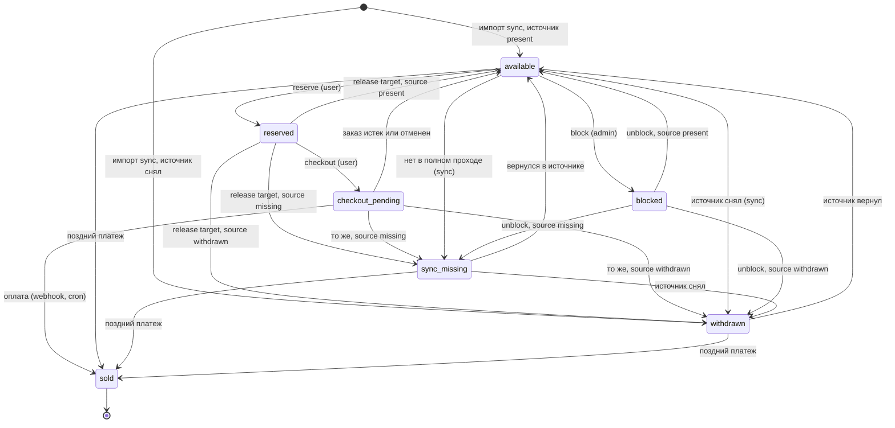
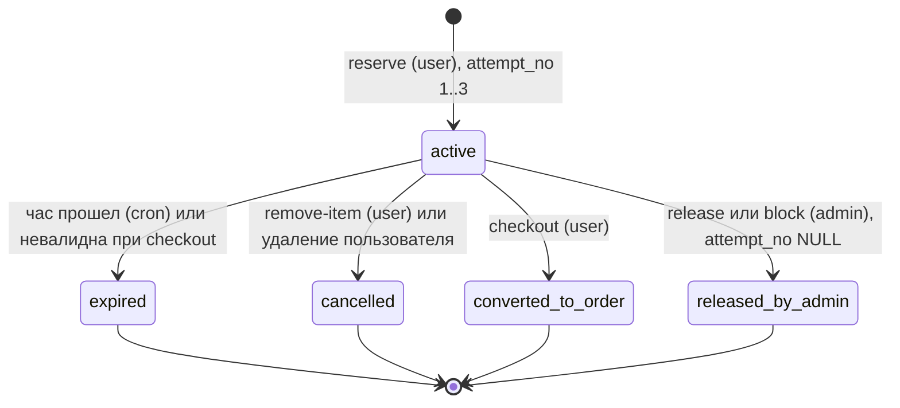
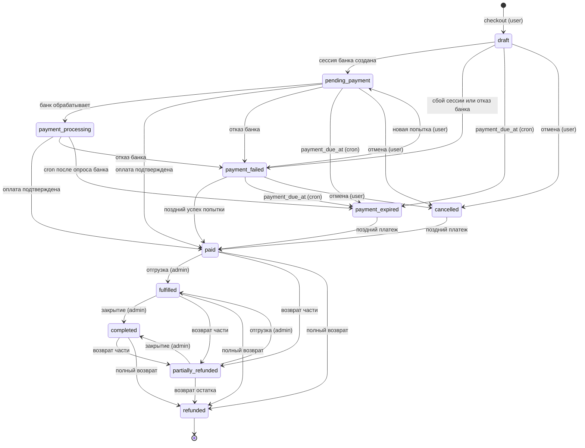
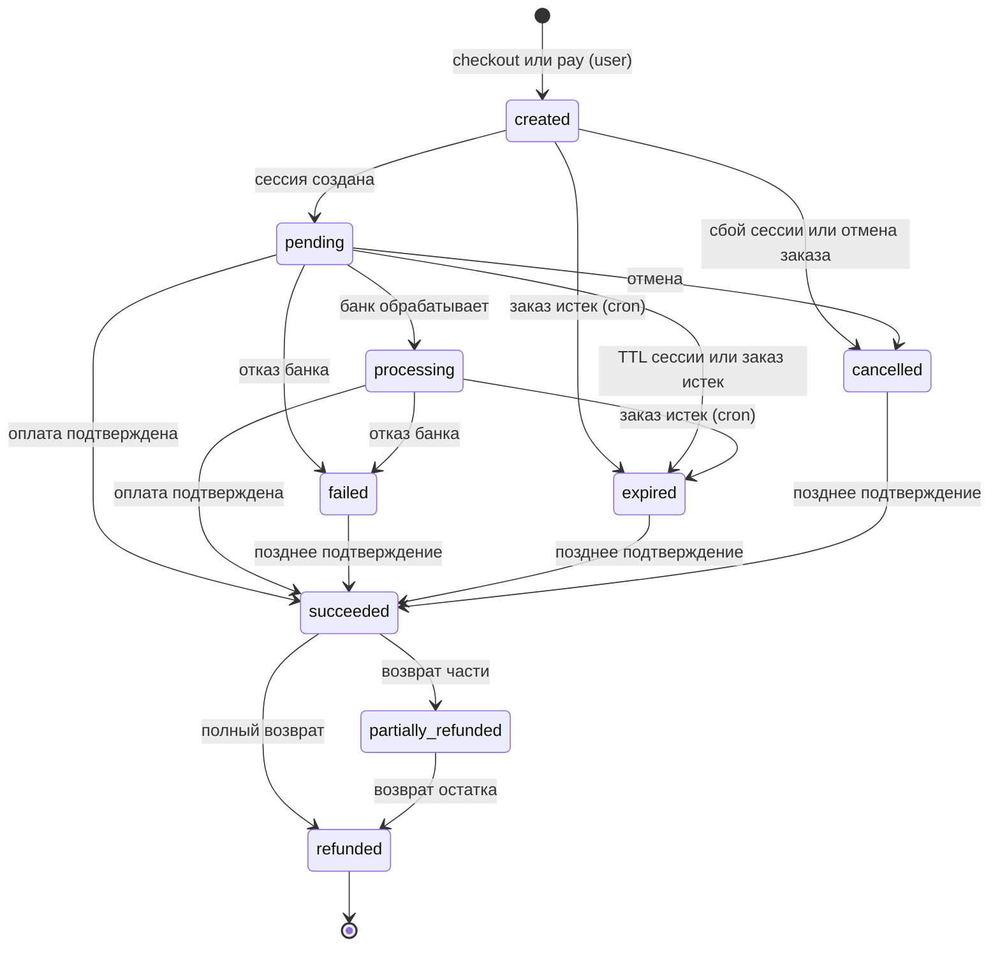
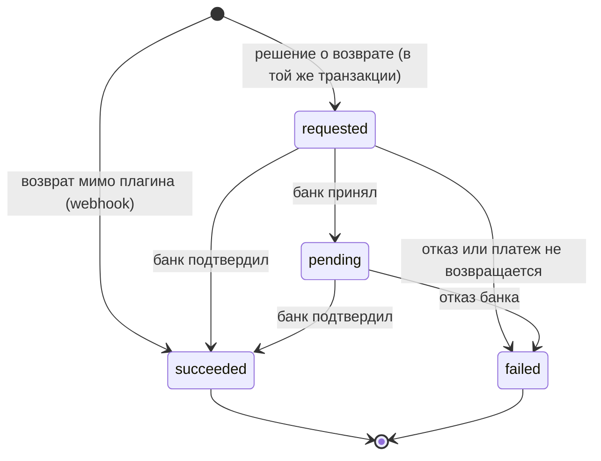

# 04. Статусы и переходы

Все статусы схемы (`sql/schema.sql` v2): смысл, допустимые переходы, инициатор каждого перехода и защита от
запрещённых. Таблицы переходов совпадают с кодом: `allowedTransitions()` enum-ов `Domain\ItemStatus`,
`ReservationStatus`, `OrderStatus`, `PaymentStatus`, карты `PaymentService::PAYMENT_FROM` / `ORDER_FROM` и
guard-ы `ReservationService`, `ReservationExpiryService`, `CheckoutService`, `OrderExpiryService`,
`PaymentService`, `SyncService`, `Rest\AdminController`.

Содержание:

1. [Принципы](#1-принципы)
2. [Сводка](#2-сводка)
3. [Экземпляр](#3-экземпляр-wp_book_itemsavailability_status)
4. [Резерв](#4-резерв-wp_book_reservationsreservation_status)
5. [Позиция корзины](#5-позиция-корзины-wp_book_cart_itemsstatus)
6. [Корзина](#6-корзина-wp_book_cartsstatus)
7. [Заказ](#7-заказ-wp_book_ordersstatus)
8. [Платёж](#8-платёж-wp_book_paymentsstatus)
9. [Возврат](#9-возврат-wp_book_refundsstatus)
10. [Событие платежа](#10-событие-платежа-wp_book_payment_eventsprocessing_status)
11. [Прогон синхронизации](#11-прогон-синхронизации-wp_book_sync_runsstatus)
12. [Согласованность статусов между таблицами](#12-согласованность-статусов-между-таблицами)
13. [Защита переходов](#13-защита-переходов)
14. [Гонки: какой переход выигрывает](#14-гонки-какой-переход-выигрывает)
15. [Соответствие ТЗ](#15-соответствие-тз)

---

## 1. Принципы

* Статус в БД — `VARCHAR(n) CHARACTER SET utf8mb4 COLLATE utf8mb4_bin` + `CHECK (… IN (…))` с именем
  `<таблица>_chk_status` (`wp_book_items_chk_status`); в PHP — backed enum (для корзины, позиции корзины,
  возврата, события и прогона — строковые литералы в guard-ах сервисов). `utf8mb4_bin` делает CHECK
  регистрозависимым: `'Available'` даёт 3819. Почему не `ENUM` и не `ascii` —
  [03, разделы 1, 7, 13](03-tables-and-indexes.md).
* Переход выполняется в `Db::transaction()` (READ COMMITTED): `SELECT … FOR UPDATE` в глобальном порядке
  блокировок — 0 `sync_runs`, `records` (только синхронизация); 1 `carts`; 2 `items` (по возрастанию id);
  3 `reservations`; 4 `cart_items`; 5 `orders`; 6 `payments`; 7 `payment_events`; 8 `refunds` — затем
  перепроверка прочитанного, условный `UPDATE … WHERE <статус> IN (допустимые исходные)` с проверкой числа
  строк и `AuditLog::record()` в той же транзакции: статус и аудит фиксируются или откатываются вместе.
* HTTP к банку и источнику — только вне транзакции; письма, возвраты, уведомления — задачи Action Scheduler
  после COMMIT.
* Терминальные статусы не покидаются. Намеренное исключение — деньги: подтверждение банка, пришедшее после
  закрытия платежа или заказа, проводится по ветке «поздний платёж» (деньги не теряются, конфликт разбирает
  менеджер).

| Инициатор | Что это | `actor_type` |
|---|---|---|
| user | REST покупателя: cookie + `X-WP-Nonce`, `user_id = get_current_user_id()` | `user` |
| admin | REST/wp-admin с capability `manage_book_reservations`, `manage_book_catalog`, `manage_book_orders`, `manage_book_sync` | `admin` |
| cron | Action Scheduler, группа `uniundata`: `uniundata_expire_reservations`, `uniundata_expire_orders` (каждые 60 с), `uniundata_abandon_carts` (04:40 UTC) | `cron` |
| webhook | `POST /payment/webhook` после проверки подписи | `webhook` |
| sync | `uniundata_sync_daily` (03:15 UTC), `POST /admin/sync/run`, `wp uniundata sync` | `sync` / `cli` |
| system | Задача `uniundata_refund_payment {refund_id}` (статус возврата, через него — платежа и заказа); хук `delete_user` (снятие резервов, отмена неоплаченных заказов) | `system` |

---

## 2. Сводка

| Сущность | Колонка | Значения | Терминальные |
|---|---|---|---|
| Экземпляр | `wp_book_items.availability_status` | `available`, `reserved`, `checkout_pending`, `sold`, `withdrawn`, `sync_missing`, `blocked` | `sold` |
| Экземпляр (источник) | `wp_book_items.source_status` | `present`, `missing`, `withdrawn` | — (отражает источник) |
| Резерв | `wp_book_reservations.reservation_status` | `active`, `expired`, `cancelled`, `converted_to_order`, `released_by_admin` | все, кроме `active` |
| Позиция корзины | `wp_book_cart_items.status` | `active`, `expired`, `removed`, `converted_to_order` | все, кроме `active` |
| Корзина | `wp_book_carts.status` | `active`, `checkout_started`, `converted_to_order`, `abandoned`, `expired` | `converted_to_order`, `abandoned`, `expired` |
| Заказ | `wp_book_orders.status` | `draft`, `pending_payment`, `payment_processing`, `paid`, `payment_failed`, `payment_expired`, `cancelled`, `refunded`, `partially_refunded`, `fulfilled`, `completed` | `refunded` (`payment_expired`, `cancelled` — кроме позднего платежа) |
| Платёж | `wp_book_payments.status` | `created`, `pending`, `processing`, `succeeded`, `failed`, `cancelled`, `expired`, `refunded`, `partially_refunded` | `refunded` (`failed`, `expired`, `cancelled` — кроме позднего подтверждения) |
| Возврат | `wp_book_refunds.status` | `requested`, `pending`, `succeeded`, `failed` | `succeeded`, `failed` |
| Событие платежа | `wp_book_payment_events.processing_status` | `received`, `processed`, `ignored`, `failed` | `processed`, `ignored` |
| Прогон синхронизации | `wp_book_sync_runs.status` | `running`, `succeeded`, `partial`, `failed`, `aborted` | все, кроме `running` |

Флаг `wp_book_orders.needs_attention` + `attention_reason` — не статус, а очередь ручного разбора; сочетается
с любым статусом заказа (раздел 7.6).

---

## 3. Экземпляр: `wp_book_items.availability_status`

### 3.1. Статусы

| Статус | Смысл | Витрина (`ItemStatus::publicState()`) |
|---|---|---|
| `available` | Свободен: нет активного резерва и открытого заказа | `available` — кнопка «Отложить» активна |
| `reserved` | Ровно один активный резерв (не старше часа) | `reserved` — «Зарезервирована»; владельцу — «В корзине» |
| `checkout_pending` | В открытом заказе (`draft`, `pending_payment`, `payment_processing`, `payment_failed`) до `payment_due_at` | `reserved` |
| `sold` | Продан: есть строка `wp_book_sales`, `sold_at` заполнен | `sold` — «Продано» |
| `withdrawn` | Снят с продажи источником | `unavailable` — скрыт из списков, по ссылке «Нет в продаже» |
| `sync_missing` | Не пришёл в последнем полном проходе синхронизации | `unavailable` |
| `blocked` | Заблокирован администратором | `unavailable` |

Кнопка строится по `GET /catalog/availability?item_ids=…` (без кэша), а не по закэшированной странице;
решение о резерве принимает только сервер под блокировкой.

`source_status` — мнение источника. Синхронизация не трогает `reserved`, `checkout_pending`, `sold`, `blocked`,
но запоминает, что источник книгу снял или потерял. При освобождении экземпляр получает **целевой статус
освобождения** (release target, `ItemStatus::releaseTarget()`):

```sql
CASE source_status WHEN 'present' THEN 'available' WHEN 'missing' THEN 'sync_missing' WHEN 'withdrawn' THEN 'withdrawn' END
```

Освобождать можно только из `reserved` (освобождающий резерв) или `checkout_pending` (освобождающий заказ) и
только экземпляр, принадлежащий этому резерву или заказу.

### 3.2. Переходы

| # | Переход | Операция | Инициатор | Guard и сопутствующие изменения |
|---|---|---|---|---|
| 1 | (новый) → `available` / `withdrawn` | Импорт синхронизацией по `source_status` источника | sync | `INSERT`; `uq_items_external`. Экземпляр в валюте ≠ `uniundata_currency` (RUB) не импортируется (`currency_mismatch` в `error_log` прогона) |
| 2 | `available` → `reserved` | `POST /cart/reserve` | user | `WHERE id = ? AND availability_status = 'available'` под `FOR UPDATE`; `is_active = 1`; валюта = валюте магазина (иначе 409 `uniundata_item_unavailable`, `data.reason = 'currency'`); попыток < 3; активных резервов пользователя < `uniundata_max_active_reservations` (10, иначе 409 `uniundata_active_reservation_limit`); в той же транзакции — резерв `active` и позиция корзины `active` |
| 3 | `reserved` → `checkout_pending` | `POST /checkout` | user | `WHERE id IN (…) AND availability_status = 'reserved'`; резерв этого пользователя `active` и `expires_at > UTC_TIMESTAMP(6)`; резерв → `converted_to_order` |
| 4 | `reserved` → release target | Истечение резерва; удаление из корзины; снятие администратором; блокировка экземпляра в корзине; checkout нашёл невалидную позицию; повторный reserve/remove владельцем просроченного резерва; удаление пользователя | cron, user, admin, system | `WHERE id = ? AND availability_status = 'reserved'`; освобождающий резерв заблокирован, `active` и относится к этому экземпляру |
| 5 | `checkout_pending` → `sold` | Подтверждённая оплата | webhook, cron (опрос банка — общий путь `applyProviderResult()`) | `WHERE id IN (…) AND availability_status = 'checkout_pending'`; `sold_at` заполняется; `INSERT` в `wp_book_sales` |
| 6 | `checkout_pending` → release target | Заказ → `payment_expired` или `cancelled` | cron, user, system | `WHERE id IN (…) AND availability_status = 'checkout_pending'`; заказ заблокирован и был открыт |
| 7 | `available` → `sync_missing` | Не пришёл в **полном** проходе | sync | Только в завершении полного прохода; не применяется, если пропало > 10 % активных экземпляров (`MISSING_THRESHOLD`, прогон → `partial` + оповещение) |
| 8 | `available` / `sync_missing` → `withdrawn` | Источник снял экземпляр | sync | `WHERE availability_status = ?` (прочитанный под блокировкой) |
| 9 | `available` → `blocked` | `POST /admin/items/{id}/block` | admin (`manage_book_catalog`) | `WHERE availability_status = 'available'`. Из `reserved` — в одной транзакции резерв → `released_by_admin` (нужна ещё `manage_book_reservations`, иначе 403), экземпляр → release target → `blocked` (две записи аудита); если release target ≠ `available`, блокировка не нужна — 200 с этим статусом. Из `checkout_pending` — 409 (`data.required_action = 'cancel_order'`) |
| 10 | `blocked` → release target | `POST /admin/items/{id}/unblock` | admin (`manage_book_catalog`) | `WHERE availability_status = 'blocked'`; `available` / `sync_missing` / `withdrawn` по `source_status` |
| 11 | `sync_missing` → `available` | Экземпляр снова пришёл | sync | `WHERE availability_status = 'sync_missing'` |
| 12 | `withdrawn` → `available` | Источник вернул экземпляр | sync | Только если `withdrawn` выставлен источником (`source_status = 'withdrawn'`) |
| 13 | `available` / `sync_missing` / `withdrawn` → `sold` | **Поздний платёж** (заказ уже `payment_expired`/`cancelled`), экземпляр свободен: статус из списка и нет активного резерва | webhook, cron | `WHERE id IN (…) AND availability_status IN ('available', 'sync_missing', 'withdrawn')` под `FOR UPDATE`. Занятые экземпляры не продаются: `needs_attention`, `late_payment_conflict`, возврат (раздел 7.6). Проданный при `source_status ≠ 'present'` — `late_payment_source_check` |

Ручное снятие с продажи — `blocked`, а не `withdrawn`: `withdrawn` отражает источник, `blocked` синхронизация
не трогает. Переходов `withdrawn`/`sync_missing` → `blocked` нет: такие экземпляры и так не продаются.

### 3.3. Диаграмма



### 3.4. Синхронизация и локальный статус

Синхронизация всегда обновляет `source_status`, цену и поля источника, а `availability_status` меняет только
у `available`, `sync_missing`, `withdrawn` (`ItemStatus::isProtectedFromSync()`):

| Локальный статус \ источник | `present` | нет в полном проходе (`missing`) | `withdrawn` |
|---|---|---|---|
| `available` | без изменений | → `sync_missing` (переход 7) | → `withdrawn` |
| `sync_missing` | → `available` | без изменений | → `withdrawn` |
| `withdrawn` (`source_status = 'withdrawn'`) | → `available` | без изменений | без изменений |
| `withdrawn` при `source_status = 'present'` (выставлен не синхронизацией) | не трогается, `items_conflicts += 1` | `source_status = 'missing'` | → `source_status` |
| `reserved`, `checkout_pending`, `blocked` | статус не меняется | `source_status = 'missing'`, `items_conflicts += 1`; освобождение даст `sync_missing` | `source_status = 'withdrawn'`, `items_conflicts += 1`; освобождение даст `withdrawn` |
| `sold` | не меняется; источник предлагает проданную книгу — `items_conflicts += 1` | не меняется (проход пропавших `sold` не трогает) | `source_status = 'withdrawn'` |

### 3.5. Запрещённые переходы и защита

| Запрещено | Чем защищено |
|---|---|
| Выход из `sold` | Ни один `UPDATE` не содержит `sold` в исходных статусах; `wp_book_items_chk_sold_at` (`sold` ⇔ `sold_at IS NOT NULL`); `uq_sales_book_item` не даст второй продажи. Возврат денег экземпляр в продажу не возвращает |
| Второй резерв на `reserved` (другой пользователь, двойной клик) | `FOR UPDATE` строки экземпляра + guard `availability_status = 'available'`; второй рубеж — `uq_reservations_one_active_per_item`, `uq_cart_items_one_active_per_item` (1062 → 409 `uniundata_item_unavailable`) |
| `available` → `checkout_pending` в обход резерва | Checkout берёт экземпляры только из активных резервов пользователя; guard `availability_status = 'reserved'` |
| `reserved`/`checkout_pending` → `blocked` напрямую | Блокировка только из `available`: резерв сначала снимается (`released_by_admin`), заказ — отменяется |
| Синхронизация меняет `reserved`/`checkout_pending`/`sold`/`blocked` | Guard синхронизации; мнение источника пишется в `source_status` |
| `reserved` → `sold` без заказа | Продажа — только позиции оплачиваемого заказа из `checkout_pending` (или свободного экземпляра по ветке позднего платежа) |

---

## 4. Резерв: `wp_book_reservations.reservation_status`

### 4.1. Статусы

| Статус | Смысл | Попытка | `attempt_no` | `released_at` |
|---|---|---|---|---|
| `active` | Действует до `expires_at = reserved_at + 1 час`, не продлевается | да | 1..3 | `NULL` |
| `expired` | Час истёк, или checkout признал позицию невалидной (`release_reason = 'checkout_<причина>'`) | да | 1..3 | заполнен |
| `cancelled` | Удалён из корзины (`user_removed`) или пользователь удалён (`user_deleted`) | да | 1..3 | заполнен |
| `converted_to_order` | Вошёл в заказ; `order_id` заполнен | да | 1..3 | заполнен |
| `released_by_admin` | Снят администратором (`admin_release` или код администратора, `admin_block`) | **нет** | `NULL` | заполнен |

Новый `attempt_no = 1 + COUNT(*)` резервов пары `(user_id, book_item_id)` с `attempt_no IS NOT NULL`, под
блокировкой строки экземпляра. Четвёртую попытку физически не вставить: `wp_book_reservations_chk_attempt_range`
(3819; `Db::isCheckViolation('_chk_attempt_range')` сравнивает суффикс, поэтому работает при любом префиксе) или
`uq_reservations_attempt` (1062) → 409 `uniundata_reservation_limit_reached`.

* Повторное «Отложить» владельцем своего действующего резерва — 200 и тот же резерв, попытка не создаётся.
* Свой просроченный резерв, до которого ещё не дошёл cron, при reserve/remove-item закрывается как `expired`
  (это была попытка); при reserve создаётся следующая попытка.
* Чужой просроченный резерв освобождает только cron (иначе пришлось бы блокировать чужую корзину после
  экземпляра — нарушение порядка блокировок): до минуты экземпляр отвечает 409.
* `converted_to_order` — попытка: если заказ истёк и экземпляр освободился, новое «Отложить» — попытка N+1.

### 4.2. Переходы

| Переход | Операция | Инициатор | Guard и сопутствующие изменения |
|---|---|---|---|
| (новый) → `active` | `POST /cart/reserve` | user | `INSERT` под `FOR UPDATE` экземпляра; экземпляр → `reserved`; позиция корзины `active` |
| `active` → `expired` | `uniundata_expire_reservations` (`expires_at <= UTC_TIMESTAMP(6)`, перепроверка под блокировкой); checkout с невалидной позицией; reserve/remove-item владельцем просроченного резерва | cron, user | `WHERE id = ? AND reservation_status = 'active'`; позиция → `expired`; экземпляр → release target; корзина без активных позиций → `expired` (кроме remove-item) |
| `active` → `cancelled` | `POST /cart/remove-item`; удаление пользователя | user, system | то же + `user_id = ?`; позиция → `removed`; экземпляр → release target немедленно |
| `active` → `converted_to_order` | `POST /checkout` | user | `WHERE id IN (…) AND reservation_status = 'active'` после проверки `expires_at > UTC_TIMESTAMP(6)` под блокировкой; `order_id`, `release_reason = 'converted_to_order'`; позиция → `converted_to_order`; экземпляр → `checkout_pending` |
| `active` → `released_by_admin` | `POST /admin/reservations/{id}/release`; блокировка экземпляра | admin (`manage_book_reservations`) | `WHERE id = ? AND reservation_status = 'active'`; `attempt_no = NULL` (`wp_book_reservations_chk_attempt_admin`); позиция → `removed`; экземпляр → release target |

Во всех финальных переходах `released_at = UTC_TIMESTAMP(6)` (`wp_book_reservations_chk_released`), а
generated column `active_book_item_id` становится `NULL`, освобождая экземпляр для следующего резерва.

### 4.3. Диаграмма



### 4.4. Запрещённые переходы и защита

| Запрещено | Чем защищено |
|---|---|
| Выход из финального статуса («реанимация» `expired` → `active`) | Все `UPDATE` резерва — с guard `reservation_status = 'active'`; новая попытка — новая строка |
| Продление `expires_at` | Код его не меняет; открытие корзины ничего не пишет; `wp_book_reservations_chk_window` (`expires_at > reserved_at`) |
| `converted_to_order` после истечения часа | Проверка `expires_at > UTC_TIMESTAMP(6)` под блокировкой; истёкшие позиции → `expired` и 409 `uniundata_cart_changed` |
| Два `active` на экземпляр | `FOR UPDATE` экземпляра + `uq_reservations_one_active_per_item` |
| `released_by_admin` с номером попытки или другой статус без номера | `wp_book_reservations_chk_attempt_admin` |
| `converted_to_order` без заказа | `wp_book_reservations_chk_order` |

---

## 5. Позиция корзины: `wp_book_cart_items.status`

Позиция — представление резерва (`ReservationStatus::cartItemStatus()`); меняется в той же транзакции, что и
резерв, с guard `WHERE id = ? AND status = 'active'`.

| Статус | Смысл | Статус резерва | Переход из `active` — инициатор |
|---|---|---|---|
| `active` | Книга в корзине, таймер по `expires_at` (копия срока резерва) | `active` | (новая) — user (reserve); `uq_cart_items_one_active_per_item`, `uq_cart_items_reservation` |
| `expired` | Срок истёк или позиция невалидна при checkout | `expired` | cron, user |
| `removed` | Удалена пользователем, снята или заблокирована администратором, пользователь удалён | `cancelled`, `released_by_admin` | user, admin, system |
| `converted_to_order` | Вошла в заказ | `converted_to_order` | user (checkout) |

Финальные статусы терминальны; при выходе из `active` заполняется `closed_at` (`wp_book_cart_items_chk_closed`).
Позиции истекают независимо: книги, отложенные в 10:00, 10:20 и 10:40, освобождаются в 11:00, 11:20 и 11:40.

---

## 6. Корзина: `wp_book_carts.status`

| Статус | Смысл | Открыта |
|---|---|---|
| `active` | Обычное состояние | да |
| `checkout_started` | Checkout ответил 409 `uniundata_cart_changed`, ждём повторного подтверждения того же состава | да |
| `converted_to_order` | Из корзины создан заказ | нет |
| `expired` | Не осталось активных позиций: истекла последняя или все признаны невалидными при checkout | нет |
| `abandoned` | Пустая и без активности 30 дней; либо пользователь удалён | нет |

«Открыта» = `active` или `checkout_started`: для обоих generated column `open_cart_user_id = user_id`, reserve,
remove-item и checkout работают одинаково.

| Переход | Операция | Инициатор |
|---|---|---|
| (новая) → `active` | Первый резерв без открытой корзины: `INSERT … ON DUPLICATE KEY UPDATE id = LAST_INSERT_ID(id)` по `uq_carts_one_open_per_user`, затем `SELECT … FOR UPDATE` | user |
| `active` → `checkout_started` | `POST /checkout` вернул 409 `uniundata_cart_changed` (`positions_expired` или `total_mismatch`), активные позиции остались; `checkout_started_at = COALESCE(checkout_started_at, now)` | user |
| `checkout_started` → `active` | Покупатель изменил состав: `POST /cart/reserve` или `/cart/remove-item` (`ReservationService::refreshCartLocked()`, `checkout_started_at = NULL`, аудит `cart_modified`) — оформление начинается заново | user |
| `active` / `checkout_started` → `converted_to_order` | Checkout создал заказ (из `active` — сразу, без промежуточного статуса) | user |
| `active` / `checkout_started` → `expired` | Последняя активная позиция истекла (cron) или checkout не нашёл ни одной валидной позиции | cron, user |
| `active` / `checkout_started` → `abandoned` | `uniundata_abandon_carts`: нет активных позиций и `last_activity_at` старше 30 дней; удаление пользователя | cron, system |

Истечение позиций (cron), снятие и блокировка администратором статус открытой корзины не меняют; checkout
принимает обе формы. Удаление последней книги корзину не закрывает (пустая открытая корзина закрывается через
30 дней). При закрытии заполняется `closed_at` (`wp_book_carts_chk_closed`),
`open_cart_user_id` становится `NULL` — следующий резерв создаст новую корзину. Открытие страницы корзины не
меняет ни статус, ни `last_activity_at`, ни сроки.

---

## 7. Заказ: `wp_book_orders.status`

### 7.1. Статусы

| Статус | Смысл | Экземпляры | Покупатель может |
|---|---|---|---|
| `draft` | Заказ создан транзакцией checkout, сессии у банка ещё нет | `checkout_pending` | оплатить (`POST /orders/{id}/pay`), отменить |
| `pending_payment` | Сессия создана, покупатель на странице банка | `checkout_pending` | оплатить (живая сессия возвращается повторно), отменить |
| `payment_processing` | Банк обрабатывает платёж (3-D Secure, асинхронный метод) | `checkout_pending` | ждать: отмена — 409 `uniundata_order_not_cancellable` |
| `payment_failed` | Последняя попытка не удалась; до `payment_due_at` можно повторить | `checkout_pending` | повторить, отменить |
| `payment_expired` | `payment_due_at` прошёл без оплаты (после опроса банка) | release target | — |
| `cancelled` | Отменён до оплаты | release target | — |
| `paid` | Оплата подтверждена webhook-ом или опросом банка | `sold` | — |
| `fulfilled` | Передан в доставку / выдан | `sold` | — |
| `completed` | Завершён | `sold` | — |
| `partially_refunded` | Возвращена часть (`refunded_amount < total_amount`) | `sold` | — |
| `refunded` | Возвращена вся сумма | `sold` (в продажу не возвращаются) | — |

### 7.2. Почему есть `draft`

`draft` — **заказ зафиксирован в БД, а сессии у банка ещё нет**; это следствие правила «HTTP к банку — вне
транзакции»:

1. Tx1 checkout: заказ `draft` (`payment_due_at = now + uniundata_payment_ttl_minutes (30) +
   uniundata_payment_grace_minutes (10)`), резервы → `converted_to_order`, экземпляры → `checkout_pending`,
   платёж `created` с `idempotency_key`; COMMIT.
2. `createSession` вне транзакции (TTL сессии = payment_ttl; позиции, НДС и контакт для чека 54-ФЗ облачной
   кассы провайдера). Tx2: успех — платёж `pending` + `session_redirect_url`, заказ `pending_payment`; сбой
   банка или сборки чека (фильтр `uniundata_fiscal_receipt`, расхождение суммы) — платёж `cancelled`
   (`failure_code = 'session_create_failed'`), заказ `payment_failed`, ответ 502
   `uniundata_payment_provider_error`. Экземпляры остаются за заказом до `payment_due_at`.
3. Процесс умер между шагами — заказ остаётся `draft`: «Оплатить» повторяет `createSession` с тем же ключом
   (банк вернёт ту же сессию); иначе после `payment_due_at` cron сначала спрашивает банк о платеже `created`
   (запрос мог дойти), затем закрывает заказ.

`draft` — не редактируемый черновик: состав и суммы зафиксированы в checkout.

### 7.3. Переходы

| Переход | Операция | Инициатор |
|---|---|---|
| (новый) → `draft` | `POST /checkout` (повтор того же `Idempotency-Key` возвращает тот же заказ) | user |
| `draft` → `pending_payment` | Сессия создана (Tx2 checkout или `/pay`) либо событие банка `pending` | user, webhook |
| `draft` → `payment_failed` | Сбой `createSession` или событие банка `failed`/`cancelled`/`expired` по последней попытке | user, webhook, cron |
| `draft` → `payment_expired` | `payment_due_at` прошёл (после опроса банка) | cron |
| `draft` → `cancelled` | `POST /orders/{id}/cancel`; удаление пользователя | user, system |
| `pending_payment` → `payment_processing` | Банк: «в обработке» | webhook, cron |
| `pending_payment` → `paid` | Платёж `succeeded` | webhook, cron |
| `pending_payment` → `payment_failed` | Событие `failed`/`cancelled`/`expired` по последней попытке | webhook, cron |
| `pending_payment` → `payment_expired` | `payment_due_at` прошёл, банк подтвердил отсутствие оплаты | cron |
| `pending_payment` → `cancelled` | Отмена, если ни один платёж не `processing`/`succeeded`; после COMMIT — `cancelSession` | user, system |
| `payment_processing` → `paid` / `payment_failed` | Итог обработки | webhook, cron |
| `payment_processing` → `payment_expired` | Срок прошёл; если банк отвечает `processing`, срок один раз продлевается на grace (`payment_due_extended_at`, `needs_attention = 'payment_processing_overdue'`), затем заказ закрывается | cron |
| `payment_failed` → `pending_payment` | `POST /pay`: новая попытка (`attempt_no + 1`, не более 10; прежняя `pending` → `expired`) — пока до `payment_due_at − grace` не меньше 120 с; или событие `pending` | user, webhook |
| `payment_failed` → `paid` | Предыдущая попытка всё-таки прошла | webhook, cron |
| `payment_failed` → `payment_expired` | `payment_due_at` прошёл | cron |
| `payment_failed` → `cancelled` | Отмена | user, system |
| `payment_expired` → `paid`, `cancelled` → `paid` | **Поздний платёж**: свободные экземпляры продаются; занятые — `needs_attention`, возврат по ним (7.6) | webhook, cron |
| `paid` → `fulfilled`, `fulfilled` → `completed`, `partially_refunded` → `fulfilled` / `completed` | Отгрузка и закрытие; частичный возврат выполнение не останавливает | admin (`manage_book_orders`) |
| `paid` / `fulfilled` / `completed` → `partially_refunded` / `refunded`; `partially_refunded` → `refunded` | Возврат основного платежа завершён: `orders.refunded_amount` < или = `total_amount` | system (задача возврата), webhook |

Прямых переходов `draft → paid`, `draft → payment_processing` и `payment_failed → payment_processing` нет:
если событие банка опередило Tx2, обработчик в одной транзакции проводит заказ через `pending_payment` (две
записи аудита). Второй успешный платёж по оплаченному заказу статус заказа не меняет (`duplicate_payment`,
7.6); возврат дубля меняет статус только этого платежа.

### 7.4. Диаграмма



### 7.5. Запрещённые переходы и защита

| Запрещено | Чем защищено |
|---|---|
| `paid` и далее → `payment_expired` / `cancelled` / `payment_failed` | Guard истечения `status IN ('draft', 'pending_payment', 'payment_processing', 'payment_failed')`, отмены — `IN ('draft', 'pending_payment', 'payment_failed')`; заказ под `FOR UPDATE`, статус перепроверен |
| Отмена при деньгах в пути | Отмена отказывает (409 `uniundata_order_not_cancellable`), если заказ `payment_processing` или любой его платёж `processing`/`succeeded`/`refunded`/`partially_refunded` |
| Повторный `paid` (дубль webhook-а), `paid` из `refunded` | `ORDER_FROM['paid']` = `pending_payment`, `payment_processing`, `payment_failed`, `payment_expired`, `cancelled`; дедупликация `uq_payment_events_provider`; `uq_sales_order_item`/`uq_sales_book_item` |
| Автозакрытие заказа на разборе `amount_mismatch` / `reference_mismatch` | Выборка `uniundata_expire_orders` исключает такие заказы; решение за менеджером |
| `paid` без `paid_at` | `wp_book_orders_chk_paid_at` |
| Возврат больше суммы заказа | `wp_book_orders_chk_refund` (`refunded_amount <= total_amount`) |
| Оплата после `payment_due_at` | `/pay` под блокировкой заказа проверяет запас до `payment_due_at − grace` → 409 `uniundata_order_not_payable` |
| Выход из `refunded` | Нет guard-а с `refunded` в исходных статусах |

### 7.6. `needs_attention`: причины ручного разбора

`PaymentService::flagOrder()` ставит `needs_attention = 1` и `attention_reason`, пишет аудит
`order.needs_attention` и после COMMIT ставит задачу `uniundata_order_needs_attention {order_id, reason}`
(письмо менеджеру). Блокирующие причины `amount_mismatch` и `reference_mismatch` менее важные не перетирают;
история причин — в аудите.

| Причина | Когда | Что происходит |
|---|---|---|
| `late_payment_conflict` | Поздний платёж, часть экземпляров занята | Заказ `paid`, свободные экземпляры проданы, возврат `late_payment_conflict` на сумму занятых позиций (или весь платёж, если продать нечего) |
| `late_payment_source_check` | Поздний платёж забрал экземпляр с `source_status ≠ 'present'` | Продажа проведена; книгу нужно проверить физически |
| `duplicate_payment` | Второй успешный платёж по оплаченному заказу | Платёж `succeeded`, возврат `duplicate_payment` на его сумму, заказ не меняется |
| `amount_mismatch` | Сумма или валюта банка ≠ `payments.amount`/`currency` | Платёж и заказ не меняются (только `provider_status`); cron заказ не закрывает |
| `reference_mismatch` | `public_order_id` или ключ попытки у банка не совпали | То же |
| `payment_processing_overdue` | Срок прошёл, банк отвечает `processing` | Однократное продление `payment_due_at` на grace |
| `refund_failed` | Возврат → `failed` | Решение менеджера (новый возврат — новая строка) |
| `refund_stuck` | Возврат `requested`/`pending` дольше суток | Опрос банка продолжается |
| `refund_unexpected` | Событие возврата по неоплаченному платежу | Статусы не меняются |
| `refund_mismatch` | Банк сообщил о возврате больше остатка платежа | Статусы не меняются |

---

## 8. Платёж: `wp_book_payments.status`

### 8.1. Статусы

| Статус | Смысл |
|---|---|
| `created` | Строка с `idempotency_key` создана до HTTP-запроса; сессии у банка может не быть |
| `pending` | Сессия создана (`provider_payment_id`, `session_expires_at`, `session_redirect_url`) |
| `processing` | Банк обрабатывает платёж |
| `succeeded` | Банк подтвердил оплату (`succeeded_at`, `wp_book_payments_chk_succeeded`). Факт оплаты — только webhook с проверенной подписью или ответ API банка, не return URL |
| `failed` | Банк отклонил платёж **по открытой сессии** |
| `cancelled` | Сессия отменена банком или покупателем; заказ отменён (`failure_code = 'order_cancelled'`); сбой `createSession` или сборки чека (`session_create_failed`); заказ оплачен другой попыткой |
| `expired` | TTL сессии истёк; заказ истёк (`order_expired`); попытку заменила новая (`superseded_by_new_attempt`) |
| `partially_refunded` / `refunded` | Подтверждён возврат части / всей суммы (`refunded_amount`, `wp_book_payments_chk_amount`: `refunded_amount <= amount`) |

### 8.2. Переходы

| Переход | Операция | Инициатор |
|---|---|---|
| (новый) → `created` | Checkout или `POST /pay` (новая попытка) | user |
| `created` → `pending` | Сессия создана (Tx2) или событие банка | user, webhook |
| `created` → `cancelled` | Сбой `createSession`; отмена заказа; заказ оплачен другой попыткой | user, system, webhook, cron |
| `created` → `expired` | Заказ истёк | cron |
| `pending` → `processing` / `succeeded` / `failed` | Событие или ответ API банка | webhook, cron |
| `pending` → `cancelled` | Событие банка; отмена заказа; заказ оплачен другой попыткой | webhook, user, system, cron |
| `pending` → `expired` | TTL сессии (событие); заказ истёк; новая попытка через `/pay` | webhook, cron, user |
| `processing` → `succeeded` / `failed` / `expired` | Итог обработки; заказ истёк после продления | webhook, cron |
| `succeeded` → `partially_refunded` / `refunded`; `partially_refunded` → `refunded` | Возврат завершён (`refunded_amount += amount`) | system, webhook |
| `failed` / `expired` / `cancelled` → `succeeded` | **Только** позднее подтверждение банка | webhook, cron |

`created → failed` запрещён: `failed` — ответ банка по открытой сессии, сбой создания сессии — `cancelled`.
Событие `processing`/`succeeded`/`failed` по строке `created` (опередило Tx2) проводится через `pending` в одной
транзакции (две записи аудита).

Влияние на заказ:

| Платёж стал | Заказ |
|---|---|
| `pending` (последняя попытка) | `draft` / `payment_failed` → `pending_payment` |
| `processing` (последняя попытка) | `draft` / `pending_payment` / `payment_failed` → `payment_processing` (через `pending_payment`) |
| `succeeded` | открытый → `paid`; `payment_expired` / `cancelled` → `paid` по ветке позднего платежа; уже оплачен → без изменений, `duplicate_payment`. Остальные открытые попытки → `cancelled` (+ `cancelSession` после COMMIT) |
| `failed` / `cancelled` / `expired` по событию банка (последняя попытка) | `draft` / `pending_payment` / `payment_processing` → `payment_failed` |
| `cancelled` / `expired` по нашему действию | заказ уже `cancelled` / `payment_expired` / `paid`, не меняется |
| `partially_refunded` / `refunded` (основной платёж) | → `partially_refunded` / `refunded` по `orders.refunded_amount`; возврат дубля заказ не меняет |

Основной платёж — тот, на который ссылаются продажи; без продаж — первый с полученными деньгами.

### 8.3. Диаграмма



### 8.4. Запрещённые переходы и защита

| Запрещено | Чем защищено |
|---|---|
| `succeeded` → `failed` / `expired` / `processing` (события не по порядку) | `PAYMENT_FROM` + `UPDATE … WHERE id = ? AND status = <прочитанный>`; опоздавшее событие → `processing_status = 'ignored'` |
| `created` → `failed` | `PAYMENT_FROM['failed']` = `pending`, `processing` |
| `succeeded` без `succeeded_at` | `wp_book_payments_chk_succeeded` |
| Две сессии на одну попытку | `uq_payments_idempotency` + тот же ключ у банка; живая сессия при повторе `/pay` возвращается (`payment.reused = true`) |
| Дубли номера попытки или платежа провайдера | `uq_payments_attempt`, `uq_payments_provider_id` |
| Успех без сверки суммы, валюты и ссылок | Сверяются `amount`, `currency`, `public_order_id`, ключ попытки; расхождение — статус не меняется, `amount_mismatch` / `reference_mismatch` |
| Возврат больше суммы | `wp_book_payments_chk_amount`; сумма незавершённых и успешных возвратов проверяется под блокировкой (раздел 9) |

---

## 9. Возврат: `wp_book_refunds.status`

Одна строка — один запрос возврата к банку. Решение о возврате и строка `requested` фиксируются **в одной
транзакции**; запрос к банку делает задача `uniundata_refund_payment {refund_id}` после COMMIT.

| Статус | Смысл |
|---|---|
| `requested` | Решение принято, банк ещё не вызывался (или вызов не дошёл) |
| `pending` | Банк принял запрос, итог позже; `provider_refund_id` может быть заполнен |
| `succeeded` | Возврат подтверждён: `completed_at`; `payments.refunded_amount += amount`; для основного платежа — `orders.refunded_amount += amount` и статус заказа |
| `failed` | Банк отказал, или платёж нельзя вернуть через API (`failure_message = 'payment_not_refundable'`); `completed_at`; заказ — `needs_attention = 'refund_failed'` |

| Переход | Операция | Инициатор |
|---|---|---|
| (новый) → `requested` | `duplicate_payment`, `late_payment_conflict` — при обработке платежа; `order_cancelled`, `customer_return`, `manual` — менеджер: `POST /admin/orders/{public_order_id}/refunds` (`manage_book_orders`, ответ 202 + `refund_id`) → `PaymentService::requestRefund()` | webhook, cron, admin |
| `requested` → `pending` | Банк принял запрос | system |
| `requested` / `pending` → `succeeded` | Ответ банка или webhook возврата (сопоставление по `provider_refund_id`, ключу, затем по приросту суммы) | system, webhook |
| `requested` / `pending` → `failed` | Отказ банка; платёж не в `succeeded`/`partially_refunded` или без `provider_payment_id` | system |
| (новый) → `succeeded` | Возврат сделан мимо плагина (кабинет банка) и узнан из webhook-а: строка `manual` создаётся и завершается в одной транзакции | webhook |

* Guard создания: сумма возвратов платежа со `status <> 'failed'` плюс новая ≤ `payments.amount` — под
  `FOR UPDATE` строк возвратов платежа (CHECK не видит других строк). `amount_mismatch` схема допускает, но
  `requestRefund()` принимает только `order_cancelled`, `customer_return`, `manual`.
* `PaymentService::processRefund()`: Tx1 (orders → payments → refunds `FOR UPDATE`, перепроверка
  `status IN ('requested', 'pending')`) → `provider->refund(…, idempotency_key)` вне транзакции → Tx2 в том же
  порядке → `pending | succeeded | failed`. Повтор задачи не создаёт второй возврат: ключ тот же. Пока статус не
  финальный, задача ставит себе следующий запуск с растущим интервалом; старше суток — `refund_stuck`.
* Финальные `succeeded`/`failed` терминальны (`wp_book_refunds_chk_completed`: финальный ⇔ `completed_at`);
  повтор после `failed` — новая строка с новым ключом. Экземпляр остаётся `sold`; при полном возврате платежа
  `wp_book_sales.refunded_at` заполняется.



---

## 10. Событие платежа: `wp_book_payment_events.processing_status`

| Статус | Смысл |
|---|---|
| `received` | Подпись проверена, событие в inbox, ещё не применено |
| `processed` | Применено: статусы изменены или подтверждены |
| `ignored` | Валидно, но действий не требует: опоздавший или повторный статус, платёж не найден (`payment_not_found`), неизвестный тип |
| `failed` | Не применено: ошибка, API банка недоступно или не подтвердило успех; `error_message` заполнен, банк получает 5xx и повторит |

| Переход | Инициатор |
|---|---|
| (новое) → `received` | webhook, только после проверки подписи и окна времени 300 с |
| `received` / `failed` → `processed` / `ignored` / `failed` | webhook (обработчик, повторная доставка) |

Повторная доставка: `INSERT … ON DUPLICATE KEY UPDATE attempts = attempts + 1` по `uq_payment_events_provider`;
`processed`/`ignored` → 200 без изменений. Guard применения — `processing_status IN ('received', 'failed')` под
`FOR UPDATE` (уровень 7 порядка блокировок).

---

## 11. Прогон синхронизации: `wp_book_sync_runs.status`

| Статус | Смысл |
|---|---|
| `running` | Идёт; `heartbeat_at` обновляется после каждого пакета; не более одного на источник (`uq_sync_runs_one_running`) |
| `succeeded` | Источник пройден целиком, ошибок нет |
| `partial` | Пройден целиком, но есть ошибки записей (`errors_count > 0`) или пропало > 10 % активных экземпляров (`sync_missing` не применён, оповещение) |
| `failed` | Прерван (источник недоступен, исключение); `source_cursor` сохранён |
| `aborted` | Признан мёртвым: `heartbeat_at` старше 900 с (`SyncService::STALE_AFTER_SECONDS`) |

| Переход | Инициатор |
|---|---|
| (новый) → `running` | cron, WP-CLI, admin (`manage_book_sync`), `retry`; только после `GET_LOCK(Db::lockName('sync_<source>'), 0)` — имя с суффиксом `@<md5(DB_NAME\|prefix)[0..12]>`, потому что имена `GET_LOCK` общие для сервера MySQL (на нём и `new.libsmr.ru`, и `shop.libsmr.ru`) |
| `running` → `succeeded` / `partial` / `failed` | сам прогон |
| `running` → `aborted` | следующий запуск: `UPDATE … SET status = 'aborted', finished_at = UTC_TIMESTAMP(6) WHERE id = ? AND status = 'running' AND heartbeat_at < …` |

Статусы, кроме `running`, терминальны (`wp_book_sync_runs_chk_finished`: `running` ⇔ `finished_at IS NULL`).
Продолжение после сбоя — **новая строка**: `resumed_from_run_id` = упавший прогон, тот же
`pass_started_run_id`, `source_cursor` упавшего (если последний прогон `failed`/`aborted`, моложе 36 ч и
курсор не `NULL`). `sync_missing` и неактивность записей ставит только завершение полного прохода: прерванный
прогон «не видел» часть каталога.

---

## 12. Согласованность статусов между таблицами

| `availability_status` | Активный резерв | Активная позиция корзины | Открытый заказ* с экземпляром | Строка `wp_book_sales` |
|---|---|---|---|---|
| `available` | нет | нет | нет | нет |
| `reserved` | ровно 1 | ровно 1 (того же резерва) | нет | нет |
| `checkout_pending` | нет | нет | ровно 1 | нет |
| `sold` | нет | нет | нет (заказ оплачен) | ровно 1 |
| `withdrawn`, `sync_missing`, `blocked` | нет | нет | нет | нет |

\* Открытый заказ — `draft`, `pending_payment`, `payment_processing`, `payment_failed`.

Диагностические запросы (каждый должен вернуть 0 строк; проверены на схеме v2; основа `wp uniundata doctor` и
мониторинга, полный набор — `sql/queries.sql`, раздел 10):

```sql
-- 1. reserved ⇔ есть активный резерв
SELECT i.id, i.availability_status, r.id AS active_reservation_id
  FROM wp_book_items i
  LEFT JOIN wp_book_reservations r ON r.active_book_item_id = i.id
 WHERE (i.availability_status = 'reserved') <> (r.id IS NOT NULL);

-- 2. активная позиция корзины ⇔ активный резерв
SELECT ci.id, ci.status, r.reservation_status
  FROM wp_book_cart_items ci
  JOIN wp_book_reservations r ON r.id = ci.reservation_id
 WHERE (ci.status = 'active') <> (r.reservation_status = 'active');

-- 3. sold ⇔ есть продажа
SELECT i.id, i.availability_status, s.id AS sale_id
  FROM wp_book_items i
  LEFT JOIN wp_book_sales s ON s.book_item_id = i.id
 WHERE (i.availability_status = 'sold') <> (s.id IS NOT NULL);

-- 4. checkout_pending ⇒ есть открытый заказ с этим экземпляром
SELECT i.id
  FROM wp_book_items i
 WHERE i.availability_status = 'checkout_pending'
   AND NOT EXISTS (SELECT 1
                     FROM wp_book_order_items oi
                     JOIN wp_book_orders o ON o.id = oi.order_id
                    WHERE oi.book_item_id = i.id
                      AND o.status IN ('draft', 'pending_payment', 'payment_processing', 'payment_failed'));

-- 5. экземпляр не может быть в двух открытых заказах
SELECT oi.book_item_id, COUNT(*) AS open_orders
  FROM wp_book_order_items oi
  JOIN wp_book_orders o ON o.id = oi.order_id
 WHERE o.status IN ('draft', 'pending_payment', 'payment_processing', 'payment_failed')
 GROUP BY oi.book_item_id
HAVING COUNT(*) > 1;

-- 6. оплаченный заказ без продажи по позиции (кроме заказов на разборе)
SELECT DISTINCT o.id, o.public_order_id
  FROM wp_book_orders o
  JOIN wp_book_order_items oi ON oi.order_id = o.id
  LEFT JOIN wp_book_sales s ON s.order_item_id = oi.id
 WHERE o.status IN ('paid', 'fulfilled', 'completed')
   AND o.needs_attention = 0
   AND s.id IS NULL;

-- 7. payments.refunded_amount = сумма успешных возвратов платежа
SELECT p.id, p.refunded_amount, COALESCE(SUM(rf.amount), 0) AS refunds_sum
  FROM wp_book_payments p
  LEFT JOIN wp_book_refunds rf ON rf.payment_id = p.id AND rf.status = 'succeeded'
 GROUP BY p.id, p.refunded_amount
HAVING p.refunded_amount <> refunds_sum;

-- 8. отставание cron (норма — 0 при периоде задач 60 с)
SELECT (SELECT COUNT(*) FROM wp_book_reservations
         WHERE reservation_status = 'active'
           AND expires_at < UTC_TIMESTAMP(6) - INTERVAL 5 MINUTE) AS overdue_reservations,
       (SELECT COUNT(*) FROM wp_book_orders
         WHERE status IN ('draft', 'pending_payment', 'payment_processing', 'payment_failed')
           AND payment_due_at < UTC_TIMESTAMP(6) - INTERVAL 5 MINUTE
           AND NOT (needs_attention = 1 AND attention_reason IN ('amount_mismatch', 'reference_mismatch'))
       ) AS overdue_orders,
       (SELECT COUNT(*) FROM wp_book_refunds
         WHERE status IN ('requested', 'pending')
           AND requested_at < UTC_TIMESTAMP(6) - INTERVAL 1 DAY) AS stuck_refunds;
```

---

## 13. Защита переходов

### 13.1. Условный UPDATE + число затронутых строк

Каждый переход — `UPDATE`, в `WHERE` которого перечислены **допустимые исходные статусы**:

```php
// Внутри Db::transaction(), после SELECT … FOR UPDATE строки экземпляра.
$affected = $this->db->execute(
    "UPDATE {$this->db->table('book_items')}
        SET status_changed_at = UTC_TIMESTAMP(6), availability_status = 'reserved'
      WHERE id = %d AND availability_status = 'available' AND is_active = 1",
    $itemId,
);
if ($affected !== 1) {
    throw DomainError::itemUnavailable($itemId, $item['availability_status']); // кто-то успел раньше
}
```

* `Db::execute()` бросает исключение при ошибке SQL (`Db::transaction()` откатит и при 1213/1205 повторит) и
  возвращает число **изменённых** строк (mysqli без `CLIENT_FOUND_ROWS`): каждый переход меняет статус, поэтому
  1 — переход выполнен, 0 — guard не выполнен.
* `$wpdb->update()` не подходит: он умеет только `WHERE col = value`, а guard часто требует `IN (…)`.
* **Порядок присваиваний в `SET` важен**: MySQL вычисляет `SET` слева направо и подставляет уже обновлённые
  значения (проверено на 8.0.46). Поля, вычисляемые из старого статуса (`status_changed_at = IF(…)`),
  присваиваются **до** самого статуса.
* В массовых операциях (cron, синхронизация) число затронутых строк сверяется с числом заблокированных;
  расхождение — строки уже обработаны параллельно, для идемпотентной задачи это норма.

### 13.2. `SELECT … FOR UPDATE` и перепроверка

Guard защищает от потерянного обновления, но решение «можно ли» (лимит попыток, владелец резерва, срок, состав
заказа) принимается только по данным, прочитанным **под блокировкой**: в READ COMMITTED обычный `SELECT` видит
последние закоммиченные данные, но не блокирует их. ID сначала находятся обычным `SELECT`, затем блокируются в
глобальном порядке и перепроверяются.

### 13.3. CHECK как страховка согласованности

CHECK не видит старого значения и не проверяет сам переход, но не даёт статусу и сопутствующим полям
разойтись: `wp_book_items_chk_sold_at`, `wp_book_reservations_chk_released`, `_chk_attempt_admin`, `_chk_order`,
`wp_book_carts_chk_closed`, `wp_book_cart_items_chk_closed`, `wp_book_orders_chk_paid_at`,
`wp_book_payments_chk_succeeded`, `wp_book_refunds_chk_completed`, `wp_book_sync_runs_chk_finished` и
перечисления статусов (`*_chk_status`). Нарушение — 3819, транзакция откатывается целиком. Сопоставление
ошибок — по суффиксу имени (`Db::isCheckViolation('_chk_…')`): имена начинаются с имени таблицы и меняются
вместе с префиксом.

### 13.4. UNIQUE как второй рубеж

| Индекс | От чего страхует |
|---|---|
| `uq_reservations_one_active_per_item` | Два активных резерва на экземпляр |
| `uq_cart_items_one_active_per_item` | Экземпляр — активная позиция двух корзин |
| `uq_reservations_attempt` | Четвёртая попытка, дубль номера попытки |
| `uq_carts_one_open_per_user` | Две открытые корзины |
| `uq_orders_checkout_request` | Два заказа на один `Idempotency-Key` |
| `uq_order_items_reservation` | Один резерв в двух позициях заказа |
| `uq_payments_idempotency` | Две банковские сессии на одну попытку |
| `uq_payment_events_provider` | Повторная обработка события банка |
| `uq_refunds_idempotency` | Два запроса возврата с одним ключом |
| `uq_sales_book_item`, `uq_sales_order_item` | Двойная продажа экземпляра / позиции |
| `uq_sync_runs_one_running` | Два параллельных прогона источника |

### 13.5. Почему не триггеры

Триггер `BEFORE UPDATE` видит `OLD`, но уводит логику переходов из PHP туда, где её не покрыть unit-тестами;
права `TRIGGER` (с бинлогом — `SUPER` или `log_bin_trust_function_creators`) на хостинге часто урезаны;
ошибки `SIGNAL` хуже диагностируются. Условный `UPDATE` + CHECK + UNIQUE дают тот же результат прозрачно.

### 13.6. Идемпотентность повторов

| Повтор | Результат |
|---|---|
| Двойной клик «Отложить» | Второй запрос видит свой активный резерв → 200 с тем же резервом |
| `POST /checkout` с тем же `Idempotency-Key` | Тот же заказ (`uq_orders_checkout_request`) |
| `POST /pay` при живой сессии | Сохранённый `session_redirect_url`, `reused = true`, без нового `createSession` |
| Повторный webhook | 1062 по `uq_payment_events_provider` → 200 без изменений |
| Повтор задачи `uniundata_refund_payment` | Финальный возврат — no-op; иначе тот же `idempotency_key` у банка |
| Повторный запуск cron-задачи | Guard-ы не находят строк в исходных статусах → 0 изменений |
| Повторный запуск синхронизации | Checksum совпал → пропуск; защищённые статусы не трогаются |

---

## 14. Гонки: какой переход выигрывает

| Конкурируют | Общая блокировка | Исход |
|---|---|---|
| Два покупателя жмут «Отложить» | строка экземпляра | Первый: `available` → `reserved`. Второй ждёт, перепроверяет → 409 `uniundata_item_unavailable` |
| Истечение резерва (cron) и checkout | корзина → экземпляр → резерв | Cron после checkout видит `converted_to_order` — пропуск. Checkout после cron видит `expired` → позиция `expired`, 409 `uniundata_cart_changed` |
| Webhook оплаты и истечение заказа | экземпляры → заказ | Cron опрашивает банк вне транзакции, затем перепроверяет статус под блокировкой. Webhook первым → `paid`, cron ничего не делает. Cron первым → `payment_expired`, webhook идёт по ветке позднего платежа |
| Резерв и освобождение экземпляра | строка экземпляра | До освобождения — 409, после — обычный резерв; просроченный чужой резерв держит экземпляр до минуты |
| Синхронизация и резерв/checkout/webhook | строка экземпляра | Синхронизация меняет только `available`/`sync_missing`/`withdrawn`; остальным пишет `source_status`, который применится при освобождении |
| Удаление из корзины и истечение того же резерва | корзина → экземпляр → резерв | Первый закрывает резерв и освобождает экземпляр; второй видит финальный статус — guard не срабатывает |
| Отмена заказа и успешный webhook | экземпляры → заказ → платежи | Отмена первой → `cancelled`, экземпляры освобождены, webhook → поздний платёж. Webhook первым → `paid`, отмена — 409 `uniundata_order_not_cancellable` |
| Webhook возврата и Tx2 задачи возврата | заказ → платежи → возврат | Кто первым перевёл возврат в `succeeded`, тот обновил суммы; второй видит финальный статус → no-op (`refund_already_final`) |
| Открытая корзина: checkout закрывает, reserve создаёт новую | `uq_carts_one_open_per_user` | Изредка deadlock 1213 (gap-lock на delete-marked записи закрытой корзины); инварианты не нарушаются, `Db::transaction()` повторяет транзакцию |

---

## 15. Соответствие ТЗ

| Сущность | Статусы из ТЗ | В схеме | Что добавлено и зачем |
|---|---|---|---|
| Экземпляр | `available`, `reserved`, `checkout_pending`, `sold`, `withdrawn`, `sync_missing`, `blocked` | все 7 (`wp_book_items_chk_status`) | `source_status`: мнение источника отдельно от локального статуса |
| Резерв | `active`, `expired`, `cancelled`, `converted_to_order`, `released_by_admin` | все 5 (`wp_book_reservations_chk_status`) | `attempt_no` и правило «`released_by_admin` не считается попыткой» |
| Корзина | `active`, `checkout_started`, `converted_to_order`, `abandoned`, `expired` | все 5 (`wp_book_carts_chk_status`) | `closed_at`, generated column «одна открытая корзина» |
| Позиция корзины | `active`, `expired`, `removed`, `converted_to_order` | все 4 (`wp_book_cart_items_chk_status`) | `closed_at`, generated column «экземпляр в одной корзине» |
| Заказ | `draft`, `pending_payment`, `payment_processing`, `paid`, `payment_failed`, `payment_expired`, `cancelled`, `refunded`, `partially_refunded`, `fulfilled`, `completed` | все 11 (`wp_book_orders_chk_status`) | Точный смысл `draft` (7.2); `needs_attention` (7.6) |
| Платёж | `succeeded` | 9 (`wp_book_payments_chk_status`) | Жизненный цикл попытки у банка |
| Возврат | — | 4 (`wp_book_refunds_chk_status`) | Идемпотентная очередь возвратов: деньги не теряются при дубле и позднем платеже |
| Событие платежа | — | 4 (`wp_book_payment_events_chk_status`) | Inbox webhook-ов для идемпотентности и переобработки |
| Прогон синхронизации | `status` без значений | 5 (`wp_book_sync_runs_chk_status`) | `heartbeat_at`, `source_cursor`, `resumed_from_run_id`, `pass_started_run_id` для безопасного продолжения |
