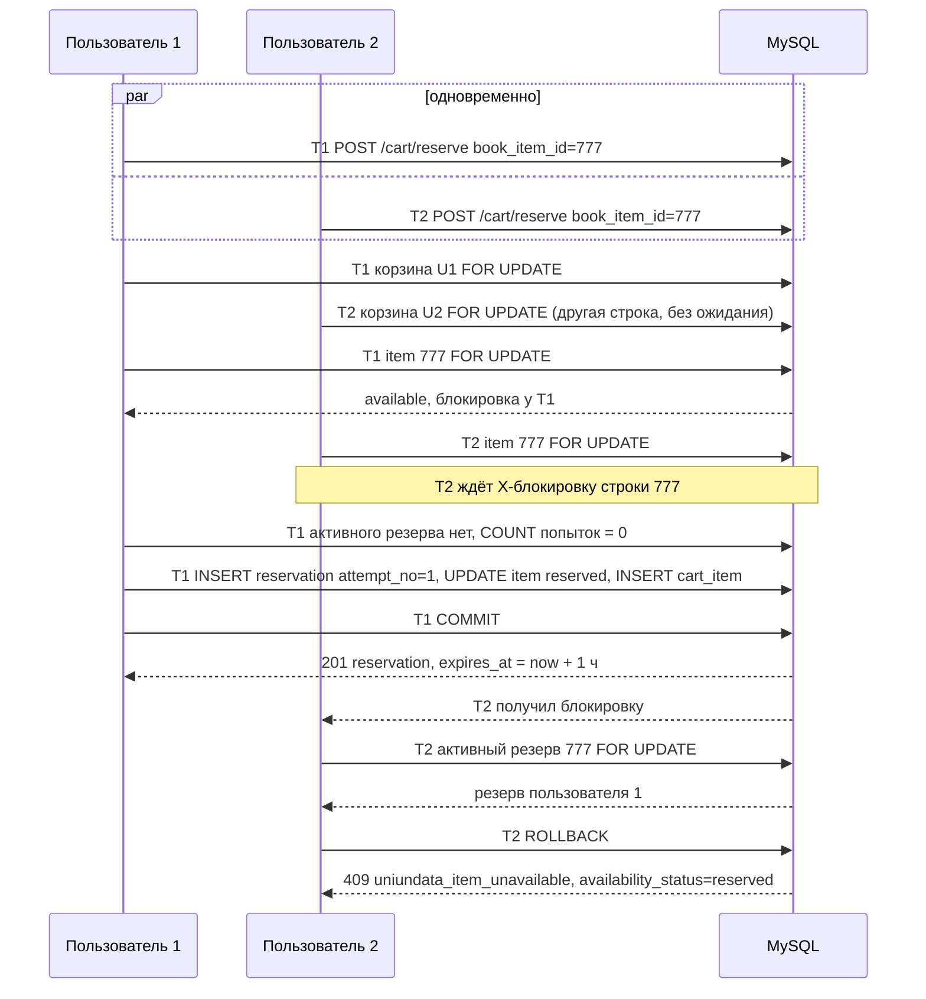
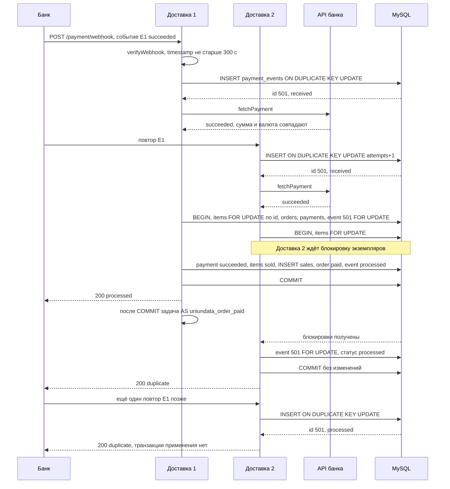

# 5. Алгоритмы: резерв, корзина, checkout, оплата, снятие, синхронизация

Каждый алгоритм описан так: шаги → выдержка из настоящего кода `src/` → сводка (блокировки, ограничения БД,
ошибки API, идемпотентность). Выдержки сокращены: `// …` — пропущенный фрагмент, `…` в аргументах —
сокращённые аргументы или список плейсхолдеров `IN (…)`. Над выдержкой указаны файл и метод.
Обоснование механизмов и матрица гонок — [08](08-security-concurrency.md), прогоны сценариев на MySQL 8.0.46 —
[10](10-scenarios.md), форматы REST — [06](06-rest-api.md), переходы статусов — [04](04-statuses.md),
DDL — `sql/schema.sql`.

| § | Алгоритм | Код | Запуск |
|---|---|---|---|
| 5.1 | Резервирование | `ReservationService::reserve()` | `POST /cart/reserve` |
| 5.2 | Удаление из корзины | `ReservationService::removeFromCart()` | `POST /cart/remove-item` |
| 5.3 | Снятие просроченных резервов (pass A) | `ReservationExpiryService::expireDue()` | AS `uniundata_expire_reservations`, каждые 60 с |
| 5.4 | Начало checkout | `CheckoutService::checkout()`, `pay()` | `POST /checkout`, `POST /orders/{id}/pay` |
| 5.5 | Webhook: успешный и повторный | `PaymentService::handleWebhook()` | `POST /payment/webhook` |
| 5.6 | Просроченные заказы (pass B) и поздний платёж | `OrderExpiryService::expireDue()`, `PaymentService::applySucceeded()` | AS `uniundata_expire_orders`, каждые 60 с |
| 5.7 | Возвраты | `PaymentService::createRefundLocked()`, `processRefund()` | AS `uniundata_refund_payment {refund_id}` |
| 5.8 | Ежедневная синхронизация | `SyncService::run()` | AS `uniundata_sync_daily` (03:15 UTC), `wp uniundata sync run` |

## 5.0 Общие правила

1. **Транзакция — только `Db::transaction(fn)`** (`src/Infrastructure/Db.php`). Перед каждым `START TRANSACTION`
   выполняется `SET TRANSACTION ISOLATION LEVEL READ COMMITTED`. На время транзакции ставятся `time_zone = '+00:00'`,
   строгий `sql_mode` и `innodb_lock_wait_timeout = 5`, после неё прежние значения сессии возвращаются.
   При 1213/1205 — `ROLLBACK`, пауза 50–200 мс и повтор всего `fn`: до 2 раз в REST, до 3 в cron и WP-CLI,
   потом 503 `uniundata_conflict_retry` с `Retry-After: 1`. Поэтому внутри `fn` выполняется только SQL, а
   состояние, накопленное замыканием, сбрасывается в его начале (`PaymentService::resetTxState()`).
2. **Порядок блокировок** ([08](08-security-concurrency.md) § 8.2): `0 sync_runs, records → 1 carts →
   2 items (по возрастанию id) → 3 reservations → 4 cart_items → 5 orders → 6 payments → 7 payment_events →
   8 refunds`. Уровни можно пропускать, менять местами нельзя. ID строк для блокировки читаются обычным
   `SELECT`, затем строки блокируются по порядку, и состояние **перепроверяется** уже под блокировкой.
3. **Переход статуса** — условный `UPDATE … WHERE id = %d AND <статус> = <ожидаемый>` с проверкой числа
   строк (`expectOneRow()` / `expectAffected()`). Если обновилось 0 строк, это ошибка логики: исключение и `ROLLBACK`.
4. **Время** берётся только с часов MySQL (`UTC_TIMESTAMP(6)`). «Срок истёк» вычисляется в том же
   `SELECT … FOR UPDATE` (`is_due`, `alive`, `seconds_to_due`).
5. **Внешние вызовы** (банк, источник каталога) выполняются только вне транзакции. Письма, возвраты и
   уведомления — задачи Action Scheduler после `COMMIT`. Обработчики идемпотентны: флаг `unique` у AS
   защитой не считается.
6. **Освобождение экземпляра** — в целевой статус по `source_status`: `present → available`,
   `missing → sync_missing`, `withdrawn → withdrawn` (`ItemStatus::releaseTarget()` или тот же `CASE` в SQL).
   Освобождается только экземпляр, который держит именно этот резерв (`reserved`) или заказ (`checkout_pending`).
7. **Ошибки** — `DomainError(code, message, httpStatus, data)`, контроллер превращает их в `WP_Error`.
   Нарушение UNIQUE/CHECK — второй рубеж: при правильных блокировках до него не доходит. Где это имеет смысл,
   1062/3819 переводятся в тот же 409, в остальных случаях — 500 и откат.

## 5.1 Резервирование — `POST /cart/reserve`

До вызова сервиса `CartController` проверяет вход, `current_user_can('reserve_books')`, nonce `wp_rest` и
rate limit. Валюту магазина (option `uniundata_currency`, при установке — `RUB`) и лимит одновременных
резервов (`uniundata_max_active_reservations`, по умолчанию 10) сервис читает до транзакции.

| Шаг | Действие | Блокировка |
|---|---|---|
| a | Открытая корзина `FOR UPDATE`; если её нет — `INSERT … ON DUPLICATE KEY UPDATE id = LAST_INSERT_ID(id)` | 1 carts |
| b | Экземпляр `FOR UPDATE OF i` (флаг активности записи читается без блокировки); нет или неактивен → 404 | 2 items |
| c | Активный резерв экземпляра `FOR UPDATE` (по `active_book_item_id`). Чужой → 409. Свой живой → 200 с тем же резервом. Свой истёкший (cron ещё не дошёл) → `expired`, дальше | 3 reservations |
| d | `availability_status ≠ 'available'` → 409; валюта экземпляра ≠ валюте магазина → 409 `reason = currency` | — |
| e | `COUNT(*)` резервов пары (user, item) с `attempt_no IS NOT NULL` ≥ 3 → 409 | — |
| e2 | Активных резервов пользователя ≥ лимита → 409 | — |
| f | `INSERT` резерва: `attempt_no = COUNT + 1`, `expires_at = UTC_TIMESTAMP(6) + 60 мин` | новая строка |
| g | `UPDATE item available → reserved`, ровно 1 строка | 2 (уже наша) |
| h | `INSERT` позиции корзины: снимок цены и валюты, `expires_at` резерва | новая строка |
| i | Корзина: `last_activity_at`, `expires_at = MIN(…)`, `checkout_started → active` | 1 (уже наша) |
| j | Аудит в той же транзакции, `COMMIT`. Корзину для ответа читает `getCart()` после `COMMIT` | — |

```php
// src/Service/ReservationService.php — reserveInTransaction()
$cart = $this->lockOrCreateOpenCart($userId);                        // (a) 1. carts
$item = $this->lockItem($itemId);                                    // (b) 2. items
if ($item === null || !$item['is_active'] || !$item['record_active']) {
    throw DomainError::itemNotFound($itemId);
}
$active = $this->lockActiveReservationForItem($itemId);              // (c) 3. reservations
if ($active !== null) {
    if ($active['user_id'] !== $userId) {
        throw DomainError::itemUnavailable($itemId, $item['availability_status']);
    }
    if (!$active['is_due']) {
        return ['created' => false, 'reservation' => $this->presentReservation($active)];
    }
    // … свой резерв истёк: $this->releaseLocked($active, $item, ReservationStatus::Expired, 'expired', …)
}
if ($item['availability_status'] !== ItemStatus::Available->value) {    // (d)
    throw DomainError::itemUnavailable($itemId, $item['availability_status']);
}
if ($item['currency'] !== $shopCurrency) {
    throw DomainError::itemCurrencyNotAccepted($itemId, $item['availability_status'], $item['currency'], $shopCurrency);
}
$used = (int) $this->db->getVar(                                      // (e)
    "SELECT COUNT(*) FROM {$this->t('reservations')}
      WHERE user_id = %d AND book_item_id = %d AND attempt_no IS NOT NULL",
    $userId, $itemId,
);
if ($used >= self::MAX_ATTEMPTS) {
    throw DomainError::reservationLimitReached($itemId, self::MAX_ATTEMPTS);
}
// … (e2) активных резервов пользователя >= $maxActive → DomainError::activeReservationLimit($maxActive)
$window = $this->db->getRow(                                          // (f) одно значение NOW из БД
    'SELECT UTC_TIMESTAMP(6) AS now_utc, UTC_TIMESTAMP(6) + INTERVAL %d MINUTE AS expires_at',
    $this->reservationMinutes,
);
// … $now, $expiresAt из $window
$attemptNo = $used + 1;
try {
    $reservationId = $this->db->insert('book_reservations', [
        'book_item_id' => $itemId, 'user_id' => $userId, 'cart_id' => $cart['id'],
        'reservation_status' => ReservationStatus::Active->value, 'attempt_no' => $attemptNo,
        'reserved_at' => $now, 'expires_at' => $expiresAt,
    ]);
} catch (\mysqli_sql_exception $e) {
    throw $this->mapConstraintViolation($e, $itemId);                // второй рубеж → 409
}
$changed = $this->db->execute(                                        // (g)
    "UPDATE {$this->t('items')} SET availability_status = 'reserved', status_changed_at = %s
      WHERE id = %d AND availability_status = 'available'",
    $now, $itemId,
);
self::expectOneRow($changed, \sprintf('item #%d available → reserved', $itemId));
// … (h) $this->db->insert('book_cart_items', […]) с тем же mapConstraintViolation()
$this->refreshCartLocked($cart, $now, true, null, 'user', $userId);   // (i)
// … (j) аудит reservation.created, item.status_changed
```

Открытая корзина создаётся без гонки на 1062. Вариант «INSERT → 1062 → SELECT FOR UPDATE» при трёх и более
параллельных запросах давал deadlock: каждый проигравший держит S-lock дубликата и просит X.

```php
// src/Service/ReservationService.php — lockOrCreateOpenCart()
$cart = $this->lockOpenCart($userId);       // SELECT … WHERE open_cart_user_id = %d FOR UPDATE
if ($cart !== null) {
    return $cart;
}
$created = $this->db->execute(
    "INSERT INTO {$this->t('carts')} (user_id, status, started_at, last_activity_at)
     VALUES (%d, 'active', UTC_TIMESTAMP(6), UTC_TIMESTAMP(6))
     ON DUPLICATE KEY UPDATE id = LAST_INSERT_ID(id)",
    $userId,
) === 1;
$cart = $this->lockCartById($this->db->lastInsertId()); // X-lock уже наш, ожидания нет
```

Здесь всё же возможен редкий 1213. Новая корзина проверяется на дубликат по ещё не вычищенной записи только
что закрытой корзины в `uq_carts_one_open_per_user`, и InnoDB ставит gap-lock даже в READ COMMITTED.
Инварианты не нарушаются: `Db::transaction()` повторяет транзакцию (сценарий S8.7e в [10](10-scenarios.md)).

```php
// src/Service/ReservationService.php — mapConstraintViolation()
if ($this->db->isDuplicateKey('uq_reservations_one_active_per_item', $e)
    || $this->db->isDuplicateKey('uq_cart_items_one_active_per_item', $e)) {
    return DomainError::itemUnavailable($itemId, ItemStatus::Reserved->value, $e);
}
if ($this->db->isDuplicateKey('uq_reservations_attempt', $e)
    || $this->db->isCheckViolation('_chk_attempt_range', $e)) {
    return DomainError::reservationLimitReached($itemId, self::MAX_ATTEMPTS, $e);
}
```

**Два пользователя одновременно.** Корзины у них разные, поэтому первая блокировка не мешает. Встречаются
они на строке экземпляра: второй ждёт (не дольше `innodb_lock_wait_timeout = 5` с), а после `COMMIT` первого
находит чужой активный резерв.



Если бы в коде забыли `FOR UPDATE`, второй `INSERT` получил бы 1062 по `uq_reservations_one_active_per_item`,
и `mapConstraintViolation()` ответил бы тем же 409 (S1.2 в [10](10-scenarios.md)). Двойной клик одного
пользователя сериализуется блокировкой его корзины: второй запрос на шаге c получает 200 с тем же резервом.
Чужой просроченный резерв `reserve` не снимает: для этого пришлось бы блокировать чужую корзину после
экземпляра, то есть нарушить порядок блокировок. До прохода pass A (не дольше 60 с) ответ — 409.

| | |
|---|---|
| Блокировки | carts → items → reservations; `INSERT` резерва и позиции, `UPDATE` уже заблокированных item и cart |
| Ограничения БД | `uq_carts_one_open_per_user` (generated `open_cart_user_id`); `uq_reservations_one_active_per_item` (generated `active_book_item_id`); `uq_cart_items_one_active_per_item`; `uq_reservations_attempt (user_id, book_item_id, attempt_no)` + `wp_book_reservations_chk_attempt_range` (1–3) + `_chk_attempt_admin` (`released_by_admin` ⇔ `attempt_no IS NULL`); `_chk_window` (`expires_at > reserved_at`); `wp_book_cart_items_chk_price`, `_chk_currency` |
| Ошибки API | 201 — создан, 200 — свой активный резерв; 401/403/429/400 — контроллер; 404 `uniundata_item_not_found`; 409 `uniundata_item_unavailable` (`data.availability_status`, для валюты `data.reason = 'currency'`); 409 `uniundata_reservation_limit_reached`; 409 `uniundata_active_reservation_limit`; 503 `uniundata_conflict_retry`. Без option `uniundata_currency` — 500: сервис отказывает, а не резервирует книгу в чужой валюте |
| Идемпотентность | Ключ — (user, item, active): повтор возвращает тот же резерв, попытка не тратится, срок не продлевается |

## 5.2 Удаление из корзины — `POST /cart/remove-item`

1. Блокировки: открытая корзина (её может не быть) → экземпляр (нет → 404) → активный резерв экземпляра.
2. Резерв мой → `releaseLocked()`: позиция корзины `FOR UPDATE`; резерв `active → cancelled`
   (`release_reason = 'user_removed'`; если срок уже вышел — `expired`); `attempt_no` остаётся, поэтому удаление
   считается попыткой; позиция `active → removed`; экземпляр `reserved → release target`. Затем
   `refreshCartLocked()`: корзина остаётся открытой, `checkout_started → active`.
3. Своего активного резерва нет — по статусу последней позиции пользователя для этого экземпляра (обычный `SELECT`):
   позиции не было → 404 (не раскрываем, что книгу держит другой); `converted_to_order` → 409; `removed`/`expired` → 200.

```php
// src/Service/ReservationService.php — removeFromCart()
$cart = $this->lockOpenCart($userId);                  // 1. carts
$item = $this->lockItem($itemId);                      // 2. items
if ($item === null) {
    throw DomainError::itemNotFound($itemId);
}
$active = $this->lockActiveReservationForItem($itemId); // 3. reservations
if ($active !== null && $active['user_id'] === $userId) {
    // … резерв вне открытой корзины пользователя → LogicException
    $now = $this->db->now();
    $to = $active['is_due'] ? ReservationStatus::Expired : ReservationStatus::Cancelled;
    $this->releaseLocked($active, $item, $to, $active['is_due'] ? 'expired' : 'user_removed', $now, 'user', $userId);
    $this->refreshCartLocked($cart, $now, true, null, 'user', $userId);

    return $to === ReservationStatus::Expired ? 'expired' : 'removed';
}
// … $lastStatus — статус последней позиции (cart_items JOIN carts) этого пользователя и экземпляра
return match ($lastStatus) {
    null => throw DomainError::itemNotFound($itemId),
    'converted_to_order' => throw DomainError::cartChanged(['book_item_id' => $itemId, 'reason' => 'item_in_order']),
    'removed', 'expired' => 'already_removed',
    // … иначе LogicException
};
```

`releaseLocked()` — общий код освобождения для remove-item, pass A и снятия резерва администратором:

```php
// src/Service/ReservationService.php — releaseLocked()
$cartItem = $this->db->getRow(
    "SELECT id, status FROM {$this->t('cart_items')} WHERE reservation_id = %d FOR UPDATE", // 4. cart_items
    $reservation['id'],
);
// attempt_no = NULL только вместе с released_by_admin (wp_book_reservations_chk_attempt_admin): слот попытки освобождается.
$attemptSql = $to === ReservationStatus::ReleasedByAdmin ? ', attempt_no = NULL' : '';
$changed = $this->db->execute(
    "UPDATE {$this->t('reservations')}
        SET reservation_status = %s, released_at = %s, release_reason = %s{$attemptSql}
      WHERE id = %d AND reservation_status = 'active'",
    $to->value, $now, $reason, $reservation['id'],
);
self::expectOneRow($changed, …);
// … позиция корзины active → $to->cartItemStatus() (removed | expired), closed_at = $now
if ($itemFrom === ItemStatus::Reserved->value) {
    $itemTo = ItemStatus::releaseTarget($item['source_status'])->value;
    $changed = $this->db->execute(
        "UPDATE {$this->t('items')} SET availability_status = %s, status_changed_at = %s
          WHERE id = %d AND availability_status = 'reserved'",
        $itemTo, $now, $item['id'],
    );
    self::expectOneRow($changed, …);
}
// … иначе экземпляр не трогаем (checkout_pending/sold — им владеет заказ), аудит item.release_skipped
```

| | |
|---|---|
| Блокировки | carts → items → reservations → cart_items |
| Ограничения БД | `wp_book_reservations_chk_released` (`active` ⇔ `released_at IS NULL`); `_chk_attempt_admin` (у `cancelled` номер попытки сохраняется); `wp_book_cart_items_chk_closed`; `wp_book_carts_chk_closed` |
| Ошибки API | 200 `{outcome: removed \| expired \| already_removed, cart}`; 404 `uniundata_item_not_found`; 409 `uniundata_cart_changed` (`reason = 'item_in_order'`: книга уже в заказе, нужна отмена заказа); 503 |
| Идемпотентность | Повтор → 200 `already_removed` по статусу позиции. Гонку с checkout решает блокировка корзины: либо книга уже в заказе (409), либо удалена, и checkout отвечает 409 `cart_changed` |

## 5.3 Снятие просроченных резервов (pass A)

Задача AS `uniundata_expire_reservations` запускается каждые 60 с: `Scheduler::expireReservations()` →
`ReservationExpiryService::expireDue(200)`. Если обработано 200, сразу ставится ещё один запуск. Pass A
освобождает только экземпляры в `reserved`. После checkout резерв уже `converted_to_order`, и экземпляр
`checkout_pending` освобождает только pass B (§ 5.6). Поэтому pass A не трогает книгу, по которой идёт или
прошла оплата.

1. `GET_LOCK(Db::lockName('expire_reservations'), 0)`. Если занято — `return 0`: второй раннер не нужен,
   корректность обеспечивают блокировки строк, а имя с отпечатком БД и префикса не пересекается с new.libsmr.ru.
2. Кандидаты читаются обычным `SELECT` по `ix_reservations_expiry`: `active AND expires_at <= UTC_TIMESTAMP(6)
   ORDER BY expires_at, id LIMIT 200`, с бюджетом времени.
3. Для каждого кандидата — своя короткая транзакция: корзина → экземпляр → резерв, перепроверка под блокировкой.
4. `releaseLocked(…, Expired, 'expired', 'cron')`, затем `refreshCartLocked(…, closeEmptyAs: 'expired')`:
   если истекла последняя активная позиция, корзина → `expired`, иначе пересчитывается `expires_at`.
5. Ошибка одного резерва (в том числе 503 после повторов) пишется в `error_log`. Резерв остаётся `active`
   и попадёт в следующий запуск.

```php
// src/Service/ReservationExpiryService.php — expireOne()
return $this->db->transaction(function () use ($reservationId, $cartId, $itemId): bool {
    $cart = $cartId !== null ? $this->reservations->lockCartById($cartId) : null; // 1. carts
    $item = $this->reservations->lockItem($itemId);                              // 2. items
    $reservation = $this->reservations->lockReservation($reservationId);         // 3. reservations
    if ($item === null || $reservation === null
        || $reservation['status'] !== ReservationStatus::Active->value
        || !$reservation['is_due']
        || $reservation['cart_id'] !== $cartId
        || $reservation['book_item_id'] !== $itemId) {
        return false;            // checkout, удаление или параллельный запуск успели раньше
    }
    $now = $this->db->now();
    $this->reservations->releaseLocked($reservation, $item, ReservationStatus::Expired, 'expired', $now, $this->actorType, null);
    if ($cart !== null) {
        $this->reservations->refreshCartLocked($cart, $now, false, 'expired', $this->actorType, null);
    }

    return true;
});
```

Гонки ([08](08-security-concurrency.md) § 8.3). **Pass A и checkout**: обе операции начинают с корзины.
Если первым успел cron, checkout видит `expired` и отвечает 409 `cart_changed`. Если первым успел checkout,
cron видит `converted_to_order` и пропускает резерв. **Pass A и «Отложить» другим пользователем**: до
`COMMIT` cron-а другой пользователь видит `reserved` и получает 409, после — `available`.

Ежедневная задача `uniundata_abandon_carts` (`abandonStaleCarts()`) берёт корзину `FOR UPDATE`, перепроверяет
`last_activity_at` и закрывает её как `abandoned`, только если в ней нет активных позиций.

| | |
|---|---|
| Блокировки | GET_LOCK; на каждый резерв — carts → items → reservations → cart_items |
| Ограничения БД | `uq_reservations_one_active_per_item`: у `expired` generated-колонка равна NULL, и слот экземпляра освобождается; `_chk_released`; `wp_book_items_chk_status` |
| Ошибки API | Нет (фоновая задача): `error_log` и журнал Action Scheduler |
| Идемпотентность | Условные `UPDATE … WHERE reservation_status = 'active'` и перепроверка `is_due`: повторный запуск ничего не меняет |

## 5.4 Начало checkout — `POST /checkout`

Резерв «замораживается»: начать оплату можно только при живом резерве. В момент checkout резерв переходит в
`converted_to_order`, экземпляр — в `checkout_pending`, а дальнейший срок задаёт
`orders.payment_due_at = now + payment_ttl (30 мин) + grace (10 мин)`. Сессия у банка создаётся на
`payment_due_at − grace`.

1. **До транзакции.** Ищется заказ с тем же `Idempotency-Key`; если он есть — возвращается он же (replay).
   Затем снимки: версии оферты и политики (устарели → 409 `terms_outdated`), данные покупателя, валюта, окно оплаты.
2. **Tx1 `createOrderTx()`:** корзина → экземпляры (по возрастанию id) → резервы → позиции, все `FOR UPDATE`.
   Каждая позиция перепроверяется.
   - Есть невалидные позиции → они `expired` (экземпляр → release target), корзина → `checkout_started`
     (или `expired`, если она опустела), **`COMMIT`** и 409 `cart_changed` (`positions_expired`). Покупатель
     видит новую корзину и подтверждает ещё раз — заказ создаётся по оставшимся позициям.
   - Сумма по снимкам цен или валюта не совпали с `expected_total_amount` / `currency` → 409 `cart_changed`
     (`total_mismatch`).
   - Иначе: согласия (offer, privacy); заказ `draft`; позиции заказа со снимками названия, автора, ISBN и
     цены; резервы и позиции корзины → `converted_to_order`; корзина закрывается; экземпляры
     `reserved → checkout_pending`; платёж `created` (попытка 1, `idempotency_key` = UUID); аудит. `COMMIT`.
3. **HTTP вне транзакции:** чек 54-ФЗ (`receiptForOrder()`: позиции, НДС, контакт) и `createSession()` с
   `idempotency_key` платежа.
4. **Tx2:** `markSessionOpenedTx()` (заказ → платёж): платёж `created → pending`, сохраняются
   `provider_payment_id`, `session_expires_at`, `session_redirect_url`; заказ `draft → pending_payment`.
   Если заказ успели закрыть, пока банк создавал сессию, — `cancelSession()` и 409 `order_not_payable`.
   При ошибке банка — `markSessionFailedTx()`: платёж `created → cancelled` (`failure_code = 'session_create_failed'`),
   заказ → `payment_failed`, ответ 502. Экземпляры остаются за заказом до `payment_due_at`: можно повторить `/pay`.

```php
// src/Service/CheckoutService.php — checkout()
$existing = $this->findOrderByCheckoutKey($userId, $req->idempotencyKey);
if ($existing !== null) {
    return $this->replay($userId, $existing, $req);                 // быстрый путь идемпотентности
}
$terms = $this->termsSnapshot($req);                                // 409 uniundata_terms_outdated
$customer = $this->customerSnapshot($userId, $req);
$currency = $this->shopCurrency();
[$ttlMinutes, $graceMinutes] = $this->paymentWindow();
try {
    $tx = $this->db->transaction(
        fn (): array => $this->createOrderTx($userId, $req, $customer, $terms, $currency, $ttlMinutes + $graceMinutes)
    );
} catch (\RuntimeException $e) {
    // Второй рубеж: 1062 по uq_orders_checkout_request (параллельный запрос с тем же ключом).
    $dup = $e instanceof DomainError ? null : $this->findOrderByCheckoutKey($userId, $req->idempotencyKey);
    if ($dup !== null) {
        return $this->replay($userId, $dup, $req);
    }
    throw $e;
}
if ($tx['kind'] === 'replay') {
    return $this->replay($userId, $tx['order'], $req);
}
if ($tx['kind'] === 'cart_changed') {
    throw DomainError::cartChanged($tx['data']);                    // изменения корзины уже закоммичены
}
$payment = $this->openSession($tx['order_id'], $tx['payment_id'], $userId); // HTTP, затем Tx2
```

```php
// src/Service/CheckoutService.php — createOrderTx() (Tx1)
$cart = $this->row('SELECT id, status FROM %i WHERE open_cart_user_id = %d FOR UPDATE', $t['carts'], $userId); // 1
$dup = $this->findOrderByCheckoutKey($userId, $req->idempotencyKey); // пока ждали корзину, повтор мог создать заказ
// … нет корзины или позиций → DomainError::cartEmpty(); ID позиций — обычным SELECT (корзина заблокирована)
$items = $this->rowsById('SELECT id, availability_status, is_active, source_status FROM %i WHERE id IN (…) ORDER BY id FOR UPDATE', …); // 2
$reservations = $this->rowsById(
    'SELECT id, book_item_id, user_id, reservation_status, (expires_at > UTC_TIMESTAMP(6)) AS alive
       FROM %i WHERE id IN (…) ORDER BY id FOR UPDATE',
    …
);                                                                                                            // 3
$cartItems = $this->rowsById('SELECT id, book_item_id, reservation_id, unit_price_amount, currency, status FROM %i WHERE id IN (…) ORDER BY id FOR UPDATE', …); // 4
foreach ($cartItems as $ci) {
    // … $r — резерв позиции, $i — экземпляр
    $reason = match (true) {
        $ci['status'] !== 'active' => null, // уже закрыта параллельно — просто не берём
        $r === null || $i === null => 'missing',
        $r['reservation_status'] !== 'active' => 'reservation_inactive',
        (int) $r['user_id'] !== $userId || (int) $r['book_item_id'] !== (int) $ci['book_item_id'] => 'foreign_reservation',
        (int) $r['alive'] !== 1 => 'expired',
        $i['availability_status'] !== 'reserved' => 'item_not_reserved',
        (int) $i['is_active'] !== 1 => 'item_inactive',
        $ci['currency'] !== $shopCurrency => 'currency', // валюту магазина сменили после резерва
        default => 'ok',
    };
    // … 'ok' → $valid[], иначе → $invalid[]
}
if ($invalid !== []) {
    $this->expirePositions($userId, $invalid);   // резерв → expired, позиция → expired, item reserved → release target
    $this->refreshCart($cartId, (string) $cart['status'], $userId);
    return ['kind' => 'cart_changed', 'data' => ['reason' => 'positions_expired', /* … */]];
}
$total = array_sum(array_map(static fn (array $ci): int => (int) $ci['unit_price_amount'], $valid));
if ($shopCurrency !== $req->currency || $total !== $req->expectedTotalAmount) {
    // … refreshCart(); return ['kind' => 'cart_changed', 'data' => ['reason' => 'total_mismatch', …]];
}
// … согласия; INSERT orders (status 'draft', payment_due_at = UTC_TIMESTAMP(6) + INTERVAL %d MINUTE);
//   INSERT order_items … SELECT со снимками (неявный S-lock на wp_book_records по FK — после items, см. docs/08)
$this->expectAffected($this->exec(
    "UPDATE %i
        SET order_id = %d, released_at = UTC_TIMESTAMP(6), release_reason = 'converted_to_order',
            reservation_status = 'converted_to_order'
      WHERE id IN (…) AND reservation_status = 'active'",
    …
), $n, 'reservations → converted_to_order');
// … cart_items → converted_to_order; carts → converted_to_order (closed_at)
$this->expectAffected($this->exec(
    "UPDATE %i SET status_changed_at = UTC_TIMESTAMP(6), availability_status = 'checkout_pending'
      WHERE id IN (…) AND availability_status = 'reserved'",
    …
), $n, 'items → checkout_pending');
// … INSERT payments (attempt_no 1, idempotency_key = wp_generate_uuid4(), status 'created'); аудит
```

```php
// src/Service/CheckoutService.php — openSession()
$ttl = max(self::MIN_SESSION_SECONDS, (int) $p['seconds_to_due'] - $graceMinutes * 60);
try {
    $receipt = $this->receiptForOrder($orderId, (int) $p['amount']);   // 54-ФЗ
    $session = $this->provider->createSession($publicOrderId, (string) $p['idempotency_key'], (int) $p['amount'],
        (string) $p['currency'], $ttl, rest_url('uniundata/v1/payment/webhook'), …, $receipt);
} catch (\Throwable $e) {
    // … error_log: только класс исключения
    $orderStatus = $this->db->transaction(fn (): string => $this->markSessionFailedTx($orderId, $paymentId, $userId));
    throw new DomainError('uniundata_payment_provider_error', …, 502, ['public_order_id' => $publicOrderId, 'order_status' => $orderStatus]);
}
$closedStatus = $this->db->transaction(fn (): ?string => $this->markSessionOpenedTx($orderId, $paymentId, $session, $userId));
if ($closedStatus !== null) {
    // Пока банк создавал сессию, заказ отменили/закрыли: сессию сразу закрываем у банка.
    $this->cancelSessionsBestEffort([…]);
    throw DomainError::orderNotPayable($closedStatus);
}
```

**Повторная попытка `POST /orders/{id}/pay`** (`preparePaymentTx()`: экземпляры → заказ → платежи). Если у
последней попытки живая сессия с сохранённым URL, возвращается она (`reused = true`), и банк не вызывается.
Платёж `created` (процесс упал между Tx1 и банком) досоздаётся с тем же ключом. Иначе создаётся новая попытка
(`attempt_no + 1`, не больше 10): прежние `pending` → `expired`, а после `COMMIT` у банка вызывается `cancelSession()`.
409 `order_not_payable`, если деньги уже в пути (`processing`/`succeeded`) или до `payment_due_at − grace`
остаётся меньше 120 с. **Отмена `POST /orders/{id}/cancel`** — тот же порядок блокировок. Отменить можно
только `draft`/`pending_payment`/`payment_failed` без денег в пути: экземпляры → release target, иначе 409
`order_not_cancellable`.

| | |
|---|---|
| Блокировки | Tx1: carts → items↑ → reservations → cart_items, затем `INSERT` orders, order_items, payments. Tx2: orders → payments. `pay` и `cancel`: items↑ → orders → payments |
| Ограничения БД | `uq_orders_checkout_request (user_id, checkout_request_id)`; `uq_orders_public_id` + `wp_book_orders_chk_public_id`; `uq_order_items_item (order_id, book_item_id)`, `uq_order_items_reservation`; `wp_book_reservations_chk_order` (`converted_to_order` ⇒ `order_id`); `wp_book_orders_chk_total`, `_chk_positive`; `uq_payments_idempotency`, `uq_payments_attempt (order_id, attempt_no)`; `wp_book_carts_chk_closed` |
| Ошибки API | 201 — заказ создан, 200 — replay; 409 `uniundata_cart_empty`; 409 `uniundata_cart_changed` (`positions_expired` + `expired_book_item_ids` + `cart`, либо `total_mismatch` + `actual_total_amount`); 409 `uniundata_terms_outdated` (`data.current_versions`); 400 `uniundata_invalid_param` (тот же ключ с другой суммой, нет ФИО или e-mail); 502 `uniundata_payment_provider_error` (заказ создан, `data.public_order_id`); 503 |
| Идемпотентность | `Idempotency-Key` → `orders.checkout_request_id`: проверка до транзакции, повторная проверка под блокировкой корзины, 1062 по `uq_orders_checkout_request` → replay. Replay не создаёт новой попытки: живая сессия → сохранённый URL, `created` → `createSession` с тем же `idempotency_key` (банк вернёт ту же сессию) |

## 5.5 Webhook оплаты: успешный и повторный

Факт оплаты — только серверный webhook (или опрос банка в pass B, § 5.6). Оба идут через один путь
`PaymentService::apply()`. Return URL покупателя ничего не подтверждает. Контроллер до вызова сервиса делает
только транспортные проверки: необязательный IP allowlist и лимит отклонённых доставок по IP.

1. Тело больше 64 КБ → 413. Подпись (`verifyWebhook()`, `hash_equals`) и `|now − signed_at| ≤ 300 с` проверяются
   **до любой записи в БД**: иначе атакующий мог бы «занять» `provider_event_id`. Ошибка → 401 и запись в аудит
   не чаще раза в минуту.
2. Inbox: `INSERT … ON DUPLICATE KEY UPDATE attempts = attempts + 1, id = LAST_INSERT_ID(id)` по
   `uq_payment_events_provider (provider, provider_event_id)` — отдельной короткой транзакцией. Событие
   уже `processed`/`ignored` → 200 `duplicate`, без изменений.
3. Для `succeeded`, `processing` и возвратов результат подтверждается запросом `fetchPayment()` к API банка
   (вне транзакции). API недоступно, платёж неизвестен или успех не подтверждён → событие `failed`, ответ 503,
   и банк повторит доставку. Дальше источником истины служат данные API.
4. `apply()`: платёж ищется по `provider_payment_id` или `idempotency_key`; чужой или неизвестный → событие
   `ignored`, 200. ID экземпляров заказа читаются обычным `SELECT`.
5. Транзакция `applyTx()`: экземпляры↑ → заказ → все платежи заказа → событие, всё `FOR UPDATE`. Событие уже
   обработано параллельной доставкой → `duplicate`. Сверяются `public_order_id` и `idempotency_key` попытки
   (иначе `needs_attention = reference_mismatch`), затем выполняется ветка по статусу.
6. `applySucceeded()`: сумма или валюта не совпали → `amount_mismatch`, продажи нет. Платёж уже `succeeded` →
   `ignored` (`already_succeeded`). Иначе платёж → `succeeded`. Если у заказа уже есть другой успешный платёж
   или заказ оплачен → `duplicate_payment` и возврат (§ 5.7). Поздний платёж → § 5.6. Обычный случай:
   экземпляры `checkout_pending → sold`, `INSERT` в `wp_book_sales`, заказ → `paid`, другие открытые попытки →
   `cancelled`.
7. Событие → `processed`/`ignored` (`WHERE processing_status IN ('received', 'failed')`), `COMMIT`.
8. После `COMMIT`: задача AS `uniundata_order_paid {order_id}` (письмо, документы, хук
   `uniundata_after_order_paid`) и `cancelSession()` для закрытых попыток. Исключение в `apply()` → событие
   `failed`, ответ 503/500, банк повторит; условие `IN ('received', 'failed')` позволяет обработать событие заново.

```php
// src/Service/PaymentService.php — handleWebhook()
try {
    $event = $this->provider->verifyWebhook($rawBody, $headers);
} catch (DomainError $e) {
    $this->noteRejectedWebhook($e->errorCode());

    return WebhookResult::invalidSignature();                       // 401
}
// … InvalidArgumentException → 400; |time() − signedAt| > SIGNATURE_TOLERANCE_SECONDS → 401
$eventId = $this->storeEvent($event, $rawBody);                     // inbox, своя транзакция
$state = $this->scalar('SELECT processing_status FROM %i WHERE id = %d', $this->db->table('book_payment_events'), $eventId);
if ($state === 'processed' || $state === 'ignored') {
    return WebhookResult::duplicate($eventId); // повтор доставки: 200, без изменений
}
// … succeeded|processing|refunded|partially_refunded: $fresh = $this->provider->fetchPayment(…) вне транзакции;
//   нет ответа / платёж неизвестен / успех не подтверждён → markEventFailed(), WebhookResult::retryLater() (503)
try {
    [$outcome, $note] = $this->apply($result, $eventId, 'webhook');
} catch (\Throwable $e) {
    $this->markEventFailed($eventId, $e instanceof DomainError ? $e->errorCode() : 'apply_failed: ' . $e::class);
    // … error_log
    return WebhookResult::retryLater($eventId, 'apply failed', $e instanceof DomainError ? 503 : 500);
}
```

```php
// src/Service/PaymentService.php — applyTx() (внутри Db::transaction, после resetTxState())
$items = $itemIds === [] ? [] : $this->rowsById(
    'SELECT id, availability_status, source_status FROM %i WHERE id IN (…) ORDER BY id FOR UPDATE', …);   // 2. items
$order = $this->lockOrder($orderId);                                                                      // 5. orders
$payments = $this->rowsById(
    'SELECT id, attempt_no, status, amount, refunded_amount, currency, provider_payment_id, idempotency_key
       FROM %i WHERE order_id = %d ORDER BY id FOR UPDATE',
    $t['payments'], $orderId
);                                                                                                        // 6. payments
if ($eventId !== null) {
    $evState = $this->scalar('SELECT processing_status FROM %i WHERE id = %d FOR UPDATE', $t['events'], $eventId); // 7
    if ($evState === 'processed' || $evState === 'ignored') {
        return ['duplicate', 'already processed'];
    }
}
// … сверка public_order_id и idempotency_key попытки, иначе flagOrder($order, 'reference_mismatch')
$outcome = match ($r->status->value) {
    'succeeded' => $this->applySucceeded($r, $order, $payments, $paymentId, $items),
    'pending', 'processing' => $this->applyInFlight($r, $order, $payments, $paymentId),
    'failed', 'cancelled', 'expired' => $this->applyFailure($r, $order, $payments, $paymentId),
    'refunded', 'partially_refunded' => $this->applyRefundEvent($r, $order, $payments, $paymentId),
    default => ['ignored', 'unsupported_status'],
};
// … UPDATE payment_events SET processing_status = processed|ignored … WHERE id = %d AND processing_status IN ('received', 'failed')
```

```php
// src/Service/PaymentService.php — applySucceeded()
if ($r->amount === null || $r->currency === null || $r->amount !== (int) $p['amount'] || $r->currency !== $p['currency']) {
    // … provider_status
    $this->flagOrder($order, 'amount_mismatch', ['payment_id' => $paymentId]);

    return ['processed', 'amount_mismatch'];          // не продаём: решение менеджера
}
if (\in_array($p['status'], self::MONEY_RECEIVED, true)) {
    return ['ignored', 'already_succeeded']; // повтор успеха: статусы уже такие
}
$this->movePayment($p, 'succeeded', $r);
// … $otherSucceeded — у заказа есть другой платёж succeeded|refunded|partially_refunded
if ($otherSucceeded || \in_array($order['status'], self::PAID_ORDER_STATUSES, true)) {
    $this->flagOrder($order, 'duplicate_payment', ['payment_id' => $paymentId]);
    $this->createRefundLocked($order, $p, (int) $p['amount'], 'duplicate_payment', null);

    return ['processed', 'duplicate_payment'];
}
$late = \in_array($order['status'], ['payment_expired', 'cancelled'], true);
// … $sellable: обычный платёж — экземпляры в checkout_pending; поздний — § 5.6; дальше — если $sellable не пуст:
$this->expectAffected($this->exec(
    "UPDATE %i
        SET sold_at = UTC_TIMESTAMP(6), status_changed_at = UTC_TIMESTAMP(6), availability_status = 'sold'
      WHERE id IN (…) AND availability_status IN (…)",
    …
), \count($sellable), 'items → sold');
$this->expectAffected($this->exec(
    'INSERT INTO %i
       (book_item_id, book_record_id, order_id, order_item_id, payment_id, user_id, sold_at, price_amount, currency)
     SELECT oi.book_item_id, oi.book_record_id, oi.order_id, oi.id, %d, o.user_id, UTC_TIMESTAMP(6),
            oi.unit_price_amount, oi.currency
       FROM %i oi JOIN %i o ON o.id = oi.order_id
      WHERE oi.order_id = %d AND oi.book_item_id IN (…)
      ORDER BY oi.book_item_id',
    …
), \count($sellable), 'sales insert');
$this->moveOrder($order, 'paid', ['payment_id' => $paymentId, 'late_payment' => $late]);
$this->closeOtherOpenAttempts($payments, $paymentId);   // другие created|pending → cancelled, сессии — после COMMIT
// … конфликт позднего платежа — § 5.6; письмо — только если что-то продано:
$this->afterCommit[] = [self::HOOK_ORDER_PAID, ['order_id' => $orderId]];
```

**Успешный и повторный webhook.** Доставка 2 — повтор события E1: банк не дождался ответа на первую доставку
и прислал её снова, пока первая ещё обрабатывается.



Другое событие E2 о том же успехе проходит inbox как новое, но в `applySucceeded()` платёж уже `succeeded`:
ответ 200 `ignored`. Второй успешный платёж того же заказа (оплата из двух вкладок) даёт `duplicate_payment`
и возврат. Двойной продажи не бывает: экземпляры уже `sold`, а `UNIQUE(book_item_id)` в `wp_book_sales` —
второй рубеж.

| | |
|---|---|
| Блокировки | inbox `INSERT` — отдельная транзакция; затем items↑ → orders → payments → payment_events (→ refunds при возврате). `INSERT` в `wp_book_sales` — после блокировки заказа |
| Ограничения БД | `uq_payment_events_provider (provider, provider_event_id)`; `uq_sales_book_item`, `uq_sales_order_item`; `wp_book_items_chk_sold_at` (`sold` ⇔ `sold_at`); `wp_book_orders_chk_paid_at`; `wp_book_payments_chk_succeeded`; `uq_payments_provider_id (provider, provider_payment_id)`; `uq_refunds_idempotency` |
| Ответы банку | 200 — `processed`, `duplicate` или `ignored` (платёж не наш, устаревший статус); 400 — тело не разбирается; 401 `uniundata_invalid_signature`; 403 — IP не из allowlist; 413 — тело больше 64 КБ; 429 — лимит отклонённых доставок; 503 — повторите (API банка, `conflict_retry`); 500 — ошибка логики (событие `failed`, банк повторит) |
| Идемпотентность | Три уровня: inbox по `(provider, provider_event_id)` → статус события под `FOR UPDATE` → статусы платежа и заказа (условные `UPDATE` в `movePayment()`/`moveOrder()`, `already_succeeded`). Письмо: обработчик `uniundata_order_paid` проверяет запись аудита `notification.order_paid` |

## 5.6 Снятие просроченных заказов (pass B) и поздний платёж

Задача AS `uniundata_expire_orders` запускается каждые 60 с: `OrderExpiryService::expireDue(100)`.
`GET_LOCK(Db::lockName('expire_orders'), 0)` нужен только для экономии HTTP-запросов, корректность
обеспечивают блокировки строк.

1. Кандидаты — по `ix_orders_payment_due`: статус `draft`, `pending_payment`, `payment_processing` или
   `payment_failed` и `payment_due_at <= UTC_TIMESTAMP(6)`. Заказы на разборе `amount_mismatch` и
   `reference_mismatch` не берутся: решает менеджер. Бюджет запуска — 15 с (`max_execution_time` 30 с,
   HTTP-таймаут адаптера ≤ 10 с).
2. **Вне транзакции** банк опрашивается по каждой открытой попытке (`created`, `pending`, `processing`):
   - `succeeded` → `PaymentService::applyProviderResult($res, null)`, тот же путь, что у webhook: заказ станет `paid`;
   - `processing` → `applyProviderResult()`, флаг `bankProcessing`;
   - исключение (банк недоступен) → флаг `bankUnknown`.
3. **Транзакция** экземпляры↑ → заказ → платежи. Перепроверка: заказ всё ещё открыт и просрочен, полученных
   денег нет. Если `bankUnknown`, заказ ждёт ещё один grace. Если `bankProcessing`, `payment_due_at` один раз
   продлевается на grace (отметка `payment_due_extended_at`, `needs_attention = payment_processing_overdue`).
   Иначе заказ → `payment_expired`, платежи `created`/`pending`/`processing` → `expired`, экземпляры
   `checkout_pending` этого заказа → release target.
4. После `COMMIT` — `cancelSession()` у банка (best effort) и уведомление менеджеру о продлении. Если деньги
   всё-таки придут, сработает ветка позднего платежа.

```php
// src/Service/OrderExpiryService.php — expireOne(), опрос банка вне транзакции
foreach ($open as $p) {                                    // платежи created|pending|processing
    try {
        $res = $this->provider->fetchPayment($p['provider_payment_id'], (string) $p['idempotency_key']);
    } catch (\RuntimeException $e) {
        $bankUnknown = true; // банк недоступен: результат неизвестен
        continue;
    }
    // … $res === null — банк не знает платежа: сессия не создавалась
    if ($status === 'succeeded') {
        $this->payments->applyProviderResult($res, null);
        return true;
    }
    if ($status === 'processing') {
        $this->payments->applyProviderResult($res, null);
        $bankProcessing = true;
    }
}
```

```php
// src/Service/OrderExpiryService.php — expireTx()
// … 2. items: SELECT id, availability_status, source_status … ORDER BY id FOR UPDATE
$order = $this->row(
    'SELECT id, status, needs_attention, payment_due_extended_at,
            (payment_due_at <= UTC_TIMESTAMP(6)) AS is_due,
            (payment_due_at <= UTC_TIMESTAMP(6) - INTERVAL %d MINUTE) AS is_overdue_by_grace
       FROM %i WHERE id = %d FOR UPDATE',
    $graceMinutes, $t['orders'], $orderId
);                                                                                       // 5. orders
if ($order === null || !in_array($order['status'], self::OPEN_ORDER_STATUSES, true) || (int) $order['is_due'] !== 1) {
    return $noop; // оплачен/отменён/продлён параллельно
}
// … 6. payments FOR UPDATE; есть succeeded|refunded|partially_refunded → $noop
if ($bankUnknown && (int) $order['is_overdue_by_grace'] !== 1) {
    return $noop;
}
if ($bankProcessing && $order['payment_due_extended_at'] === null) {
    // … UPDATE orders SET payment_due_at = now + grace, payment_due_extended_at = now, needs_attention = 1
    return ['expired' => false, 'extended' => true, 'cancel_sessions' => []];
}
// … заказ → payment_expired; платежи created|pending|processing → expired (failure_code 'order_expired')
$this->expectAffected($this->exec(
    "UPDATE %i
        SET status_changed_at = UTC_TIMESTAMP(6),
            availability_status = CASE source_status
                WHEN 'present' THEN 'available'
                WHEN 'missing' THEN 'sync_missing'
                WHEN 'withdrawn' THEN 'withdrawn' END
      WHERE id IN (…) AND availability_status = 'checkout_pending'",
    …
), count($pending), 'items → release target');
```

**Гонка webhook ↔ pass B.** Обе стороны блокируют экземпляры, затем заказ; второй перепроверяет статус
заказа под блокировкой. Webhook первым: заказ `paid`, pass B видит `paid` и ничего не делает. Pass B первым:
заказ `payment_expired`, экземпляры освобождены, webhook идёт по ветке позднего платежа. Кроме того, перед
освобождением pass B сам спрашивает банк, поэтому окно для позднего платежа узкое.

**Поздний платёж** (`applySucceeded()`, заказ `payment_expired` или `cancelled`). Деньги никогда не теряются:

- экземпляр свободен, то есть `available`, `sync_missing` или `withdrawn` и без активного резерва, → забирается
  и продаётся. Заказ → `paid` (переходы `payment_expired → paid` и `cancelled → paid` допустимы только здесь);
- экземпляр занят (чужой резерв, чужой checkout, продан) → конфликт: заказ всё равно `paid`, но
  `needs_attention = late_payment_conflict` и в той же транзакции возврат на сумму конфликтных позиций
  (на всю сумму, если продать нечего);
- среди забранных есть `source_status ≠ present` → `needs_attention = late_payment_source_check`: книгу
  нужно проверить физически.

```php
// src/Service/PaymentService.php — applySucceeded(), ветка позднего платежа
if ($late && $items !== []) {
    // Обычное чтение: экземпляры заблокированы нами, новый резерв на них сейчас невозможен.
    $activeReserved = array_map('intval', $this->col(
        'SELECT active_book_item_id FROM %i WHERE active_book_item_id IN (…)', …));
}
foreach ($items as $id => $it) {
    $ok = $late
        ? \in_array($it['availability_status'], self::FREE_ITEM_STATUSES, true) && !\in_array($id, $activeReserved, true)
        : $it['availability_status'] === 'checkout_pending';
    if (!$ok) {
        $conflict[] = (int) $id;
        continue;
    }
    $sellable[] = (int) $id;
    if ($late && $it['source_status'] !== 'present') {
        $sourceCheck[] = (int) $id; // источник говорит «нет/снят»: книгу нужно проверить физически
    }
}
// … продажа $sellable (см. § 5.5), заказ → paid
if ($conflict !== []) {
    $refund = $sellable === []
        ? (int) $p['amount']
        : (int) $this->scalar('SELECT COALESCE(SUM(unit_price_amount), 0) FROM %i WHERE order_id = %d AND book_item_id IN (…)', …);
    $this->flagOrder($order, 'late_payment_conflict', […]);
    $this->createRefundLocked($order, $p, $refund, 'late_payment_conflict', null);
} elseif ($sourceCheck !== []) {
    $this->flagOrder($order, 'late_payment_source_check', ['source_check_item_ids' => $sourceCheck]);
}
```

| | |
|---|---|
| Блокировки | GET_LOCK; на каждый заказ — items↑ → orders → payments (+ refunds при позднем конфликте) |
| Ограничения БД | `uq_sales_book_item` (поздний платёж не продаст экземпляр второй раз); `uq_reservations_one_active_per_item`; `wp_book_orders_chk_paid_at`; `wp_book_refunds_chk_amount`, `wp_book_payments_chk_amount` (`refunded_amount <= amount`) |
| Ошибки API | Нет (фоновая задача). Сбой по одному заказу пишется в `error_log`, остальные заказы пакета обрабатываются |
| Идемпотентность | Условные `UPDATE … WHERE status IN (открытые)`; однократность продления — `payment_due_extended_at IS NULL` под блокировкой заказа; повторный запуск после закрытия — no-op |

## 5.7 Возвраты — `wp_book_refunds`

Возврат денег не возвращает книгу в продажу: `sold` — терминальный статус, `UNIQUE(book_item_id)` в
`wp_book_sales` не даёт продать экземпляр ещё раз. Модель возврата — «решение в транзакции, исполнение — задачей».

1. **Решение** — `INSERT` строки `requested` в той же транзакции, где оно принято (`createRefundLocked()`):
   `duplicate_payment` и `late_payment_conflict` создаются автоматически в webhook, `order_cancelled`,
   `customer_return` и `manual` — через `requestRefund()` менеджера. Под блокировкой строк возвратов платежа
   проверяется, что сумма не‑`failed` возвратов вместе с новым не больше суммы платежа. После `COMMIT` ставится
   задача AS `uniundata_refund_payment {refund_id}`.
2. **Исполнение** `processRefund(refund_id)`. Финальный статус → no-op. Tx1 (заказ → платёж → возврат
   `FOR UPDATE`): статус всё ещё `requested`/`pending`? платёж можно вернуть? (иначе `failed` и `refund_failed`).
   Затем HTTP `provider->refund()` вне транзакции с `idempotency_key` возврата и чеком «возврат прихода» (54-ФЗ).
   Tx2 в том же порядке: если webhook возврата ещё не закрыл строку — `succeeded`, `failed` или `pending`.
   Пока статус не финальный, задача ставит себе следующий опрос: 1 мин → 5 мин → 30 мин → 6 ч. Возврат,
   который не завершился за сутки, получает `needs_attention = refund_stuck`.
3. **`completeRefundLocked()`**: возврат → `succeeded`; `payments.refunded_amount += amount` (условие — старое
   значение), платёж → `partially_refunded` или `refunded`; при полном возврате — `wp_book_sales.refunded_at`.
   Для основного платежа заказа ещё `orders.refunded_amount += amount` и заказ → `partially_refunded`/`refunded`.
   Возврат дубля сумму заказа не меняет.
4. **Webhook возврата** (`applyRefundEvent()`) ищет строку по `provider_refund_id`, затем по ключу возврата, затем
   по приросту `refunded_amount` (открытый возврат на ту же сумму). Не нашлось — возврат сделан мимо плагина,
   в личном кабинете банка: создаётся строка `manual` и сразу завершается. Прирост больше остатка →
   `needs_attention = refund_mismatch`.

```php
// src/Service/PaymentService.php — createRefundLocked() (вызывающий держит orders → payments)
$reserved = (int) $this->scalar(
    "SELECT COALESCE(SUM(amount), 0) FROM %i WHERE payment_id = %d AND status <> 'failed' FOR UPDATE", // 8. refunds
    $t['refunds'], (int) $payment['id']
);
if ($amount <= 0 || $reserved + $amount > (int) $payment['amount']) {
    throw DomainError::invalidParam('amount', …);
}
$this->exec(
    "INSERT INTO %i (payment_id, order_id, amount, currency, reason, idempotency_key, status, requested_by, requested_at)
     VALUES (%d, %d, %d, %s, %s, %s, 'requested', NULLIF(%d, 0), UTC_TIMESTAMP(6))",
    …,
    wp_generate_uuid4(),
    $requestedBy ?? 0
);
// … аудит refund.requested
if ($enqueue) {
    $this->afterCommit[] = [self::HOOK_REFUND, ['refund_id' => $refundId]];
}
```

```php
// src/Service/PaymentService.php — processRefund()
if (\in_array($ref['status'], ['succeeded', 'failed'], true)) {
    return (string) $ref['status'];
}
$job = $this->db->transaction(function () use ($refundId, $orderId, $paymentId): array {   // Tx1
    $this->resetTxState('system', null);

    return $this->loadRefundJobTx($refundId, $orderId, $paymentId);
});
// … $job['status'] не requested|pending → return
try {
    $res = $this->provider->refund((string) $job['provider_payment_id'], (int) $job['amount'], (string) $job['currency'],
        (string) $job['idempotency_key'], $this->refundReceipt($orderId, $paymentId, (int) $job['amount']));
} catch (\RuntimeException $e) {
    // … error_log
    $this->scheduleRefundFollowUp($refundId, (int) $job['age_seconds']);

    return (string) $job['status'];
}
$status = $this->db->transaction(function () use ($refundId, $orderId, $paymentId, $res): string {   // Tx2
    $this->resetTxState('system', null);

    return $this->applyRefundResultTx($refundId, $orderId, $paymentId, $res);
});
```

| | |
|---|---|
| Блокировки | Решение: items → orders → payments → refunds (в транзакции webhook или `requestRefund()`: orders → payments → refunds). Исполнение: Tx1 и Tx2 — orders → payments → refunds, HTTP между ними; `UPDATE wp_book_sales.refunded_at` — после блокировки заказа |
| Ограничения БД | `uq_refunds_idempotency`; `uq_refunds_provider_id`; `wp_book_refunds_chk_amount` (> 0), `_chk_status`, `_chk_reason`, `_chk_completed` (финальный статус ⇔ `completed_at`); `wp_book_payments_chk_amount` (`refunded_amount <= amount`); `wp_book_orders_chk_refund` (`refunded_amount <= total_amount`) |
| Ошибки API | Менеджеру (`requestRefund()`): 400 `uniundata_invalid_param` (`amount`, `reason`, `payment_id`), 404 `uniundata_order_not_found`. Сам возврат идёт фоном; итог виден в `wp_book_refunds` и `needs_attention` |
| Идемпотентность | Строка `requested` создаётся вместе с решением (откат решения = нет возврата). Банку передаётся `idempotency_key` возврата. Повтор задачи видит финальный статус или повторяет запрос с тем же ключом. Webhook возврата и задача сходятся на одной строке под `FOR UPDATE` |

## 5.8 Ежедневная синхронизация каталога

Запуск: задача AS `uniundata_sync_daily` (cron 03:15 UTC) → `Scheduler::syncDaily()` →
`SyncService::run($source, 'cron', resume: true, budget: 25 с)`. Статус `running` → продолжение задачей
`uniundata_sync_continue {source, run_id}`; `failed`/`lock_lost` → повтор через 15 мин с курсора. Вручную:
`wp uniundata sync run` (без бюджета времени) или `POST /admin/sync/run`. WP-Cron — только триггер:
на сервере `DISABLE_WP_CRON` и системный cron ([11](11-environment.md)).

1. Валюта магазина не задана → `misconfigured`. `GET_LOCK(Db::lockName('sync_<source>'), 0)` занят → `locked`.
2. `openRun()` (транзакция, строка `wp_book_sync_runs` по `running_source` `FOR UPDATE`):
   - живой `running`-прогон (heartbeat моложе 900 с) → `busy`; продолжение той же цепочки → тот же прогон;
   - зависший прогон → `aborted`, новый прогон продолжает с его `source_cursor`;
   - последний прогон `failed`/`aborted` моложе 36 ч с курсором → новый прогон с `resumed_from_run_id` и тем же
     `pass_started_run_id`;
   - `INSERT` прогона `running`; 1062 по `uq_sync_runs_one_running` → `busy`.
3. `process()`: страницы источника читаются вне транзакций (`fetchWithRetry()`, 3 попытки). Перед каждой
   страницей проверяются GET_LOCK (`IS_USED_LOCK = CONNECTION_ID()`) и бюджет. Последняя страница полного
   снимка записывает курсор `''` («прочитано, идёт проход пропавших»). Инкрементальная выгрузка закрывается
   без прохода пропавших.
4. `applyBatch()` по 200 записей:
   - разбор MARC и checksum — до транзакций. Валюта ≠ валюте магазина → ошибка `currency_mismatch`,
     экземпляр только отмечается как «есть в источнике». Новый экземпляр со статусом `withdrawn` не заводится;
   - **транзакция A** (`writeRecords()`): прогон → записи `FOR UPDATE` по возрастанию id; новые — multi-row
     `INSERT`, изменённые по checksum — `UPDATE`, неизменённые — только `last_seen_sync_run_id`;
   - **транзакция B** (`writeItems()`): прогон → экземпляры `FOR UPDATE` по возрастанию id; новые → `INSERT`
     (`available`, `present`), существующие → `applyItem()` по `decide()`; счётчики, ошибки и курсор — в той же
     транзакции;
   - ошибка данных одной записи (1062, 1366, 3819) → фаза повторяется по одной сущности, плохая уходит в
     `error_log` прогона. Инфраструктурная ошибка (1213 после повторов, обрыв соединения) → прогон `failed`,
     следующий запуск продолжит с курсора.
5. `finalize()` — проход пропавших. Кандидаты: экземпляры источника с `last_seen_sync_run_id < pass_started_run_id`,
   `source_status = 'present'`, не `sold`. Если их больше 10 % активных, пометка не выполняется: прогон
   `partial`, алерт `uniundata_sync_alert` (`--allow-mass-missing` — осознанное решение оператора). Иначе —
   пакеты в транзакциях «прогон → экземпляры `FOR UPDATE`»: `available → sync_missing`; у защищённых
   статусов меняется только `source_status = 'missing'`, и растёт `items_conflicts`.
6. `closeRun()`: `succeeded` или `partial` (были ошибки или порог); номер версии каталога увеличивается для кэша.

Решение по статусу экземпляра — чистая функция (покрыта unit-тестами). Локальные `reserved`,
`checkout_pending`, `sold` и `blocked` синхронизация не меняет никогда. Ранее проданная книга, снова пришедшая
из источника, остаётся `sold`: растёт `items_conflicts`, в журнал прогона пишется `conflict_sold`.

```php
// src/Sync/SyncService.php — decide()
public static function decide(string $local, string $localSource, string $incoming): array
{
    if (\in_array($local, self::PROTECTED_STATUSES, true)) {
        return [
            'availability' => $local, // никогда не перетираем
            'source_status' => $incoming,
            'conflict' => $local === 'sold'
                ? $incoming === 'present'
                : $incoming === 'withdrawn' && $localSource !== 'withdrawn',
        ];
    }

    if ($incoming === 'withdrawn') {
        // available → withdrawn; sync_missing → withdrawn (контракт: sync_missing→withdrawn).
        return ['availability' => 'withdrawn', 'source_status' => 'withdrawn', 'conflict' => false];
    }

    // incoming = present
    return match ($local) {
        'available' => ['availability' => 'available', 'source_status' => 'present', 'conflict' => false],
        'sync_missing' => ['availability' => 'available', 'source_status' => 'present', 'conflict' => false],
        // withdrawn по решению источника — возвращаем; withdrawn при source_status = present поставлен
        // локально (не синхронизацией) — не трогаем.
        'withdrawn' => $localSource === 'present'
            ? ['availability' => 'withdrawn', 'source_status' => 'present', 'conflict' => true]
            : ['availability' => 'available', 'source_status' => 'present', 'conflict' => false],
        default => throw new \UnexpectedValueException(\sprintf('Unknown availability_status "%s"', $local)),
    };
}
```

```php
// src/Sync/SyncService.php — applyBatch(): две транзакции, X-блокировки записей и экземпляров не совмещаются
// … разбор MARC, checksum, проверка валюты — без транзакции
$recordIds = $this->db->transaction(fn (): array => $this->writeRecords($runId, $source, $byRecord)); // A
// … ошибка данных → по одной записи; isInfrastructureError() → throw (прогон failed, resume)
$this->db->transaction(fn () => $this->writeItems(
    $runId, $source, $work, $touchIds, $errors, $skipped, true, $nextCursor, $batch->receivedCount,
));                                                                                                   // B
```

```php
// src/Sync/SyncService.php — writeItems() (транзакция B)
$run = $this->lockRun($runId);                     // 0. sync_runs: прогон ещё running, иначе стоп
// … ID экземпляров пакета обычным SELECT, sort($ids)
foreach ($this->db->getResults(
    "SELECT id, book_record_id, external_item_id, availability_status, source_status, source_checksum
       FROM {$this->t('items')}
      WHERE id IN ({$this->db->placeholders(\count($ids))})
      ORDER BY id
        FOR UPDATE",                               // 2. items по возрастанию id
    ...$ids,
) as $row) {
    $items[(string) $row['external_item_id']] = $row;
}
// … новые → insertRows('items', …); существующие → applyItem(): UPDATE … WHERE id = %d AND availability_status = %s
//   (статус, прочитанный под блокировкой); checksum совпал → только last_seen_sync_run_id
$this->updateRun($runId, $c, $errors, $run['error_log'], $setCursor, $cursor); // счётчики + курсор атомарно с данными
```

| | |
|---|---|
| Блокировки | GET_LOCK `sync_<source>`; A: sync_runs → records↑ (→ identifiers, contributors, subjects); B: sync_runs → items↑; проход пропавших: sync_runs → items↑. X-блокировки записи и экземпляров в одной транзакции не берутся. `INSERT` нового экземпляра даёт неявный S-lock записи по FK — как у checkout и webhook |
| Ограничения БД | `uq_sync_runs_one_running` (generated `running_source`); `uq_records_source (source_name, source_record_id)`; `uq_items_external (source_name, external_item_id)`; `uq_items_inventory`; `wp_book_items_chk_status`, `_chk_source_status`, `_chk_price`, `_chk_currency`. Продажи живут в `wp_book_sales`, синхронизация их не трогает |
| Результат | `succeeded`, `partial`, `failed`, `running` (продолжение следующим шагом), `locked`, `busy`, `not_running`, `lock_lost`, `misconfigured`; журнал — `wp_book_sync_runs` (счётчики, `error_log`, курсор) |
| Идемпотентность | Checksum записи и экземпляра; `last_seen_sync_run_id`; курсор и счётчики сохраняются в одной транзакции с данными пакета, поэтому повтор после сбоя ничего не удваивает; resume продолжает с курсора упавшего прогона |
